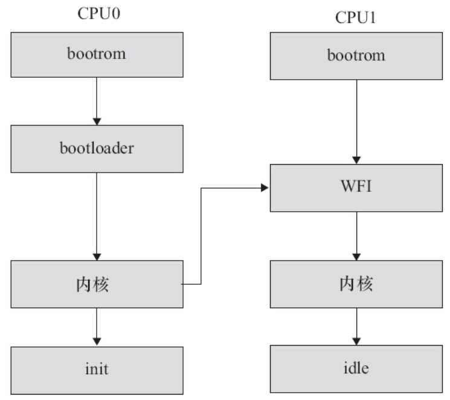

# 3.4.3　Linux内核的引导

引导Linux系统的过程包括很多阶段，这里将以引导ARM Linux为例来进行讲解（见图3.11）。一般的SoC内嵌入了bootrom，上电时bootrom运行。对于CPU0而言，bootrom会去引导bootloader，而其他CPU则判断自己是不是CPU0，进入WFI的状态等待CPU0来唤醒它。CPU0引导bootloader，bootloader引导Linux内核，在内核启动阶段，CPU0会发中断唤醒CPU1，之后CPU0和CPU1都投入运行。CPU0导致用户空间的init程序被调用，init程序再派生其他进程，派生出来的进程再派生其他进程。CPU0和CPU1共担这些负载，进行负载均衡。



图3.11　ARM上的Linux引导流程

bootrom是各个SoC厂家根据自身情况编写的，目前的SoC一般都具有从SD、eMMC、NAND、USB等介质启动的能力，这证明这些bootrom内部的代码具备读SD、NAND等能力。

嵌入式Linux领域最著名的bootloader是U-Boot，其代码仓库位于http://git.denx.de/u-boot.git/ 。早前，bootloader需要将启动信息以ATAG的形式封装，并且把ATAG的地址填充在r2寄存器中，机型号填充在r1寄存器中，详见内核文档Documentation/arm/booting。在ARM Linux支持设备树（Device Tree）后，bootloader则需要把dtb的地址放入r2寄存器中。当然，ARM Linux也支持直接把dtb和zImage绑定在一起的模式（内核ARM_APPENDED_DTB选项“Use appended device tree blob to zImage”），这样r2寄存器就不再需要填充dtb地址了。

类似zImage的内核镜像实际上是由没有压缩的解压算法和被压缩的内核组成，所以在bootloader跳入zImage以后，它自身的解压缩逻辑就把内核的镜像解压缩出来了。关于内核启动，与我们关系比较大的部分是每个平台的设备回调函数和设备属性信息，它们通常包装在DT_MACHINE_START和MACHINE_END之间，包含reserve（）、map_io（）、init_machine（）、init_late（）、smp等回调函数或者属性。这些回调函数会在内核启动过程中被调用。后续章节会进一步介绍。

用户空间的init程序常用的有busybox init、SysVinit、systemd等，它们的职责类似，把整个系统启动，最后形成一个进程树，比如Ubuntu上运行的pstree：

```
init─┬─ModemManager───2*[{ModemManager}]
     ├─NetworkManager─┬─dhclient
     │                ├─dnsmasq
     │                └─3*[{NetworkManager}]
     ├─accounts-daemon───2*[{accounts-daemon}]
     ├─acpid
     ├─atd
     ├─atop
     ├─avahi-daemon───avahi-daemon
     ├─bluetoothd
     ├─colord───2*[{colord}]
     ├─console-kit-dae───64*[{console-kit-dae}]
     ├─cron
     ├─cups-browsed
     ├─cupsd
     ├─dbus-daemon
     ├─docker───6*[{docker}]
     ├─6*[getty]
     ├─gnome-keyring-d───4*[{gnome-keyring-d}]
     ├─in.tftpd
     ├─kerneloops
     ├─lightdm─┬─Xorg
     │         ├─lightdm─┬─init─┬─at-spi-bus-laun─┬─dbus-daemon
     │         │         │      │                 └─3*[{at-spi-bus-laun}]
     │         │         │      ├─at-spi2-registr───{at-spi2-registr}
     │         │         │      ├─dbus-daemon
     │         │         │      ├─dconf-service───2*[{dconf-service}]
     │         │         │      ├─evolution-calen───4*[{evolution-calen}]
     │         │         │      ├─evolution-sourc───2*[{evolution-sourc}]
     │         │         │      ├─gconfd-2
     │         │         │      ├─gnome-screensav───3*[{gnome-screensav}]
     │         │         │      ├─gnome-session─┬─compiz─┬─gnome-terminal─┬─bash
     │         │         │      │               │        │                ├─gnome-pty-helpe
     │         │         │      │               │        │                └─3*[{gnome-terminal}]
     │         │         │      │               │        ├─gtk-window-deco───2*[{gtk-window-deco}]
     │         │         │      │               │        └─3*[{compiz}]
     │         │         │      │               ├─deja-dup-monito───2*[{deja-dup-monito}]
     │         │         │      │               ├─gnome-panel───3*[{gnome-panel}]
     │         │         │      │               ├─indicator-appli───{indicator-appli}
     │         │         │      │               ├─indicator-bluet───2*[{indicator-bluet}]
     │         │         │      │               ├─initctl
     │         │         │      │               ├─nautilus───3*[{nautilus}]
     │         │         │      │               ├─nm-applet───2*[{nm-applet}]
     │         │         │      │               ├─polkit-gnome-au───2*[{polkit-gnome-au}]
     │         │         │      │               ├─telepathy-indic───2*[{telepathy-indic}]
     │         │         │      │               ├─unity-fallback-───2*[{unity-fallback-}]
     │         │         │      │               ├─update-notifier───3*[{update-notifier}]
     │         │         │      │               ├─zeitgeist-datah───3*[{zeitgeist-datah}]
     │         │         │      │               └─3*[{gnome-session}]
     │         │         │      ├─gvfs-afc-volume───2*[{gvfs-afc-volume}]
     │         │         │      ├─gvfs-gphoto2-vo───{gvfs-gphoto2-vo}
     │         │         │      ├─gvfs-mtp-volume───{gvfs-mtp-volume}
     │         │         │      ├─gvfs-udisks2-vo───2*[{gvfs-udisks2-vo}]
     │         │         │      ├─gvfsd───{gvfsd}
     │         │         │      ├─gvfsd-fuse───5*[{gvfsd-fuse}]
     │         │         │      ├─gvfsd-trash───4*[{gvfsd-trash}]
     │         │         │      ├─ibus-daemon─┬─ibus-dconf───3*[{ibus-dconf}]
     │         │         │      │             ├─ibus-engine-sim───2*[{ibus-engine-sim}]
     │         │         │      │             ├─ibus-ui-gtk3───3*[{ibus-ui-gtk3}]
     │         │         │      │             └─2*[{ibus-daemon}]
     │         │         │      ├─ibus-x11───3*[{ibus-x11}]
     │         │         │      ├─indicator-apple───2*[{indicator-apple}]
     │         │         │      ├─indicator-datet───5*[{indicator-datet}]
     │         │         │      ├─indicator-keybo───2*[{indicator-keybo}]
     │         │         │      ├─indicator-messa───3*[{indicator-messa}]
     │         │         │      ├─indicator-power───2*[{indicator-power}]
     │         │         │      ├─indicator-sessi───2*[{indicator-sessi}]
     │         │         │      ├─indicator-sound───3*[{indicator-sound}]
     │         │         │      ├─mission-control───2*[{mission-control}]
     │         │         │      ├─notify-osd───2*[{notify-osd}]
     │         │         │      ├─pulseaudio───2*[{pulseaudio}]
     │         │         │      ├─unity-settings-───3*[{unity-settings-}]
     │         │         │      ├─update-manager───2*[{update-manager}]
     │         │         │      ├─2*[upstart-dbus-br]
     │         │         │      ├─upstart-event-b
     │         │         │      ├─upstart-file-br
     │         │         │      ├─window-stack-br
     │         │         │      ├─zeitgeist-daemo───{zeitgeist-daemo}
     │         │         │      └─zeitgeist-fts─┬─cat
     │         │         │                      └─{zeitgeist-fts}
     │         │         └─{lightdm}
     │         └─2*[{lightdm}]
     ├─lttng-sessiond───9*[{lttng-sessiond}]
     ├─netserver
     ├─polkitd───2*[{polkitd}]
     ├─rpc.idmapd
     ├─rpc.mountd
     ├─rpc.statd
     ├─rpcbind
     ├─rsyslogd───3*[{rsyslogd}]
     ├─rtkit-daemon───2*[{rtkit-daemon}]
     ├─sshd─┬─sshd───sshd─┬─bash───pstree
     │      │             └─bash───sleep
     │      └─sshd───sshd───sftp-server
     ├─systemd-logind
     ├─systemd-udevd
     ├─udisksd───4*[{udisksd}]
     ├─upowerd───2*[{upowerd}]
     ├─upstart-file-br
     ├─upstart-socket-
     ├─upstart-udev-br
     └─whoopsie───2*[{whoopsie}]

```

