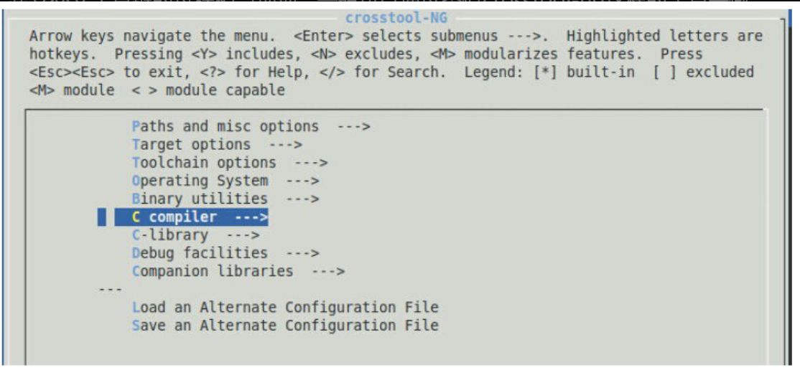

在Linux的编程中，通常使用GNU工具链编译Bootloader、内核和应用程序。GNU组织维护了GCC、GDB、glibc、Binutils等，分别见于https://gcc.gnu.org/ ，https://www.gnu.org/software/gdb/ ，https://www.gnu.org/software/libc/ 、https://www.gnu.org/software/binutils/ 。

建立交叉工具链的过程相当烦琐，一般可以通过类似crosstool-ng这样的工具来做。crosstool-ng也采用了与内核相似的menuconfig配置方法。在官网http://www.crosstool-ng.org/ 上下载crosstool-ng的源代码并编译安装后，运行ct-ng menuconfig，会出现如图3.12的配置菜单。在里面我们可以选择目标机处理器型号，支持的内核版本号等。



图3.12　crosstool-ng的配置菜单

当然，也可以直接下载第三方编译好的、开放的、针对目标处理器的交叉工具链，如在http://www.mentor.com/embedded-software/sourcery-tools/sourcery-codebench/editions/lite-edition/ 上可以下载针对ARM、MIPS、高通Hexagon、Altera Nios II、Intel、AMD64等处理器的工具链，在http://www.linaro.org/downloads/ 可以下载针对ARM的工具链。

目前，在ARM Linux的开发中，人们趋向于使用Linaro（http://www.linaro.org/ ）工具链团队维护的ARM工具链，它以每月一次的形式发布新的版本，编译好的可执行文件可从网址http://www.linaro.org/downloads/ 下载。Linaro是ARM Linux领域中最著名最具技术成就的开源组织，其会员包括ARM、Broadcom、Samsung、TI、Qualcomm等，国内的海思、中兴、全志和中国台湾的MediaTek也是它的会员。

一个典型的ARM Linux工具链包含arm-linux-gnueabihf-gcc（后续工具省略前缀）、strip、gcc、objdump、ld、gprof、nm、readelf、addr2line等。用strip可以删除可执行文件中的符号表和调试信息等来实现缩减程序体积的目的。gprof在编译过程中在函数入口处插入计数器以收集每个函数的被调用情况和被调用次数，检查程序计数器并在分析时找出与程序计数器对应的函数来统计函数占用的时间。objdump是反汇编工具。nm则用于显示关于对象文件、可执行文件以及对象文件库里的符号信息。其中，前缀中的“hf”显示该工具链是完全的硬浮点，由于目前主流的ARM芯片都自带VFP或者NEON等浮点处理单元（FPU），所以对硬浮点的需求就更加强烈。Linux的浮点处理可以采用完全软浮点，也可以采用与软浮点兼容，但是使用FPU硬件的softfp，以及完全硬浮点。具体的ABI（Application Binary Interface，应用程序二进制接口）通过-mfloat-abi=参数指定，3种情况下的参数分别是-mfloat-abi=soft/softfp/hard。

在以前，主流的工具链采用“与软浮点兼容，但是使用FPU硬件的softfp”。softfp使用了硬件的FPU，但是函数的参数仍然使用整型寄存器来传递，完全硬浮点则直接使用FPU的寄存器传递参数。

下面一段程序：

```
float mul(float a, float b)
{
        return a * b;
}
void main(void)
{
        printf("1.1 * 2.3 = %f\n", mul(1.1, 2.3));
}
```

对其使用arm-linux-gnueabihf-gcc编译并反汇编的结果是：

```
000 08394 <mul>:
     8394: b480        push  {r7}
     8396: b083        sub  sp, #12
     8398: af00        add  r7, sp, #0
  839a: ed87 0a01


vstr


s0, [r7, #4](null)


839e: edc7 0a00


vstr


s1, [r7]


     83a2: ed97 7a01   vldr  s14, [r7, #4](null)
     83a6: edd7 7a00   vldr  s15, [r7]
     83aa: ee67 7a27   vmul.f32  s15, s14, s15
     83ae: eeb0 0a67   vmov.f32  s0, s15
     83b2: f107 070c   add.w  r7, r7, #12
     83b6: 46bd        mov  sp, r7
     83b8: bc80        pop  {r7}
     83ba: 4770        bxlr
0000 83bc <main>:
     83bc: b580        push  {r7, lr}
     83be: af00        add  r7, sp, #0
   83c0: ed9f 0a09


vldr


s0, [pc, #36](null)


; 83e8 <main+0x2c>


83c4: eddf 0a09


vldr


s1, [pc, #36](null)


; 83ec <main+0x30>


     83c8: f7ff ffe4   b8394 <mul>
     83cc: eef0 7a40   vmov.f32  s15, s0
     83d0: eeb7 7ae7   vcvt.f64.f32  d7, s15
     83d4: f248 4044   movw  r0, #33860  ; 0x8444
     83d8: f2c0 0000   movt  r0, #0
     83dc: ec53 2b17   vmov  r2, r3, d7
     83e0: f7ff ef82   blx  82e8 <_init+0x20>
     83e4: bd80        pop  {r7, pc}
     83e6: bf00        nop
```

而使用没有“hf”前缀的arm-linux-gnueabi-gcc编译并反汇编的结果则为

```
000 0838c <mul>:
     838c: b480        push  {r7}
     838e: b083        sub  sp, #12
     8390: af00        add  r7, sp, #0
   8392: 6078        str  r0, [r7, #4]


8394: 6039        str  r1, [r7, #0]


8396: ed97 7a01   vldr  s14, [r7, #4](null)


839a: edd7 7a00   vldr  s15, [r7]


     839e: ee67 7a27   vmul.f32  s15, s14, s15
     83a2: ee17 3a90   vmov  r3, s15
     83a6: 4618        mov  r0, r3
     83a8: f107 070c   add.w  r7, r7, #12
     83ac: 46bd        mov  sp, r7
     83ae: bc80        pop  {r7}
     83b0: 4770        bxlr
     83b2: bf00        nop
000 083b4 <main>:
     83b4: b580        push  {r7, lr}
     83b6: af00        add  r7, sp, #0
   83b8: 4808        ldr  r0, [pc, #32]  ; (83dc <main+0x28>)


83ba: 4909        ldr  r1, [pc, #36]  ; (83e0 <main+0x2c>)


     83bc: f7ff ffe6   bl  838c <mul>
     83c0: ee07 0a90   vmov  s15, r0
     83c4: eeb7 7ae7   vcvt.f64.f32  d7, s15
     83c8: f248 4038   movwr0, #33848; 0x8438
     83cc: f2c0 0000   movtr0, #0
     83d0: ec53 2b17   vmovr2, r3, d7
     83d4: f7ff ef84   blx  82e0 <_init+0x20>
     83d8: bd80        pop  {r7, pc}
     83da: bf00        nop
```

关注其中加粗的行，可以看出前面的汇编使用s0和s1传递参数，后者则仍然使用ARM的r0和r1。测试显示一个含有浮点运算的程序若使用hard ABI会比softfp ABI快5%~40%，如果浮点负载重，结果可能会快200%以上