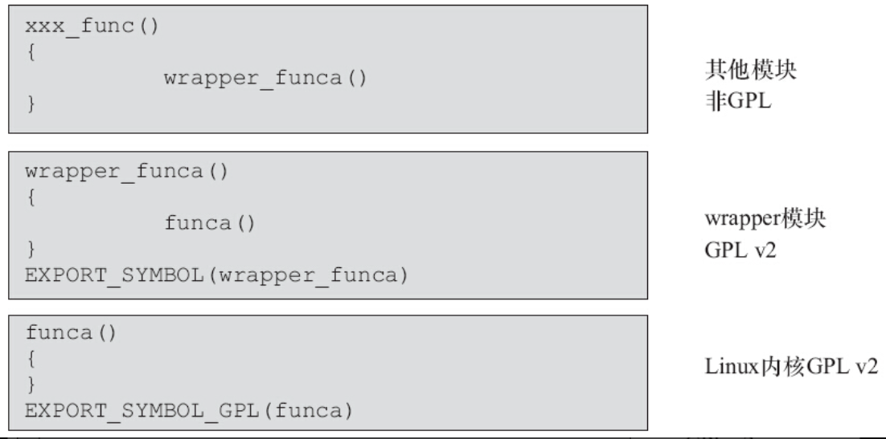

Linux内核有两种导出符号的方法给模块使用，一种方法是EXPORT_SYMBOL（），另外一种是EXPORT_SYMBOL_GPL（）。这一点和模块A导出符号给模块B用是一致的。

内核的Documentation/DocBook/kernel-hacking.tmpl明确表明“the symbols exported by EXPORT_SYMBOL_GPL（）can only be seen by modules with a MODULE_LICENSE（）that specifies a GPL compatible license.”由此可见内核用EXPORT_SYMBOL_GPL（）导出的符号是不可以被非GPL模块引用的。

由于相当多的内核符号都是以EXPORT_SYMBOL_GPL（）导出的，所以历史上曾经有一些公司把内核的EXPORT_SYMBOL_GPL（）直接改为EXPORT_SYMBOL（），然后将修改后的内核以GPL形式发布。这样修改内核之后，模块不再使用内核的EXPORT_SYMBOL_GPL（）符号，因此模块不再需要GPL。对此Linus的回复是：“I think both them said that anybody who were to change a xyz_GPL to the non-GPL one in order to use it with a non-GPL module would almost immediately fall under the“willful infringement”thing，and that it would make it MUCH easier to get triple damages and/or injunctions，since they clearly knew about it”。因此，这种做法可能构成“蓄意侵权（willful infringement）”。

另外一种做法是写一个wrapper内核模块（这个模块遵循GPL），把EXPORT_SYMBOL_GPL（）导出的符号封装一次后再以EXPORT_SYMBOL（）形式导出，而其他的模块不直接调用内核而是调用wrapper函数，如图4.1所示。这种做法也具有争议。

图4.1　将EXPORT_SYMBOL_GPL重新以EXPORT_SYMBOL导出

一般认为，保守的做法是Linux内核不能使用非GPL许可权