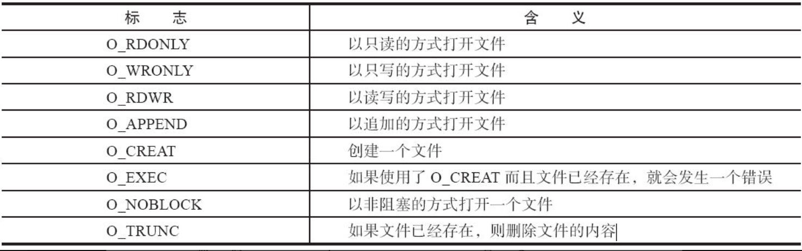
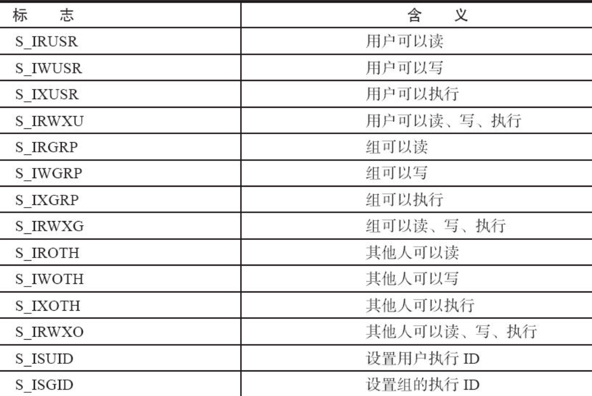
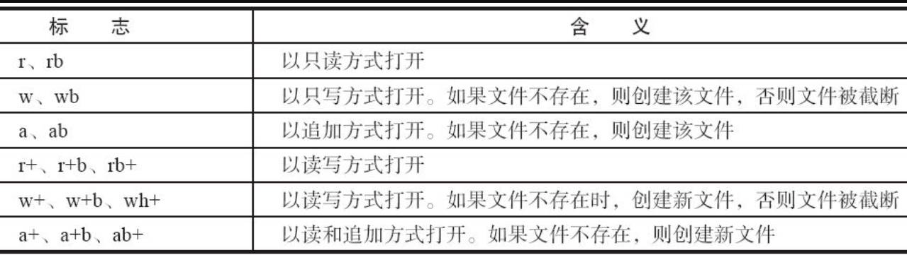

# 5.1.1　文件操作系统调用

Linux的文件操作系统调用（在Windows编程领域，习惯称操作系统提供的接口为API）涉及创建、打开、读写和关闭文件。

1.创建

```
int creat(const char *filename, mode_t mode);
```

参数mode指定新建文件的存取权限，它同umask一起决定文件的最终权限（mode&umask），其中，umask代表了文件在创建时需要去掉的一些存取权限。umask可通过系统调用umask（）来改变：

```
int umask(int newmask);
```

该调用将umask设置为newmask，然后返回旧的umask，它只影响读、写和执行权限。

2.打开

```
int open(const char *pathname, int flags);
int open(const char *pathname, int flags, mode_t mode);
```

open（）函数有两个形式，其中pathname是我们要打开的文件名（包含路径名称，缺省是认为在当前路径下面），flags可以是表5.1中的一个值或者是几个值的组合。

表5.1　文件打开标志



O_RDONLY、O_WRONLY、O_RDWR三个标志只能使用任意的一个。

如果使用了O_CREATE标志，则使用的函数是int open（const char*pathname，int flags，mode_t mode）；这个时候我们还要指定mode标志，以表示文件的访问权限。mode可以是表5.2中所列值的组合。

表5.2　文件访问权限



除了可以通过上述宏进行“或”逻辑产生标志以外，我们也可以自己用数字来表示，Linux用5个数字来表示文件的各种权限：第一位表示设置用户ID；第二位表示设置组ID；第三位表示用户自己的权限位；第四位表示组的权限；最后一位表示其他人的权限。每个数字可以取1（执行权限）、2（写权限）、4（读权限）、0（无）或者是这些值的和。例如，要创建一个用户可读、可写、可执行，但是组没有权限，其他人可以读、可以执行的文件，并设置用户ID位，那么应该使用的模式是1（设置用户ID）、0（不设置组ID）、7（1+2+4，读、写、执行）、0（没有权限）、5（1+4，读、执行）即10705：

```
open("test", O_CREAT, 10 705);
```

上述语句等价于：

```
open("test", O_CREAT, S_IRWXU | S_IROTH | S_IXOTH | S_ISUID );
```

如果文件打开成功，open函数会返回一个文件描述符，以后对该文件的所有操作就可以通过对这个文件描述符进行操作来实现。

3.读写

在文件打开以后，我们才可对文件进行读写，Linux中提供文件读写的系统调用是read、write函数：

```
int read(int fd, const void *buf, size_t length);
int write(int fd, const void *buf, size_t length);
```

其中，参数buf为指向缓冲区的指针，length为缓冲区的大小（以字节为单位）。函数read（）实现从文件描述符fd所指定的文件中读取length个字节到buf所指向的缓冲区中，返回值为实际读取的字节数。函数write实现把length个字节从buf指向的缓冲区中写到文件描述符fd所指向的文件中，返回值为实际写入的字节数。

以O_CREAT为标志的open实际上实现了文件创建的功能，因此，下面的函数等同于creat（）函数：

```
int open(pathname, O_CREAT | O_WRONLY | O_TRUNC, mode);
```

4.定位

对于随机文件，我们可以随机指定位置进行读写，使用如下函数进行定位：

```
int lseek(int fd, offset_t offset, int whence);
```

lseek（）将文件读写指针相对whence移动offset个字节。操作成功时，返回文件指针相对于文件头的位置。参数whence可使用下述值：

- SEEK_SET：相对文件开头
- SEEK_CUR：相对文件读写指针的当前位置
- SEEK_END：相对文件末尾

offset可取负值，例如下述调用可将文件指针相对当前位置向前移动5个字节：

```
lseek(fd, -5, SEEK_CUR);
```

由于lseek函数的返回值为文件指针相对于文件头的位置，因此下列调用的返回值就是文件的长度：

```
lseek(fd, 0, SEEK_END);
```

5.关闭

当我们操作完成以后，要关闭文件，此时，只要调用close就可以了，其中fd是我们要关闭的文件描述符：

```
int close(int fd);
```

例程：编写一个程序，在当前目录下创建用户可读写文件hello.txt，在其中写入“Hello，software weekly”，关闭该文件。再次打开该文件，读取其中的内容并输出在屏幕上。

解答如代码清单5.1。

代码清单5.1　Linux文件操作用户空间编程（使用系统调用）

```
 1  #include <sys/types.h>
 2  #include <sys/stat.h>
 3  #include <fcntl.h>
 4  #include <stdio.h>
 5  #define LENGTH 100
 6  main()
 7  {
 8    int fd, len;
 9    char str[LENGTH];
10
11    fd = open("hello.txt", O_CREAT | O_RDWR, S_IRUSR | S_IWUSR); /*
12    创建并打开文件


 */
13    if (fd) {
14         write(fd, "Hello World", strlen("Hello World")); /*
15         写入字符串


 */
16         close(fd);
17    }
18
19    fd = open("hello.txt", O_RDWR);
20    len = read(fd, str, LENGTH); /* 读取文件内容


 */
21    str[len] = '\0';
22    printf("%s\n", str);
23    close(fd);
24 }
```

编译并运行，执行结果为输出“Hello World”。

# 5.1.2　C库文件操作

C库函数的文件操作实际上独立于具体的操作系统平台，不管是在DOS、Windows、Linux还是在VxWorks中都是这些函数

1.创建和打开

```
fiLE *fopen(const char *path, const char *mode);
```

fopen（）用于打开指定文件filename，其中的mode为打开模式，C库函数中支持的打开模式如表5.3所示。

表5.3　C库函数文件打开标志



其中，b用于区分二进制文件和文本文件，这一点在DOS、Windows系统中是有区分的，但Linux不区分二进制文件和文本文件。

2.读写

C库函数支持以字符、字符串等为单位，支持按照某种格式进行文件的读写，这一组函数为：

```
int fgetc(fiLE *stream);
int fputc(int c, fiLE *stream);
char *fgets(char *s, int n, fiLE *stream);
int fputs(const char *s, fiLE *stream);
int fprintf(fiLE *stream, const char *format, ...);
int fscanf (fiLE *stream, const char *format, ...);
size_t fread(void *ptr, size_t size, size_t n, fiLE *stream);
size_t fwrite (const void *ptr, size_t size, size_t n, fiLE *stream);
```

fread（）实现从流（stream）中读取n个字段，每个字段为size字节，并将读取的字段放入ptr所指的字符数组中，返回实际已读取的字段数。当读取的字段数小于num时，可能是在函数调用时出现了错误，也可能是读到了文件的结尾。因此要通过调用feof（）和ferror（）来判断。

write（）实现从缓冲区ptr所指的数组中把n个字段写到流（stream）中，每个字段长为size个字节，返回实际写入的字段数。

另外，C库函数还提供了读写过程中的定位能力，这些函数包括：

```
int fgetpos(fiLE *stream, fpos_t *pos);
int fsetpos(fiLE *stream, const fpos_t *pos);
int fseek(fiLE *stream, long offset, int whence);
```

3.关闭

利用C库函数关闭文件依然是很简单的操作：

```
int fclose (fiLE *stream);
```

例程：将第5.1.1节中的例程用C库函数来实现，如代码清单5-2所示

代码清单5.2　Linux文件操作用户空间编程（使用C库函数）

```
 1 #include <stdio.h>
 2 #define LENGTH 100
 3 main()
 4 {
 5   fiLE *fd;
 6   char str[LENGTH];
 7
 8   fd = fopen("hello.txt", "w+");/* 创建并打开文件


 */
 9   if (fd) {
10       fputs("Hello World", fd); /* 写入字符串


 */
11       fclose(fd);
12   }
13
14   fd = fopen("hello.txt", "r");
15   fgets(str, LENGTH, fd);       /* 读取文件内容


 */
16   printf("%s\n", str);
17   fclose(fd);
18 }
```

