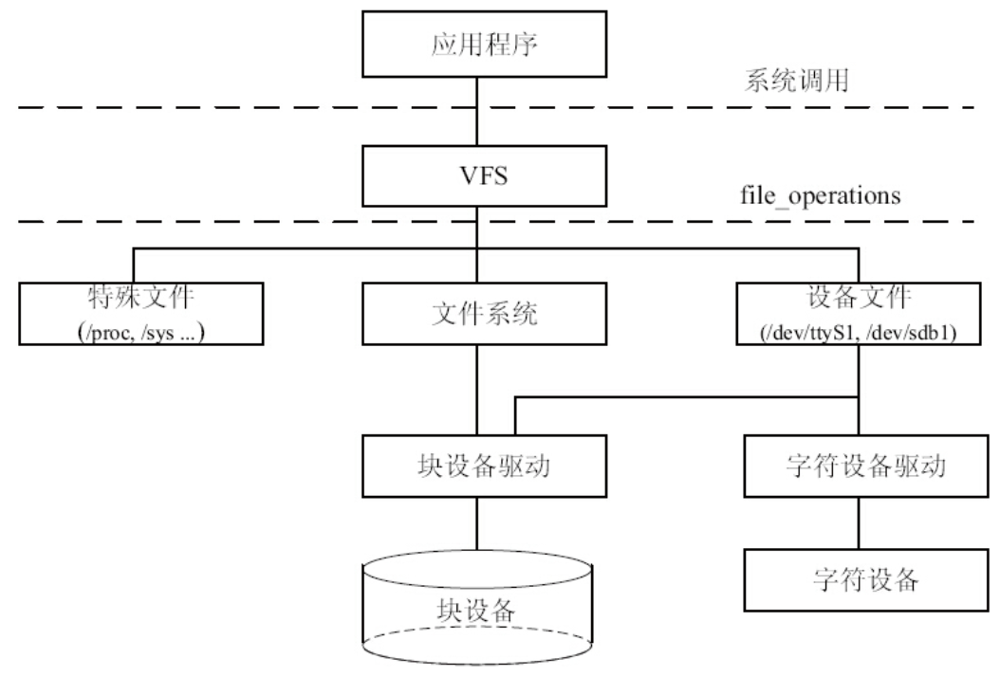
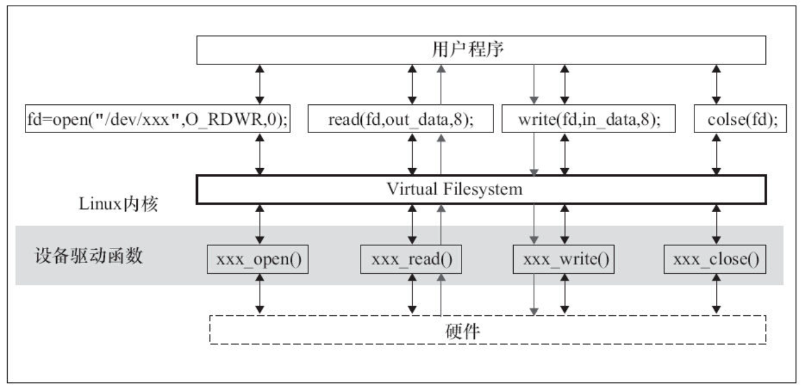

# 5.2.1　Linux文件系统目录结构

进入Linux根目录（即“/”，Linux文件系统的入口，也是处于最高一级的目录），运行“ls–l”命令，看到Linux包含以下目录。

## 1./bin

包含基本命令，如ls、cp、mkdir等，这个目录中的文件都是可执行的。

## 2./sbin

包含系统命令，如modprobe、hwclock、ifconfig等，大多是涉及系统管理的命令，这个目录中的文件都是可执行的。

## 3./dev

设备文件存储目录，应用程序通过对这些文件的读写和控制以访问实际的设备。

## 4./etc

系统配置文件的所在地，一些服务器的配置文件也在这里，如用户账号及密码配置文件。busybox的启动脚本也存放在该目录。

## 5./lib

系统库文件存放目录等。

## 6./mnt

/mnt这个目录一般是用于存放挂载储存设备的挂载目录，比如含有cdrom等目录。可以参看/etc/fstab的定义。有时我们可以让系统开机自动挂载文件系统，并把挂载点放在这里。

## 7./opt

opt是“可选”的意思，有些软件包会被安装在这里。

## 8./proc

操作系统运行时，进程及内核信息（比如CPU、硬盘分区、内存信息等）存放在这里。/proc目录为伪文件系统proc的挂载目录，proc并不是真正的文件系统，它存在于内存之中。

## 9./tmp

用户运行程序的时候，有时会产生临时文件，/tmp用来存放临时文件。

## 10./usr

这个是系统存放程序的目录，比如用户命令、用户库等。

## 11./var

var表示的是变化的意思，这个目录的内容经常变动，如/var的/var/log目录被用来存放系统日志。

## 12./sys

Linux 2.6以后的内核所支持的sysfs文件系统被映射在此目录上。Linux设备驱动模型中的总线、驱动和设备都可以在sysfs文件系统中找到对应的节点。当内核检测到在系统中出现了新设备后，内核会在sysfs文件系统中为该新设备生成一项新的记录。

# 5.2.2　Linux文件系统与设备驱动

图5.1所示为Linux中虚拟文件系统、磁盘/Flash文件系统及一般的设备文件与设备驱动程序之间的关系。



图5.1　文件系统与设备驱动之间的关系

应用程序和VFS之间的接口是系统调用，而VFS与文件系统以及设备文件之间的接口是file_operations结构体成员函数，这个结构体包含对文件进行打开、关闭、读写、控制的一系列成员函数，关系如图5.2所示。



图5.2　应用程序、VFS与设备驱动

在设备驱动程序的设计中，一般而言，会关心file和inode这两个结构体。

## 1.file结构体

file结构体代表一个打开的文件，系统中每个打开的文件在内核空间都有一个关联的struct file。它由内核在打开文件时创建，并传递给在文件上进行操作的任何函数。在文件的所有实例都关闭后，内核释放这个数据结构。在内核和驱动源代码中，struct file的指针通常被命名为file或filp（即file pointer）。代码清单5.3给出了文件结构体的定义。

代码清单5.3　文件结构体

```
struct file {
	union {
		struct llist_node	fu_llist;
		struct rcu_head 	fu_rcuhead;
	} f_u;
	struct path		f_path;
	struct inode		*f_inode;	/* cached value */
	const struct file_operations	*f_op;

	/*
	 * Protects f_ep_links, f_flags.
	 * Must not be taken from IRQ context.
	 */
	spinlock_t		f_lock;
	enum rw_hint		f_write_hint;
	atomic_long_t		f_count;
	unsigned int 		f_flags;
	fmode_t			f_mode;
	struct mutex		f_pos_lock;
	loff_t			f_pos;
	struct fown_struct	f_owner;
	const struct cred	*f_cred;
	struct file_ra_state	f_ra;

	u64			f_version;
#ifdef CONFIG_SECURITY
	void			*f_security;
#endif
	/* needed for tty driver, and maybe others */
	void			*private_data;

#ifdef CONFIG_EPOLL
	/* Used by fs/eventpoll.c to link all the hooks to this file */
	struct list_head	f_ep_links;
	struct list_head	f_tfile_llink;
#endif /* #ifdef CONFIG_EPOLL */
	struct address_space	*f_mapping;
	errseq_t		f_wb_err;
} __randomize_layout
  __attribute__((aligned(4)));	/* lest something weird decides that 2 is OK */
```

文件读/写模式mode、标志f_flags都是设备驱动关心的内容，而私有数据指针private_data在设备驱动中被广泛应用，大多被指向设备驱动自定义以用于描述设备的结构体。

下面的代码可用于判断以阻塞还是非阻塞方式打开设备文件：

```
if (file->f_flags & O_NONBLOCK)     /* 非阻塞*/
      pr_debug("open: non-blocking\n");
else                                /* 阻塞*/
      pr_debug("open: blocking\n");
```

## 2.inode结构体

VFS inode包含文件访问权限、属主、组、大小、生成时间、访问时间、最后修改时间等信息。它是Linux管理文件系统的最基本单位，也是文件系统连接任何子目录、文件的桥梁，inode结构体的定义如代码清单5.4所示

代码清单5.4　inode结构体

```
struct inode {
	umode_t			i_mode;
	unsigned short		i_opflags;
	kuid_t			i_uid;
	kgid_t			i_gid;
	unsigned int		i_flags;

#ifdef CONFIG_FS_POSIX_ACL
	struct posix_acl	*i_acl;
	struct posix_acl	*i_default_acl;
#endif

	const struct inode_operations	*i_op;
	struct super_block	*i_sb;
	struct address_space	*i_mapping;

#ifdef CONFIG_SECURITY
	void			*i_security;
#endif

	/* Stat data, not accessed from path walking */
	unsigned long		i_ino;
	/*
	 * Filesystems may only read i_nlink directly.  They shall use the
	 * following functions for modification:
	 *
	 *    (set|clear|inc|drop)_nlink
	 *    inode_(inc|dec)_link_count
	 */
	union {
		const unsigned int i_nlink;
		unsigned int __i_nlink;
	};
	dev_t			i_rdev;
	loff_t			i_size;
	struct timespec64	i_atime;
	struct timespec64	i_mtime;
	struct timespec64	i_ctime;
	spinlock_t		i_lock;	/* i_blocks, i_bytes, maybe i_size */
	unsigned short          i_bytes;
	u8			i_blkbits;
	u8			i_write_hint;
	blkcnt_t		i_blocks;

#ifdef __NEED_I_SIZE_ORDERED
	seqcount_t		i_size_seqcount;
#endif

	/* Misc */
	unsigned long		i_state;
	struct rw_semaphore	i_rwsem;

	unsigned long		dirtied_when;	/* jiffies of first dirtying */
	unsigned long		dirtied_time_when;

	struct hlist_node	i_hash;
	struct list_head	i_io_list;	/* backing dev IO list */
#ifdef CONFIG_CGROUP_WRITEBACK
	struct bdi_writeback	*i_wb;		/* the associated cgroup wb */

	/* foreign inode detection, see wbc_detach_inode() */
	int			i_wb_frn_winner;
	u16			i_wb_frn_avg_time;
	u16			i_wb_frn_history;
#endif
	struct list_head	i_lru;		/* inode LRU list */
	struct list_head	i_sb_list;
	struct list_head	i_wb_list;	/* backing dev writeback list */
	union {
		struct hlist_head	i_dentry;
		struct rcu_head		i_rcu;
	};
	atomic64_t		i_version;
	atomic_t		i_count;
	atomic_t		i_dio_count;
	atomic_t		i_writecount;
#ifdef CONFIG_IMA
	atomic_t		i_readcount; /* struct files open RO */
#endif
	const struct file_operations	*i_fop;	/* former ->i_op->default_file_ops */
	struct file_lock_context	*i_flctx;
	struct address_space	i_data;
	struct list_head	i_devices;
	union {
		struct pipe_inode_info	*i_pipe;
		struct block_device	*i_bdev;
		struct cdev		*i_cdev;
		char			*i_link;
		unsigned		i_dir_seq;
	};

	__u32			i_generation;

#ifdef CONFIG_FSNOTIFY
	__u32			i_fsnotify_mask; /* all events this inode cares about */
	struct fsnotify_mark_connector __rcu	*i_fsnotify_marks;
#endif

#if IS_ENABLED(CONFIG_FS_ENCRYPTION)
	struct fscrypt_info	*i_crypt_info;
#endif

	void			*i_private; /* fs or device private pointer */
} __randomize_layout;

```

对于表示设备文件的inode结构，i_rdev字段包含设备编号。Linux内核设备编号分为主设备编号和次设备编号，前者为dev_t的高12位，后者为dev_t的低20位。下列操作用于从一个inode中获得主设备号和次设备号：

```
unsigned int iminor(struct inode *inode);
unsigned int imajor(struct inode *inode);
```

查看/proc/devices文件可以获知系统中注册的设备，第1列为主设备号，第2列为设备名，如：

```
Character devices:
   1 mem
   2 pty
   3 ttyp
   4 /dev/vc/0
   4 tty
   5 /dev/tty
   5 /dev/console
   5 /dev/ptmx
   7 vcs
  10 misc
  13 input
  21 sg
  29 fb
 128 ptm
 136 pts
 171 ieee1394
 180 usb
 189 usb_device
Block devices:
   1 ramdisk
   2 fd
   8 sd
   9 md
  22 ide1
 ...
```

查看/dev目录可以获知系统中包含的设备文件，日期的前两列给出了对应设备的主设备号和次设备号：

```
crw-rw----    1 root     uucp       4,  64 Jan 30  2003 /dev/ttyS0
brw-rw----    1 root     disk       8,   0 Jan 30  2003 /dev/sda
```

主设备号是与驱动对应的概念，同一类设备一般使用相同的主设备号，不同类的设备一般使用不同的主设备号（但是也不排除在同一主设备号下包含有一定差异的设备）。因为同一驱动可支持多个同类设备，因此用次设备号来描述使用该驱动的设备的序号，序号一般从0开始。

内核Documents目录下的devices.txt文件描述了Linux设备号的分配情况，它由LANANA（the Linux Assigned Names and Numbers authority，网址为http://www.lanana.org/ ）组织维护，Torben Mathiasen（device@lanana.org）是其中的主要维护者。