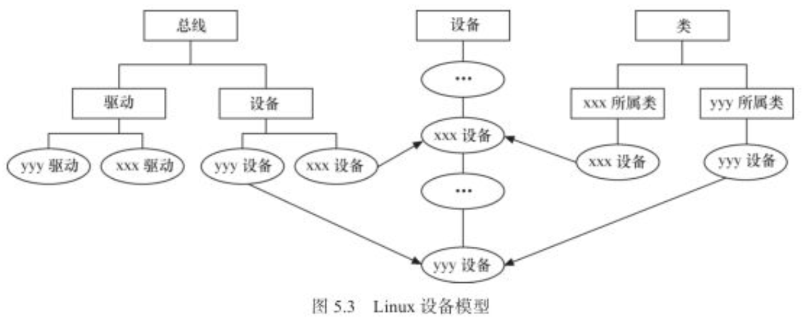
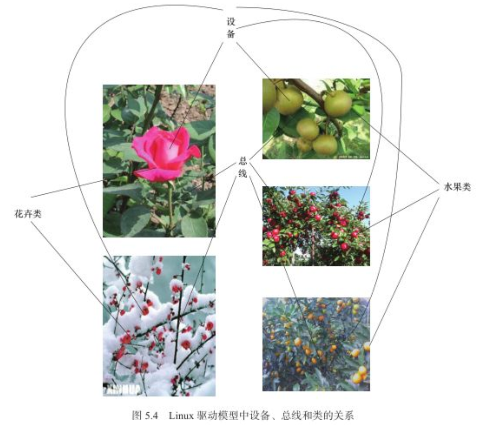

# 5.4.1　udev与devfs的区别

尽管devfs有这样和那样的优点，但是，在Linux 2.6内核中，devfs被认为是过时的方法，并最终被抛弃了，udev取代了它。Linux VFS内核维护者Al Viro指出了几点udev取代devfs的原因：

1）devfs所做的工作被确信可以在用户态来完成。

2）devfs被加入内核之时，大家期望它的质量可以迎头赶上。

3）发现devfs有一些可修复和无法修复的bug。

4）对于可修复的bug，几个月前就已经被修复了，其维护者认为一切良好。

5）对于后者，在相当长的一段时间内没有改观。

6）devfs的维护者和作者对它感到失望并且已经停止了对代码的维护工作。

Linux内核的两位贡献者，Richard Gooch（devfs的作者）和Greg Kroah-Hartman（sysfs的主要作者）就devfs/udev进行了激烈的争论：

```
Greg：Richard had stated that udev was a proper replacement for devfs.
Richard：Well，that's news to me！
Greg：devfs should be taken out because policy should exist in userspace and not in the kernel.
Richard：sysfs，developed in large part by Greg，also implemented policy in the kernel.
Greg：devfs was broken and unfixable
Richard：No proof.Never say never...
这段有趣的争论可意译如下：
Greg：Richard已经指出，udev是devfs合适的替代品。
Richard：哦，我怎么不知道？
Greg：devfs应该下课，因为策略应该位于用户空间而不是内核空间。
Richard：哦，由Greg完成大部分工作的sysfs也在内核中实现了策略。
Greg：devfs很蹩脚，也不稳定。
Richard：呵呵，没证据，别那么武断……
```

在Richard Gooch和Greg Kroah-Hartman的争论中，Greg Kroah-Hartman使用的理论依据就在于policy（策略）不能位于内核空间中。Linux设计中强调的一个基本观点是机制和策略的分离。机制是做某样事情的固定步骤、方法，而策略就是每一个步骤所采取的不同方式。机制是相对固定的，而每个步骤采用的策略是不固定的。机制是稳定的，而策略则是灵活的，因此，在Linux内核中，不应该实现策略。

比如Linux提供API可以让人把线程的优先级调高或者调低，或者调整调度策略为SCHED_FIFO什么的，但是Linux内核本身却不管谁高谁低。提供API属于机制，谁高谁低这属于策略，所以应该是应用程序自己去告诉内核要高或低，而内核不管这些杂事。同理，Greg Kroah-Hartman认为，属于策略的东西应该被移到用户空间中，谁爱给哪个设备创建什么名字或者想做更多的处理，谁自己去设定。内核只管把这些信息告诉用户就行了。这就是位于内核空间的devfs应该被位于用户空间的udev取代的原因，应该devfs管了一些不靠谱的事情。

下面举一个通俗的例子来理解udev设计的出发点。以谈恋爱为例，Greg Kroah-Hartman认为，可以让内核提供谈恋爱的机制，但是不能在内核空间中限制跟谁谈恋爱，不能把谈恋爱的策略放在内核空间。因为恋爱是自由的，用户应该可以在用户空间中实现“萝卜白菜，各有所爱”的理想，可以根据对方的外貌、籍贯、性格等自由选择。对应devfs而言，第1个相亲的女孩被命名为/dev/girl0，第2个相亲的女孩被命名为/dev/girl1，以此类推。而在用户空间实现的udev则可以使得用户实现这样的自由：不管你中意的女孩是第几个，只要它与你定义的规则符合，都命名为/dev/mygirl！

udev完全在用户态工作，利用设备加入或移除时内核所发送的热插拔事件（Hotplug Event）来工作。在热插拔时，设备的详细信息会由内核通过netlink套接字发送出来，发出的事情叫uevent。udev的设备命名策略、权限控制和事件处理都是在用户态下完成的，它利用从内核收到的信息来进行创建设备文件节点等工作。代码清单5.6给出了从内核通过netlink接收热插拔事件并冲刷掉的范例，udev采用了类似的做法。

代码清单5.6　netlink的使用范例

```
 1 #include <linux/netlink.h>
 2
 3 static void die(char *s)
 4 {
 5  write(2, s, strlen(s));
 6  exit(1);
 7 }
 8
 9 int main(int argc, char *argv[])
10{
11  struct sockaddr_nl nls;
12  struct pollfd pfd;
13  char buf[512];
14
15  // Open hotplug event netlink socket
16
17  memset(&nls, 0, sizeof(struct sockaddr_nl));
18  nls.nl_family = AF_NETLINK;
19  nls.nl_pid = getpid();
20  nls.nl_groups = -1;
21
22  pfd.events = POLLIN;
23  pfd.fd = socket(PF_NETLINK, SOCK_DGRAM, NETLINK_KOBJECT_UEVENT);
24  if (pfd.fd == -1)
25      die("Not root\n");
26
27  // Listen to netlink socket
28  if (bind(pfd.fd, (void *)&nls, sizeof(struct sockaddr_nl)))
29      die("Bind failed\n");
30  while (-1 != poll(&pfd, 1, -1)) {
31      int i, len = recv(pfd.fd, buf, sizeof(buf), MSG_DONTWAIT);
32      if (len == -1)
33          die("recv\n");
34
35      // Print the data to stdout.
36      i = 0;
37      while (i < len) {
38          printf("%s\n", buf + i);
39          i += strlen(buf + i) + 1;
40      }
41  }
42  die("poll\n");
43
44  // Dear gcc: shut up.
45  return 0;
46}
```

编译上述程序并运行，把Apple Facetime HD Camera USB摄像头插入Ubuntu，该程序会dump类似如下的信息：

```
ACTION=add
DEVLINKS=/dev/input/by-id/usb-Apple_Inc._FaceTime_HD_Camera__Built-in__
CC2B2F0TLSDG6LL0-event-if00 /dev/input/by-path/pci-0000:00:0b.0-usb-0:1:1.0-event
DEVNAME=/dev/input/event6
DEVPATH=/devices/pci0000:00/0000:00:0b.0/usb1/1-1/1-1:1.0/input/input6/event6
ID_BUS=usb
ID_INPUT=1
ID_INPUT_KEY=1
ID_MODEL=FaceTime_HD_Camera__Built-in_
ID_MODEL_ENC=FaceTime\x20HD\x20Camera\x20\x28Built-in\x29
ID_MODEL_ID=8509
ID_PATH=pci-0000:00:0b.0-usb-0:1:1.0
ID_PATH_TAG=pci-
```

udev就是采用这种方式接收netlink消息，并根据它的内容和用户设置给udev的规则做匹配来进行工作的。这里有一个问题，就是冷插拔的设备怎么办？冷插拔的设备在开机时就存在，在udev启动前已经被插入了。对于冷插拔的设备，Linux内核提供了sysfs下面一个uevent节点，可以往该节点写一个“add”，导致内核重新发送netlink，之后udev就可以收到冷插拔的netlink消息了。我们还是运行代码清单5.6的程序，并手动往/sys/module/psmouse/uevent写一个“add”，上述程序会dump出来这样的信息

```
ACTION=add
DEVPATH=/module/psmouse
SEQNUM=1682
SUBSYSTEM=module
UDEV_LOG=3
USEC_INITIALIZED=220903546792
```

# 5.4.2　sysfs文件系统与Linux设备模型

Linux 2.6以后的内核引入了sysfs文件系统，sysfs被看成是与proc、devfs和devpty同类别的文件系统，该文件系统是一个虚拟的文件系统，它可以产生一个包括所有系统硬件的层级视图，与提供进程和状态信息的proc文件系统十分类似。

sysfs把连接在系统上的设备和总线组织成为一个分级的文件，它们可以由用户空间存取，向用户空间导出内核数据结构以及它们的属性。sysfs的一个目的就是展示设备驱动模型中各组件的层次关系，其顶级目录包括block、bus、dev、devices、class、fs、kernel、power和firmware等。

block目录包含所有的块设备；devices目录包含系统所有的设备，并根据设备挂接的总线类型组织成层次结构；bus目录包含系统中所有的总线类型；class目录包含系统中的设备类型（如网卡设备、声卡设备、输入设备等）。在/sys目录下运行tree会得到一个相当长的树形目录，下面摘取一部分：

```
tree
.
├── block
│   ├── dm-0 -> ../devices/virtual/block/dm-0
│   ├── loop0 -> ../devices/virtual/block/loop0
│   ├── loop1 -> ../devices/virtual/block/loop1
│   ├── loop2 -> ../devices/virtual/block/loop2
│   ├── loop3 -> ../devices/virtual/block/loop3
│   ├── loop4 -> ../devices/virtual/block/loop4
│   ├── loop5 -> ../devices/virtual/block/loop5
│   ├── loop6 -> ../devices/virtual/block/loop6
│   ├── loop7 -> ../devices/virtual/block/loop7
│   ├── ram0 -> ../devices/virtual/block/ram0
│   ├── ram1 -> ../devices/virtual/block/ram1
│   ├── ram10 -> ../devices/virtual/block/ram10
│   ├── ram11 -> ../devices/virtual/block/ram11
│   ├── ram12 -> ../devices/virtual/block/ram12
│   ├── ram13 -> ../devices/virtual/block/ram13
│   ├── ram14 -> ../devices/virtual/block/ram14
│   ├── ram15 -> ../devices/virtual/block/ram15
│   ├── ram2 -> ../devices/virtual/block/ram2
│   ├── ram3 -> ../devices/virtual/block/ram3
│   ├── ram4 -> ../devices/virtual/block/ram4
│   ├── ram5 -> ../devices/virtual/block/ram5
│   ├── ram6 -> ../devices/virtual/block/ram6
│   ├── ram7 -> ../devices/virtual/block/ram7
│   ├── ram8 -> ../devices/virtual/block/ram8
│   ├── ram9 -> ../devices/virtual/block/ram9
│   ├── sda -> ../devices/pci0000:00/0000:00:0d.0/ata3/host2/target2:0:0/2:0:0:0/block/sda
│   └── sr0 -> ../devices/pci0000:00/0000:00:01.1/ata2/host1/target1:0:0/1:0:0:0/block/sr0
├── bus
│   ├── ac97
│   │   ├── devices
│   │   │   └── 0-0:AD1980 -> ../../../devices/pci0000:00/0000:00:05.0/0-0:AD1980
│   │   ├── drivers
│   │   ├── drivers_autoprobe
│   │   ├── drivers_probe
│   │   └── uevent
│   ├── acpi
│   │   ├── devices
│   │   │   ├── ACPI0003:00 -> ../../../devices/LNXSYSTM:00/LNXSYBUS:00/PNP0A03:00/ACPI0003:00
│   │   │   ├── APP0001:00 -> ../../../devices/LNXSYSTM:00/LNXSYBUS:00/PNP0A03:00/device:00/APP0001:00
│   │   │   ├── device:00 -> ../../../devices/LNXSYSTM:00/LNXSYBUS:00/PNP0A03:00/device:00
│   │   │   ├── device:01 -> ../../../devices/LNXSYSTM:00/LNXSYBUS:00/PNP0A03:00/LNXVIDEO:00/device:01
│   │   │   ├── device:02 -> ../../../devices/LNXSYSTM:00/LNXSYBUS:00/PNP0A03:00/device:02
│   │   │   ├── LNXPWRBN:00 -> ../../../devices/LNXSYSTM:00/LNXPWRBN:00
│   │   │   ├── LNXSLPBN:00 -> ../../../devices/LNXSYSTM:00/LNXSLPBN:00
│   │   │   ├── LNXSYBUS:00 -> ../../../devices/LNXSYSTM:00/LNXSYBUS:00
│   │   │   ├── LNXSYBUS:01 -> ../../../devices/LNXSYSTM:00/LNXSYBUS:01
│   │   │   ├── LNXSYSTM:00 -> ../../../devices/LNXSYSTM:00
│   │   │   ├── LNXVIDEO:00 -> ../../../devices/LNXSYSTM:00/LNXSYBUS:00/PNP0A03:00/LNXVIDEO:00
│   │   │   ├── PNP0000:00 -> ../../../devices/LNXSYSTM:00/LNXSYBUS:00/PNP0A03:00/device:00/PNP0000:00
│   │   │   ├── PNP0100:00 -> ../../../devices/LNXSYSTM:00/LNXSYBUS:00/PNP0A03:00/device:00/PNP0100:00
│   │   │   ├── PNP0103:00 -> ../../../devices/LNXSYSTM:00/LNXSYBUS:00/PNP0A03:00/device:00/PNP0103:00
│   │   │   ├── PNP0200:00 -> ../../../devices/LNXSYSTM:00/LNXSYBUS:00/PNP0A03:00/device:00/PNP0200:00
│   │   │   ├── PNP0303:00 -> ../../../devices/LNXSYSTM:00/LNXSYBUS:00/PNP0A03:00/device:00/PNP0303:00
│   │   │   ├── PNP0400:00 -> ../../../devices/LNXSYSTM:00/LNXSYBUS:00/PNP0A03:00/PNP0400:00
│   │   │   ├── PNP0400:01 -> ../../../devices/LNXSYSTM:00/LNXSYBUS:00/PNP0A03:00/PNP0400:01
│   │   │   ├── PNP0501:00 -> ../../../devices/LNXSYSTM:00/LNXSYBUS:00/PNP0A03:00/PNP0501:00
│   │   │   ├── PNP0501:01 -> ../../../devices/LNXSYSTM:00/LNXSYBUS:00/PNP0A03:00/PNP0501:01
│   │   │   ├── PNP0501:02 -> ../../../devices/LNXSYSTM:00/LNXSYBUS:00/PNP0A03:00/PNP0501:02
│   │   │   ├── PNP0501:03 -> ../../../devices/LNXSYSTM:00/LNXSYBUS:00/PNP0A03:00/PNP0501:03
│   │   │   ├── PNP0700:00 -> ../../../devices/LNXSYSTM:00/LNXSYBUS:00/PNP0A03:00/device:00/PNP0700:00
│   │   │   ├── PNP0A03:00 -> ../../../devices/LNXSYSTM:00/LNXSYBUS:00/PNP0A03:00
│   │   │   ├── PNP0B00:00 -> ../../../devices/LNXSYSTM:00/LNXSYBUS:00/PNP0A03:00/device:00/PNP0B00:00
│   │   │   ├── PNP0C02:00 -> ../../../devices/LNXSYSTM:00/LNXSYBUS:00/PNP0A03:00/PNP0C02:00
│   │   │   ├── PNP0C0A:00 -> ../../../devices/LNXSYSTM:00/LNXSYBUS:00/PNP0A03:00/PNP0C0A:00
│   │   │   ├── PNP0C0F:00 -> ../../../devices/LNXSYSTM:00/LNXSYBUS:00/PNP0C0F:00
│   │   │   ├── PNP0C0F:01 -> ../../../devices/LNXSYSTM:00/LNXSYBUS:00/PNP0C0F:01
│   │   │   ├── PNP0C0F:02 -> ../../../devices/LNXSYSTM:00/LNXSYBUS:00/PNP0C0F:02
│   │   │   ├── PNP0C0F:03 -> ../../../devices/LNXSYSTM:00/LNXSYBUS:00/PNP0C0F:03
│   │   │   ├── PNP0F03:00 -> ../../../devices/LNXSYSTM:00/LNXSYBUS:00/PNP0A03:00/device:00/PNP0F03:00
│   │   │   └── PNP8390:00 -> ../../../devices/LNXSYSTM:00/LNXSYBUS:00/PNP0A03:00/PNP8390:00
│   │   ├── drivers
│   │   │   ├── ac
│   │   │   │   ├── ACPI0003:00 -> ../../../../devices/LNXSYSTM:00/LNXSYBUS:00/PNP0A03:00/ACPI0003:00
│   │   │   │   ├── bind
│   │   │   │   ├── uevent
│   │   │   │   └── unbind
│   │   │   ├── battery
│   │   │   │   ├── bind
│   │   │   │   ├── PNP0C0A:00 -> ../../../../devices/LNXSYSTM:00/LNXSYBUS:00/PNP0A03:00/PNP0C0A:00
│   │   │   │   ├── uevent
│   │   │   │   └── unbind
│   │   │   ├── button
│   │   │   │   ├── bind
│   │   │   │   ├── LNXPWRBN:00 -> ../../../../devices/LNXSYSTM:00/LNXPWRBN:00
│   │   │   │   ├── LNXSLPBN:00 -> ../../../../devices/LNXSYSTM:00/LNXSLPBN:00
│   │   │   │   ├── uevent
│   │   │   │   └── unbind
│   │   │   ├── ec
│   │   │   │   ├── bind
│   │   │   │   ├── uevent
│   │   │   │   └── unbind
│   │   │   ├── hardware_error_device
│   │   │   │   ├── bind
│   │   │   │   ├── uevent
│   │   │   │   └── unbind
│   │   │   ├── hpet
│   │   │   │   ├── bind
│   │   │   │   ├── uevent
│   │   │   │   └── unbind
│   │   │   ├── thermal
│   │   │   │   ├── bind
│   │   │   │   ├── uevent
│   │   │   │   └── unbind
│   │   │   └── video
│   │   │       ├── bind
│   │   │       ├── LNXVIDEO:00 -> ../../../../devices/LNXSYSTM:00/LNXSYBUS:00/PNP0A03:00/LNXVIDEO:00
│   │   │       ├── uevent
│   │   │       └── unbind
│   │   ├── drivers_autoprobe
│   │   ├── drivers_probe
│   │   └── uevent
│   ├── clockevents
│   │   ├── devices
│   │   │   ├── broadcast -> ../../../devices/system/clockevents/broadcast
│   │   │   └── clockevent0 -> ../../../devices/system/clockevents/clockevent0
│   │   ├── drivers
│   │   ├── drivers_autoprobe
│   │   ├── drivers_probe
│   │   └── uevent
│   ├── clocksource
│   │   ├── devices
│   │   │   └── clocksource0 -> ../../../devices/system/clocksource/clocksource0
│   │   ├── drivers
│   │   ├── drivers_autoprobe
│   │   ├── drivers_probe
│   │   └── uevent


```

在/sys/bus的pci等子目录下，又会再分出drivers和devices目录，而devices目录中的文件是对/sys/devices目录中文件的符号链接。同样地，/sys/class目录下也包含许多对/sys/devices下文件的链接。如图5.3所示，Linux设备模型与设备、驱动、总线和类的现实状况是直接对应的，也正符合Linux 2.6以后内核的设备模型。



图5.3　Linux设备模型

随着技术的不断进步，系统的拓扑结构越来越复杂，对智能电源管理、热插拔以及即插即用的支持要求也越来越高，Linux 2.4内核已经难以满足这些需求。为适应这种形势的需要，Linux 2.6以后的内核开发了上述全新的设备、总线、类和驱动环环相扣的设备模型。图5.4形象地表示了Linux驱动模型中设备、总线和类之间的关系。



图5.4　Linux驱动模型中设备、总线和类的关系

大多数情况下，Linux 2.6以后的内核中的设备驱动核心层代码作为“幕后大佬”可处理好这些关系，内核中的总线和其他内核子系统会完成与设备模型的交互，这使得驱动工程师在编写底层驱动的时候几乎不需要关心设备模型，只需要按照每个框架的要求，“填鸭式”地填充xxx_driver里面的各种回调函数，xxx是总线的名字。
在Linux内核中，分别使用bus_type、device_driver和device来描述总线、驱动和设备，这3个结构体定义于include/linux/device.h头文件中，其定义如代码清单5.7所示。
代码清单5.7　bus_type、device_driver和device结构体

```
  1 struct bus_type {
  2         const char              *name;
  3         const char              *dev_name;
  4         struct device           *dev_root;
  5         struct device_attribute *dev_attrs;     /* use dev_groups instead */
  6         const struct attribute_group **bus_groups;
  7         const struct attribute_group **dev_groups;
  8         const struct attribute_group **drv_groups;
  9
 10         int (*match)(struct device *dev, struct device_driver *drv);
 11         int (*uevent)(struct device *dev, struct kobj_uevent_env *env);
 12         int (*probe)(struct device *dev);
 13         int (*remove)(struct device *dev);
 14         void (*shutdown)(struct device *dev);
 15
 16         int (*online)(struct device *dev);
 17         int (*offline)(struct device *dev);
 18
 19         int (*suspend)(struct device *dev, pm_message_t state);
 20         int (*resume)(struct device *dev);
 21
 22         const struct dev_pm_ops *pm;
 23
 24         struct iommu_ops *iommu_ops;
 25
 26         struct subsys_private *p;
 27         struct lock_class_key lock_key;
 28 };
 29
 30 struct device_driver {
 31         const char              *name;
 32         struct bus_type         *bus;
 33
 34         struct module           *owner;
 35         const char             *mod_name;      /* used for built-in modules */
 36
 37         bool suppress_bind_attrs;       /* disables bind/unbind via sysfs */
 38
 39         const struct of_device_id       *of_match_table;
 40         const struct acpi_device_id     *acpi_match_table;
 41
 42         int (*probe) (struct device *dev);
 43         int (*remove) (struct device *dev);
 44         void (*shutdown) (struct device *dev);
 45         int (*suspend) (struct device *dev, pm_message_t state);
 46         int (*resume) (struct device *dev);
 47         const struct attribute_group **groups;
 48
 49         const struct dev_pm_ops *pm;
 50
 51         struct driver_private *p;
 52 };
 53
 54 struct device {
 55 struct device        *parent;
 56
 57 struct device_private        *p;
 58
 59 struct kobject kobj;
 60 const char           *init_name; /* initial name of the device */
 61 const struct device_type *type;
 62
 63 struct mutex         mutex;/* mutex to synchronize calls to
 64                       * its driver.
 65                       */
 66
 67 struct bus_type      *bus;       /* type of bus device is on */
 68 struct device_driver  *driver;   /* which driver has allocated this
 69    device */
 70 void         *platform_data;     /* Platform specific data, device
 71                                     core doesn't touch it */
 72 struct dev_pm_infopower;
 73 struct dev_pm_domain*pm_domain;
 74
 75 #ifdef CONfiG_PINCTRL
 76 struct dev_pin_info*pins;
 77 #endif
 78
 79 #ifdef CONfiG_NUMA
 80 int          numa_node;   /* NUMA node this device is close to */
 81 #endif
 82 u64          *dma_mask;   /* dma mask (if dma'able device) */
 83 u64          coherent_dma_mask;/* Like dma_mask, but for
 84                          alloc_coherent mappings as
 85                          not all hardware supports
 86                          64 bit addresses for consistent
 87                          allocations such descriptors. */
 88
 89 struct device_dma_parameters *dma_parms;
 90
 91 struct list_head dma_pools; /* dma pools (if dma'ble) */
 92
 93 struct dma_coherent_mem     *dma_mem; /* internal for coherent mem
 94                                         override */
 95 #ifdef CONfiG_DMA_CMA
 96 struct cma *cma_area;       /* contiguous memory area for dma
 97                                allocations */
 98 #endif
 99 /* arch specific additions */
100 struct dev_archdataarchdata;
101
102 struct device_node   *of_node;     /* associated device tree node */
103 struct acpi_dev_node acpi_node;    /* associated ACPI device node */
104
105 dev_t                devt;         /* dev_t, creates the sysfs "dev" */
106 u32                  id;           /* device instance */
107
108 spinlock_t           devres_lock;
109 struct list_head     devres_head;
110
111 struct klist_node    knode_class;
112 struct class         *class;
113 const struct attribute_group **groups;     /* optional groups */
114
115 void(*release)(struct device *dev);
116 struct iommu_group   *iommu_group;
117
118 boo          offline_disabled:1;
119 boo          offline:1;
120 };
```


device_driver和device分别表示驱动和设备，而这两者都必须依附于一种总线，因此都包含struct bus_type指针。在Linux内核中，设备和驱动是分开注册的，注册1个设备的时候，并不需要驱动已经存在，而1个驱动被注册的时候，也不需要对应的设备已经被注册。设备和驱动各自涌向内核，而每个设备和驱动涌入内核的时候，都会去寻找自己的另一半，而正是bus_type的match（）成员函数将两者捆绑在一起。简单地说，设备和驱动就是红尘中漂浮的男女，而bus_type的match（）则是牵引红线的月老，它可以识别什么设备与什么驱动是可配对的。一旦配对成功，xxx_driver的probe（）就被执行（xxx是总线名，如platform、pci、i2c、spi、usb等）。

注意： 总线、驱动和设备最终都会落实为sysfs中的1个目录，因为进一步追踪代码会发现，它们实际上都可以认为是kobject的派生类，kobject可看作是所有总线、设备和驱动的抽象基类，1个kobject对应sysfs中的1个目录。

总线、设备和驱动中的各个attribute则直接落实为sysfs中的1个文件，attribute会伴随着show（）和store（）这两个函数，分别用于读写该attribute对应的sysfs文件，代码清单5.8给出了attribute、bus_attribute、driver_attribute和device_attribute这几个结构体的定义。
代码清单5.8　attribute、bus_attribute、driver_attribute和device_attribute结构体

```
 1 struct attribute {
 2         const char              *name;
 3         umode_t                 mode;
 4 #ifdef CONfiG_DEBUG_LOCK_ALLOC
 5         bool                    ignore_lockdep:1;
 6         struct lock_class_key   *key;
 7         struct lock_class_key   skey;
 8 #endif
 9 };
10
11 struct bus_attribute {
12        struct attribute        attr;
13        ssize_t (*show)(struct bus_type *bus, char *buf);
14        ssize_t (*store)(struct bus_type *bus, const char *buf, size_t count);
15 };
16
17 struct driver_attribute {
18        struct attribute attr;
19        ssize_t (*show)(struct device_driver *driver, char *buf);
20        ssize_t (*store)(struct device_driver *driver, const char *buf,
21                          size_t count);
22 };
23
24 struct device_attribute {
25        struct attribute        attr;
26        ssize_t (*show)(struct device *dev, struct device_attribute *attr,
27                        char *buf);
28        ssize_t (*store)(struct device *dev, struct device_attribute *attr,
29                         const char *buf, size_t count);
30 };
```


事实上，sysfs中的目录来源于bus_type、device_driver、device，而目录中的文件则来源于attribute。Linux内核中也定义了一些快捷方式以方便attribute的创建工作。

```
#define DRIVER_ATTR(_name, _mode, _show, _store) \
struct driver_attribute driver_attr_##_name = __ATTR(_name, _mode, _show, _store)
#define DRIVER_ATTR_RW(_name) \
        struct driver_attribute driver_attr_##_name = __ATTR_RW(_name)
#define DRIVER_ATTR_RO(_name) \
        struct driver_attribute driver_attr_##_name = __ATTR_RO(_name)
#define DRIVER_ATTR_WO(_name) \
        struct driver_attribute driver_attr_##_name = __ATTR_WO(_name)
#define DRIVER_ATTR(_name, _mode, _show, _store) \
        struct driver_attribute driver_attr_##_name = __ATTR(_name, _mode, _show, _store)
#define DRIVER_ATTR_RW(_name) \
        struct driver_attribute driver_attr_##_name = __ATTR_RW(_name)
#define DRIVER_ATTR_RO(_name) \
        struct driver_attribute driver_attr_##_name = __ATTR_RO(_name)
#define DRIVER_ATTR_WO(_name) \
        struct driver_attribute driver_attr_##_name = __ATTR_WO(_name)
#define BUS_ATTR(_name, _mode, _show, _store)   \
        struct bus_attribute bus_attr_##_name = __ATTR(_name, _mode, _show, _store)
#define BUS_ATTR_RW(_name) \
        struct bus_attribute bus_attr_##_name = __ATTR_RW(_name)
#define BUS_ATTR_RO(_name) \
        struct bus_attribute bus_attr_##_name = __ATTR_RO(_name)
```


比如，我们在drivers/base/bus.c文件中可以找到这样的代码：

```
static BUS_ATTR(drivers_probe, S_IWUSR, NULL, store_drivers_probe);
static BUS_ATTR(drivers_autoprobe, S_IWUSR | S_IRUGO,
             show_drivers_autoprobe, store_drivers_autoprobe);
static BUS_ATTR(uevent, S_IWUSR, NULL, bus_uevent_store);
```


而在/sys/bus/platform等里面就可以找到对应的文件：

```
barry@barry-VirtualBox:/sys/bus/platform$ ls
devices  drivers  drivers_autoprobe  drivers_probe  uevent
```


代码清单5.9的脚本可以遍历整个sysfs，并且dump出来总线、设备和驱动信息。
代码清单5.9　遍历sysfs

```
 1 #!/bin/bash
 2
 3   # Populate block devices
 4
 5   for i in /sys/block/*/dev /sys/block/*/*/dev
 6   do
 7     if [ -f $i ]
 8     then
 9       MAJOR=$(sed 's/:.*//' < $i)
10       MINOR=$(sed 's/.*://' < $i)
11       DEVNAME=$(echo $i | sed -e 's@/dev@@' -e 's@.*/@@')
12       echo /dev/$DEVNAME b $MAJOR $MINOR
13       #mknod /dev/$DEVNAME b $MAJOR $MINOR
14     fi
15   done
16
17   # Populate char devices
18
19   for i in /sys/bus/*/devices/*/dev /sys/class/*/*/dev
20   do
21     if [ -f $i ]
22     then
23       MAJOR=$(sed 's/:.*//' < $i)
24       MINOR=$(sed 's/.*://' < $i)
25       DEVNAME=$(echo $i | sed -e 's@/dev@@' -e 's@.*/@@')
26       echo /dev/$DEVNAME c $MAJOR $MINOR
27       #mknod /dev/$DEVNAME c $MAJOR $MINOR
28     fi
29   done
```


上述脚本遍历sysfs，找出所有的设备，并分析出来设备名和主次设备号。如果我们把27行前的“#”去掉，该脚本实际上还可以为整个系统中的设备建立/dev/下面的节点。

# 5.4.3　udev的组成

udev目前和systemd项目合并在一起了，见位于https://lwn.net/Articles/490413/ 的文档《Udev and systemd to merge》，可以从http://cgit.freedesktop.org/systemd/ 、https://github.com/systemd/systemd 等位置下载最新的代码。udev在用户空间中执行，动态建立/删除设备文件，允许每个人都不用关心主/次设备号而提供LSB（Linux标准规范，Linux Standard Base）名称，并且可以根据需要固定名称。udev的工作过程如下。

1）当内核检测到系统中出现了新设备后，内核会通过netlink套接字发送uevent。

2）udev获取内核发送的信息，进行规则的匹配。匹配的事物包括SUBSYSTEM、ACTION、atttribute、内核提供的名称（通过KERNEL=）以及其他的环境变量。

假设在Linux系统上插入一个Kingston的U盘，我们可以通过udev的工具“udevadm monitor--kernel--property--udev”捕获到的uevent包含的信息：

```
UDEV  [6328.797974] add
/devices/pci0000:00/0000:00:0b.0/usb1/1-1/1-1:1.0/host7/target7:0:0/7:0:0:0/block/sdc (block)
ACTION=add
DEVLINKS=/dev/disk/by-id/usb-Kingston_DataTraveler_2.0_5B8212000047-0:0 /dev/
        disk/by-path/pci-0000:00:0b.0-usb-0:1:1.0-scsi-0:0:0:0
DEVNAME=/dev/sdc
DEVPATH=/devices/pci0000:00/0000:00:0b.0/usb1/1-1/1-1:1.0/host7/target7:0:0/7:0:0:0/
         block/sdc
DEVTYPE=disk
ID_BUS=usb
ID_INSTANCE=0:0
ID_MODEL=DataTraveler_2.0
ID_MODEL_ENC=DataTraveler\x202.0
ID_MODEL_ID=6545
ID_PART_TABLE_TYPE=dos
ID_PATH=pci-0000:00:0b.0-usb-0:1:1.0-scsi-0:0:0:0
ID_PATH_TAG=pci-0000_00_0b_0-usb-0_1_1_0-scsi-0_0_0_0
ID_REVISION=PMAP
ID_SERIAL=Kingston_DataTraveler_2.0_5B8212000047-0:0
ID_SERIAL_SHORT=5B8212000047
ID_TYPE=disk
ID_USB_DRIVER=usb-storage
ID_USB_INTERFACES=:080650:
ID_USB_INTERFACE_NUM=00
ID_VENDOR=Kingston
ID_VENDOR_ENC=Kingston
ID_VENDOR_ID=0930
MAJOR=8
MINOR=32
SEQNUM=2335
SUBSYSTEM=block
```

我们可以根据这些信息，创建一个规则，以便每次插入的时候，为该盘创建一个/dev/kingstonUD的符号链接，这个规则可以写成代码清单5.10的样子。

代码清单5.10　设备命名规则范例

```
# Kingston USB mass storage
SUBSYSTEM=="block", ACTION=="add", KERNEL=="*sd ", ENV{ID_TYPE}=="disk",
     ENV{ID_VENDOR}=="Kingston", ENV{ID_USB_DRIVER}=="usb-storage", SYMLINK+="kingstonUD"
```

插入kingston U盘后，/dev/会自动创建一个符号链接：

```
root@barry-VirtualBox:/dev# ls -l kingstonUD
lrwxrwxrwx 1 root root 3 Jun 30 19:31 kingstonUD -> sdc
```

# 5.4.4　udev规则文件

udev的规则文件以行为单位，以“#”开头的行代表注释行。其余的每一行代表一个规则。每个规则分成一个或多个匹配部分和赋值部分。匹配部分用匹配专用的关键字来表示，相应的赋值部分用赋值专用的关键字来表示。匹配关键字包括：ACTION（行为）、KERNEL（匹配内核设备名）、BUS（匹配总线类型）、SUBSYSTEM（匹配子系统名）、ATTR（属性）等，赋值关键字包括：NAME（创建的设备文件名）、SYMLINK（符号创建链接名）、OWNER（设置设备的所有者）、GROUP（设置设备的组）、IMPORT（调用外部程序）、MODE（节点访问权限）等。

例如，如下规则：

```
SUBSYSTEM=="net", ACTION=="add", DRIVERS==" *", ATTR{address}=="08:00:27:35:be:ff",
        ATTR{dev_id}=="0x0", ATTR{type}=="1", KERNEL=="eth*", NAME="eth1"
```

其中的“匹配”部分包括SUBSYSTEM、ACTION、ATTR、KERNEL等，而“赋值”部分有一项，是NAME。这个规则的意思是：当系统中出现的新硬件属于net子系统范畴，系统对该硬件采取的动作是“add”这个硬件，且这个硬件的“address”属性信息等于“08：00：27：35：be：ff”，“dev_id”属性等于“0x0”、“type”属性为1等，此时，对这个硬件在udev层次施行的动作是创建/dev/eth1。

通过一个简单的例子可以看出udev和devfs在命名方面的差异。如果系统中有两个USB打印机，一个可能被称为/dev/usb/lp0，另外一个便是/dev/usb/lp1。但是到底哪个文件对应哪个打印机是无法确定的，lp0、lp1和实际的设备没有一一对应的关系，映射关系会因设备发现的顺序、打印机本身关闭等而不确定。因此，理想的方式是两个打印机应该采用基于它们的序列号或者其他标识信息的办法来进行确定的映射，devfs无法做到这一点，udev却可以做到。使用如下规则：

```
SUBSYSTEM="usb",ATTR{serial}="HXOLL0012202323480",NAME="lp_epson",SYMLINK+="printers/
         epson_stylus"
```

该规则中的匹配项目有SUBSYSTEM和ATTR，赋值项目为NAME和SYMLINK，它意味着当一台USB打印机的序列号为“HXOLL0012202323480”时，创建/dev/lp_epson文件，并同时创建一个符号链接/dev/printers/epson_styles。序列号为“HXOLL0012202323480”的USB打印机不管何时被插入，对应的设备名都是/dev/lp_epson，而devfs显然无法实现设备的这种固定命名。

udev规则的写法非常灵活，在匹配部分，可以通过“*”、“？”、[a~c]、[1~9]等shell通配符来灵活匹配多个项目。*类似于shell中的*通配符，代替任意长度的任意字符串，？代替一个字符。此外，%k就是KERNEL，%n则是设备的KERNEL序号（如存储设备的分区号）。

可以借助udev中的udevadm info工具查找规则文件能利用的内核信息和sysfs属性信息，如运行“udevadm info-a-p/sys/devices/platform/serial8250/tty/ttyS0”命令将得到：

```
udevadm info -a -p  /sys/devices/platform/serial8250/tty/ttyS0
Udevadm info starts with the device specified by the devpath and then
walks up the chain of parent devices. It prints for every device
found, all possible attributes in the udev rules key format.
A rule to match, can be composed by the attributes of the device
and the attributes from one single parent device.
  looking at device '/devices/platform/serial8250/tty/ttyS0':
    KERNEL=="ttyS0"
    SUBSYSTEM=="tty"
    DRIVER==""
    ATTR{irq}=="4"
    ATTR{line}=="0"
    ATTR{port}=="0x3F8"
    ATTR{type}=="0"
    ATTR{flags}=="0x10000040"
    ATTR{iomem_base}=="0x0"
    ATTR{custom_divisor}=="0"
    ATTR{iomem_reg_shift}=="0"
    ATTR{uartclk}=="1843200"
    ATTR{xmit_fifo_size}=="0"
    ATTR{close_delay}=="50"
    ATTR{closing_wait}=="3000"
    ATTR{io_type}=="0"
  looking at parent device '/devices/platform/serial8250':
    KERNELS=="serial8250"
    SUBSYSTEMS=="platform"
    DRIVERS=="serial8250"
  looking at parent device '/devices/platform':
    KERNELS=="platform"
    SUBSYSTEMS==""
    DRIVERS==""
```

如果/dev/下面的节点已经被创建，但是不知道它对应的/sys具体节点路径，可以采用“udevadm info-a-p$（udevadm info-q path-n/dev/<节点名>）”命令反向分析，比如：

```
udevadm info -a -p  $(udevadm info -q path -n /dev/sdb)
Udevadm info starts with the device specified by the devpath and then
walks up the chain of parent devices. It prints for every device
found, all possible attributes in the udev rules key format.
A rule to match, can be composed by the attributes of the device
and the attributes from one single parent device.
  looking at device '/devices/pci0000:00/0000:00:0d.0/ata4/host3/target3:0:0/3:0:0:0/block/sdb':
    KERNEL=="sdb"
    SUBSYSTEM=="block"
    DRIVER==""
    ATTR{ro}=="0"
    ATTR{size}=="71692288"
    ATTR{stat}=="     584     1698     4669     7564        0        0        0
        0        0     7564     7564"
    ATTR{range}=="16"
    ATTR{discard_alignment}=="0"
    ATTR{events}==""
    ATTR{ext_range}=="256"
    ATTR{events_poll_msecs}=="-1"
    ATTR{alignment_offset}=="0"
    ATTR{inflight}=="       0        0"
    ATTR{removable}=="0"
    ATTR{capability}=="50"
    ATTR{events_async}==""
  looking at parent device '/devices/pci0000:00/0000:00:0d.0/ata4/host3/
           target3:0:0/3:0:0:0':
    KERNELS=="3:0:0:0"
    SUBSYSTEMS=="scsi"
    DRIVERS=="sd"
    ATTRS{rev}=="1.0 "
    ATTRS{type}=="0"
    ATTRS{scsi_level}=="6"
    ATTRS{model}=="VBOX HARDDISK   "
    ATTRS{state}=="running"
    ATTRS{queue_type}=="simple"
    ATTRS{iodone_cnt}=="0x299"
    ATTRS{iorequest_cnt}=="0x29a"
    ATTRS{queue_ramp_up_period}=="120000"
    ATTRS{timeout}=="30"
    ATTRS{evt_media_change}=="0"
    ATTRS{ioerr_cnt}=="0x7"
    ATTRS{queue_depth}=="31"
    ATTRS{vendor}=="ATA     "
    ATTRS{device_blocked}=="0"
    ATTRS{iocounterbits}=="32"
  looking at parent device '/devices/pci0000:00/0000:00:0d.0/ata4/host3/
           target3:0:0':
    KERNELS=="target3:0:0"
    SUBSYSTEMS=="scsi"
    DRIVERS==""
  looking at parent device '/devices/pci0000:00/0000:00:0d.0/ata4/host3':
    KERNELS=="host3"
    SUBSYSTEMS=="scsi"
    DRIVERS==""
  looking at parent device '/devices/pci0000:00/0000:00:0d.0/ata4':
    KERNELS=="ata4"
    SUBSYSTEMS==""
    DRIVERS==""
  looking at parent device '/devices/pci0000:00/0000:00:0d.0':
    KERNELS=="0000:00:0d.0"
    SUBSYSTEMS=="pci"
    DRIVERS=="ahci"
    ATTRS{irq}=="21"
    ATTRS{subsystem_vendor}=="0x0000"
    ATTRS{broken_parity_status}=="0"
    ATTRS{class}=="0x010601"
    ATTRS{consistent_dma_mask_bits}=="64"
    ATTRS{dma_mask_bits}=="64"
    ATTRS{local_cpus}=="ff"
    ATTRS{device}=="0x2829"
    ATTRS{enable}=="1"
    ATTRS{msi_bus}==""
    ATTRS{local_cpulist}=="0-7"
    ATTRS{vendor}=="0x8086"
    ATTRS{subsystem_device}=="0x0000"
    ATTRS{d3cold_allowed}=="1"
  looking at parent device '/devices/pci0000:00':
    KERNELS=="pci0000:00"
    SUBSYSTEMS==""
    DRIVERS==""
```

在嵌入式系统中，也可以用udev的轻量级版本mdev，mdev集成于busybox中。在编译busybox的时候，选中mdev相关项目即可。

Android也没有采用udev，它采用的是vold。vold的机制和udev是一样的，理解了udev，也就理解了vold。Android的源代码NetlinkManager.cpp同样是监听基于netlink的套接字，并解析收到的消息。