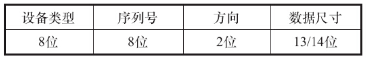

# 6.3.1　头文件、宏及设备结构体

在globalmem字符设备驱动中，应包含它要使用的头文件，并定义globalmem设备结构体及相关宏。

代码清单6.8　globalmem设备结构体和宏

```
 1#include <linux/module.h>
 2#include <linux/fs.h>
 3#include <linux/init.h>
 4#include <linux/cdev.h>
 5#include <linux/slab.h>
 6#include <linux/uaccess.h>
 7
 8#define GLOBALMEM_SIZE   0x1000
 9#define MEM_CLEAR 0x1
10#define GLOBALMEM_MAJOR 230
11
12static int globalmem_major = GLOBALMEM_MAJOR;
13module_param(globalmem_major, int, S_IRUGO);
14
15struct globalmem_dev {
16 struct cdev cdev;
17 unsigned char mem[GLOBALMEM_SIZE];
18};
19
20struct globalmem_dev *globalmem_devp;
```

从第15~18行代码可以看出，定义的globalmem_dev设备结构体包含了对应于globalmem字符设备的cdev、使用的内存mem[GLOBALMEM_SIZE]。当然，程序中并不一定要把mem[GLOBALMEM_SIZE]和cdev包含在一个设备结构体中，但这样定义的好处在于，它借用了面向对象程序设计中“封装”的思想，体现了一种良好的编程习惯。

# 6.3.2　加载与卸载设备驱动

globalmem设备驱动的模块加载和卸载函数遵循代码清单6.5的类似模板，其实现的工作与代码清单6.5完全一致，如代码清单6.9所示。

代码清单6.9　globalmem设备驱动模块的加载与卸载函数

```
 1static void globalmem_setup_cdev(struct globalmem_dev *dev, int index)
 2{
 3  int err, devno = MKDEV(globalmem_major, index);
 4
 5  cdev_init(&dev->cdev, &globalmem_fops);
 6  dev->cdev.owner = THIS_MODULE;
 7  err = cdev_add(&dev->cdev, devno, 1);
 8  if (err)
 9       printk(KERN_NOTICE "Error %d adding globalmem%d", err, index);
10}
11
12static int __init globalmem_init(void)
13{
14  int ret;
15  dev_t devno = MKDEV(globalmem_major, 0);
16
17  if (globalmem_major)
18       ret = register_chrdev_region(devno, 1, "globalmem");
19  else {
20       ret = alloc_chrdev_region(&devno, 0, 1, "globalmem");
21       globalmem_major = MAJOR(devno);
22  }
23  if (ret < 0)
24      return ret;
25
26  globalmem_devp = kzalloc(sizeof(struct globalmem_dev), GFP_KERNEL);
27  if (!globalmem_devp) {
28       ret = -ENOMEM;
29       goto fail_malloc;
30  }
31
32  globalmem_setup_cdev(globalmem_devp, 0);
33  return 0;
34
35  fail_malloc:
36  unregister_chrdev_region(devno, 1);
37  return ret;
38}
39module_init(globalmem_init);
```

第1~10行的globalmem_setup_cdev（）函数完成cdev的初始化和添加，17~22行完成了设备号的申请，第26行调用kzalloc（）申请了一份globalmem_dev结构体的内存并清0。在cdev_init（）函数中，与globalmem的cdev关联的file_operations结构体如代码清单6.10所示。

代码清单6.10　globalmem设备驱动的文件操作结构体

```
1static const struct file_operations globalmem_fops = {
2   .owner = THIS_MODULE,
3   .llseek = globalmem_llseek,
4   .read = globalmem_read,
5   .write = globalmem_write,
6   .unlocked_ioctl = globalmem_ioctl,
7   .open = globalmem_open,
8   .release = globalmem_release,
9};
```

# 6.3.3　读写函数

globalmem设备驱动的读写函数主要是让设备结构体的mem[]数组与用户空间交互数据，并随着访问的字节数变更更新文件读写偏移位置。读和写函数的实现分别如代码清单6.11和6.12所示

代码清单6.11　globalmem设备驱动的读函数

```
 1static ssize_t globalmem_read(struct file *filp, char __user * buf, size_t size,
 2              loff_t * ppos)
 3{
 4 unsigned long p = *ppos;
 5 unsigned int count = size;
 6 int ret = 0;
 7 struct globalmem_dev *dev = filp->private_data;
 8
 9 if (p >= GLOBALMEM_SIZE)
10      return 0;
11 if (count > GLOBALMEM_SIZE - p)
12     count = GLOBALMEM_SIZE - p;
13
14 if (copy_to_user(buf, dev->mem + p, count)) {
15     ret = -EFAULT;
16 } else {
17     *ppos += count;
18     ret = count;
19
20     printk(KERN_INFO "read %u bytes(s) from %lu\n", count, p);
21 }
22
23 return ret;
24}
```

*ppos是要读的位置相对于文件开头的偏移，如果该偏移大于或等于GLOBALMEM_SIZE，意味着已经到达文件末尾，所以返回0（EOF）。

代码清单6.12　globalmem设备驱动的写函数

```
 1static ssize_t globalmem_write(struct file *filp, const char __user * buf,
 2                size_t size, loff_t * ppos)
 3{
 4 unsigned long p = *ppos;
 5 unsigned int count = size;
 6 int ret = 0;
 7 struct globalmem_dev *dev = filp->private_data;
 8
 9 if (p >= GLOBALMEM_SIZE)
10     return 0;
11 if (count > GLOBALMEM_SIZE - p)
12     count = GLOBALMEM_SIZE - p;
13
14 if (copy_from_user(dev->mem + p, buf, count))
15     ret = -EFAULT;
16 else {
17     *ppos += count;
18     ret = count;
19
20     printk(KERN_INFO "written %u bytes(s) from %lu\n", count, p);
21 }
22
23 return ret;
24}
```

# 6.3.4　seek函数

seek（）函数对文件定位的起始地址可以是文件开头（SEEK_SET，0）、当前位置（SEEK_CUR，1）和文件尾（SEEK_END，2），假设globalmem支持从文件开头和当前位置的相对偏移。

在定位的时候，应该检查用户请求的合法性，若不合法，函数返回-EINVAL，合法时更新文件的当前位置并返回该位置，如代码清单6.13所示。

代码清单6.13　globalmem设备驱动的seek（）函数

```
 1static loff_t globalmem_llseek(struct file *filp, loff_t offset, int orig)
 2{
 3  loff_t ret = 0;
 4  switch (orig) {
 5  case 0: /* 从文件开头位置seek */
 6       if (offset< 0) {
 7            ret = -EINVAL;
 8            break;
 9       }
10       if ((unsigned int)offset > GLOBALMEM_SIZE) {
11            ret = -EINVAL;
12            break;
13       }
14       filp->f_pos = (unsigned int)offset;
15       ret = filp->f_pos;
16       break;
17  case 1: /* 从文件当前位置开始seek */
18       if ((filp->f_pos + offset) > GLOBALMEM_SIZE) {
19            ret = -EINVAL;
20            break;
21       }
22       if ((filp->f_pos + offset) < 0) {
23            ret = -EINVAL;
24            break;
25       }
26       filp->f_pos += offset;
27       ret = filp->f_pos;
28       break;
29  default:
30       ret = -EINVAL;
31       break;
32  }
33  return ret;
34}
```

# 6.3.5　ioctl函数

## 1.globalmem设备驱动的ioctl（）函数

globalmem设备驱动的ioctl（）函数接受MEM_CLEAR命令，这个命令会将全局内存的有效数据长度清0，对于设备不支持的命令，ioctl（）函数应该返回-EINVAL，如代码清单6.14所示。

代码清单6.14　globalmem设备驱动的I/O控制函数

```
 1static long globalmem_ioctl(struct file *filp, unsigned int cmd,
 2                unsigned long arg)
 3{
 4  struct globalmem_dev *dev = filp->private_data;
 5
 6  switch (cmd) {
 7  case MEM_CLEAR:
 8       memset(dev->mem, 0, GLOBALMEM_SIZE);
 9       printk(KERN_INFO "globalmem is set to zero\n");
10       break;
11
12  default:
13       return -EINVAL;
14  }
15
16  return 0;
17}
```

在上述程序中，MEM_CLEAR被宏定义为0x01，实际上这并不是一种值得推荐的方法，简单地对命令定义为0x0、0x1、0x2等类似值会导致不同的设备驱动拥有相同的命令号。如果设备A、B都支持0x0、0x1、0x2这样的命令，就会造成命令码的污染。因此，Linux内核推荐采用一套统一的ioctl（）命令生成方式

## 2.ioctl（）命令

Linux建议以如图6.2所示的方式定义ioctl（）的命令。



图6.2　I/O控制命令的组成

命令码的设备类型字段为一个“幻数”，可以是0~0xff的值，内核中的ioctl-number.txt给出了一些推荐的和已经被使用的“幻数”，新设备驱动定义“幻数”的时候要避免与其冲突。

命令码的序列号也是8位宽。

命令码的方向字段为2位，该字段表示数据传送的方向，可能的值是_IOC_NONE（无数据传输）、_IOC_READ（读）、_IOC_WRITE（写）和_IOC_READ|_IOC_WRITE（双向）。数据传送的方向是从应用程序的角度来看的。

命令码的数据长度字段表示涉及的用户数据的大小，这个成员的宽度依赖于体系结构，通常是13或者14位。

内核还定义了_IO（）、_IOR（）、_IOW（）和_IOWR（）这4个宏来辅助生成命令，这4个宏的通用定义如代码清单6.15所示

代码清单6.15　_IO（）、_IOR（）、_IOW（）和_IOWR（）宏定义

```
 1#define _IO(type,nr)         _IOC(_IOC_NONE,(type),(nr),0)
 2#define _IOR(type,nr,size) _IOC(_IOC_READ,(type),(nr),\
 3                                 (_IOC_TYPECHECK(size)))
 4#define _IOW(type,nr,size)  _IOC(_IOC_WRITE,(type),(nr),\
 5                                 (_IOC_TYPECHECK(size)))
 6#define _IOWR(type,nr,size) _IOC(_IOC_READ|_IOC_WRITE,(type),(nr),  \
 7                                 (_IOC_TYPECHECK(size)))
 8/* _IO、_IOR等使用的_IOC宏*/
 9#define _IOC(dir,type,nr,size) \
10     (((dir)  << _IOC_DIRSHIFT) | \
11     ((type) << _IOC_TYPESHIFT) | \
12     ((nr)   << _IOC_NRSHIFT) | \
13     ((size) << _IOC_SIZESHIFT))
```

由此可见，这几个宏的作用是根据传入的type（设备类型字段）、nr（序列号字段）、size（数据长度字段）和宏名隐含的方向字段移位组合生成命令码。

由于globalmem的MEM_CLEAR命令不涉及数据传输，所以它可以定义为：

```
#define GLOBALMEM_MAGIC 'g'
#define MEM_CLEAR _IO(GLOBALMEM_MAGIC,0)
```

## 3.预定义命令

内核中预定义了一些I/O控制命令，如果某设备驱动中包含了与预定义命令一样的命令码，这些命令会作为预定义命令被内核处理而不是被设备驱动处理，下面列举一些常用的预定义命令。

FIOCLEX：即File IOctl Close on Exec，对文件设置专用标志，通知内核当exec（）系统调用发生时自动关闭打开的文件。

FIONCLEX：即File IOctl Not Close on Exec，与FIOCLEX标志相反，清除由FIOCLEX命令设置的标志。

FIOQSIZE：获得一个文件或者目录的大小，当用于设备文件时，返回一个ENOTTY错误

FIONBIO：即File IOctl Non-Blocking I/O，这个调用修改在filp->f_flags中的O_NONBLOCK标志。

FIOCLEX、FIONCLEX、FIOQSIZE和FIONBIO这些宏定义在内核的include/uapi/asm-generic/ioctls.h文件中。

# 6.3.6　使用文件私有数据

6.3.1~6.3.5节给出的代码完整地实现了预期的globalmem雏形，代码清单6.11的第7行，代码清单6.12的第7行，代码清单6.14的第4行，都使用了struct globalmem_dev*dev=filp->private_data获取globalmem_dev的实例指针。实际上，大多数Linux驱动遵循一个“潜规则”，那就是将文件的私有数据private_data指向设备结构体，再用read（）、write（）、ioctl（）、llseek（）等函数通过private_data访问设备结构体。私有数据的概念在Linux驱动的各个子系统中广泛存在，实际上体现了Linux的面向对象的设计思想。对于globalmem驱动而言，私有数据的设置是在globalmem_open（）中完成的，如代码清单6.16所示。

代码清单6.16　globalmem设备驱动的open（）函数

```
 1static int globalmem_open(struct inode *inode, struct file *filp)
 2{
 3   filp->private_data = globalmem_devp;
 4   return 0;
 5}
```

为了让读者建立字符设备驱动的全貌视图，代码清单6.17列出了完整的使用文件私有数据的globalmem的设备驱动，本程序位于本书配套虚拟机代码的/kernel/drivers/globalmem/ch6目录下。

代码清单6.17　使用文件私有数据的globalmem的设备驱动

```
  1/*
  2 * a simple char device driver: globalmem without mutex
  3 *
  4 * Copyright (C) 2014 Barry Song  (baohua@kernel.org)
  5 *
  6 * Licensed under GPLv2 or later.
  7 */
  8
  9#include <linux/module.h>
 10#include <linux/fs.h>
 11#include <linux/init.h>
 12#include <linux/cdev.h>
 13#include <linux/slab.h>
 14#include <linux/uaccess.h>
 15
 16#define GLOBALMEM_SIZE   0x1000
 17#define MEM_CLEAR 0x1
 18#define GLOBALMEM_MAJOR 230
 19
 20static int globalmem_major = GLOBALMEM_MAJOR;
 21module_param(globalmem_major, int, S_IRUGO);
 22
 23struct globalmem_dev {
 24   struct cdev cdev;
 25   unsigned char mem[GLOBALMEM_SIZE];
 26};
 27
 28struct globalmem_dev *globalmem_devp;
 29
 30static int globalmem_open(struct inode *inode, struct file *filp)
 31{
 32   filp->private_data = globalmem_devp;
 33   return 0;
 34}
 35
 36static int globalmem_release(struct inode *inode, struct file *filp)
 37{
 38   return 0;
 39}
 40
 41static long globalmem_ioctl(struct file *filp, unsigned int cmd,
 42               unsigned long arg)
 43{
 44 struct globalmem_dev *dev = filp->private_data;
 45
 46 switch (cmd) {
 47 case MEM_CLEAR:
 48      memset(dev->mem, 0, GLOBALMEM_SIZE);
 49      printk(KERN_INFO "globalmem is set to zero\n");
 50      break;
 51
 52 default:
 53      return -EINVAL;
 54 }
 55
 56 return 0;
 57}
 58
 59static ssize_t globalmem_read(struct file *filp, char __user * buf, size_t size,
 60                 loff_t * ppos)
 61{
 62 unsigned long p = *ppos;
 63 unsigned int count = size;
 64 int ret = 0;
 65 struct globalmem_dev *dev = filp->private_data;
 66
 67 if (p >= GLOBALMEM_SIZE)
 68      return 0;
 69 if (count > GLOBALMEM_SIZE - p)
 70      count = GLOBALMEM_SIZE - p;
 71
 72 if (copy_to_user(buf, dev->mem + p, count)) {
 73      ret = -EFAULT;
 74 } else {
 75      *ppos += count;
 76      ret = count;
 77
 78      printk(KERN_INFO "read %u bytes(s) from %lu\n", count, p);
 79 }
 80
 81 return ret;
 82}
 83
 84static ssize_t globalmem_write(struct file *filp, const char __user * buf,
 85                  size_t size, loff_t * ppos)
 86{
 87 unsigned long p = *ppos;
 88 unsigned int count = size;
 89 int ret = 0;
 90 struct globalmem_dev *dev = filp->private_data;
 91
 92 if (p >= GLOBALMEM_SIZE)
 93      return 0;
 94 if (count > GLOBALMEM_SIZE - p)
 95      count = GLOBALMEM_SIZE - p;
 96
 97 if (copy_from_user(dev->mem + p, buf, count))
 98      ret = -EFAULT;
 99 else {
100      *ppos += count;
101      ret = count;
102
103      printk(KERN_INFO "written %u bytes(s) from %lu\n", count, p);
104 }
105
106 return ret;
107}
108
109static loff_t globalmem_llseek(struct file *filp, loff_t offset, int orig)
110{
111 loff_t ret = 0;
112 switch (orig) {
113 case 0:
114      if (offset < 0) {
115           ret = -EINVAL;
116           break;
117      }
118      if ((unsigned int)offset > GLOBALMEM_SIZE) {
119           ret = -EINVAL;
120           break;
121      }
122      filp->f_pos = (unsigned int)offset;
123      ret = filp->f_pos;
124      break;
125 case 1:
126      if ((filp->f_pos + offset) > GLOBALMEM_SIZE) {
127           ret = -EINVAL;
128           break;
129      }
130      if ((filp->f_pos + offset) < 0) {
131           ret = -EINVAL;
132           break;
133      }
134      filp->f_pos += offset;
135      ret = filp->f_pos;
136      break;
137 default:
138      ret = -EINVAL;
139      break;
140 }
141 return ret;
142}
143
144static const struct file_operations globalmem_fops = {
145 .owner = THIS_MODULE,
146 .llseek = globalmem_llseek,
147 .read = globalmem_read,
148 .write = globalmem_write,
149 .unlocked_ioctl = globalmem_ioctl,
150 .open = globalmem_open,
151 .release = globalmem_release,
152};
153
154static void globalmem_setup_cdev(struct globalmem_dev *dev, int index)
155{
156 int err, devno = MKDEV(globalmem_major, index);
157
158 cdev_init(&dev->cdev, &globalmem_fops);
159 dev->cdev.owner = THIS_MODULE;
160 err = cdev_add(&dev->cdev, devno, 1);
161 if (err)
162      printk(KERN_NOTICE "Error %d adding globalmem%d", err, index);
163}
164
165static int __init globalmem_init(void)
166{
167 int ret;
168 dev_t devno = MKDEV(globalmem_major, 0);
169
170 if (globalmem_major)
171      ret = register_chrdev_region(devno, 1, "globalmem");
172 else {
173      ret = alloc_chrdev_region(&devno, 0, 1, "globalmem");
174      globalmem_major = MAJOR(devno);
175 }
176 if (ret < 0)
177      return ret;
178
179 globalmem_devp = kzalloc(sizeof(struct globalmem_dev), GFP_KERNEL);
180 if (!globalmem_devp) {
181      ret = -ENOMEM;
182      goto fail_malloc;
183 }
184
185 globalmem_setup_cdev(globalmem_devp, 0);
186 return 0;
187
188 fail_malloc:
189 unregister_chrdev_region(devno, 1);
190 return ret;
191}
192module_init(globalmem_init);
193
194static void __exit globalmem_exit(void)
195{
196 cdev_del(&globalmem_devp->cdev);
197 kfree(globalmem_devp);
198 unregister_chrdev_region(MKDEV(globalmem_major, 0), 1);
199}
200module_exit(globalmem_exit);
201
202MODULE_AUTHOR("Barry Song <baohua@kernel.org>");
203MODULE_LICENSE("GPL v2"); 
```

如果globalmem不只包括一个设备，而是同时包括两个或两个以上的设备，采用private_data的优势就会集中显现出来。在不对代码清单6.17中的globalmem_read（）、globalmem_write（）、globalmem_ioctl（）等重要函数及globalmem_fops结构体等数据结构进行任何修改的前提下，只是简单地修改globalmem_init（）、globalmem_exit（）和globalmem_open（），就可以轻松地让globalmem驱动中包含N个同样的设备（次设备号分为0~N），如代码清单6.18列出了支持多个实例的globalmem和支持单实例的globalmem驱动的差异部分。

代码清单6.18　支持N个globalmem设备的globalmem驱动

```
 1#define GLOBALMEM_SIZE   0x1000
 2#define MEM_CLEAR 0x1
 3#define GLOBALMEM_MAJOR 230
 4#define DEVICE_NUM   10
 5
 6static int globalmem_open(struct inode *inode, struct file *filp)
 7{
 8  struct globalmem_dev *dev = container_of(inode->i_cdev,
 9                struct globalmem_dev, cdev);
10  filp->private_data = dev;
11  return 0;
12}
13
14static int __init globalmem_init(void)
15{
16  int ret;
17  int i;
18  dev_t devno = MKDEV(globalmem_major, 0);
19
20  if (globalmem_major)
21       ret = register_chrdev_region(devno, DEVICE_NUM, "globalmem");
22  else {
23       ret = alloc_chrdev_region(&devno, 0, DEVICE_NUM, "globalmem");
24       globalmem_major = MAJOR(devno);
25  }
26  if (ret < 0)
27       return ret;
28
29  globalmem_devp = kzalloc(sizeof(struct globalmem_dev) * DEVICE_NUM, GFP_KERNEL);
30  if (!globalmem_devp) {
31       ret = -ENOMEM;
32       goto fail_malloc;
33 }
34
35  for (i = 0; i < DEVICE_NUM; i++)
36       globalmem_setup_cdev(globalmem_devp + i, i);
37
38  return 0;
39
40fail_malloc:
41  unregister_chrdev_region(devno, DEVICE_NUM);
42  return ret;
43}
44module_init(globalmem_init);
45
46static void __exit globalmem_exit(void)
47{
48  int i;
49  for (i = 0; i < DEVICE_NUM; i++)
50       cdev_del(&(globalmem_devp + i)->cdev);
51  kfree(globalmem_devp);
52  unregister_chrdev_region(MKDEV(globalmem_major, 0), DEVICE_NUM);
53}
54module_exit(globalmem_exit);
```

代码清单6.18第8行调用的container_of（）的作用是通过结构体成员的指针找到对应结构体的指针，这个技巧在Linux内核编程中十分常用。在container_of（inode->i_cdev，struct globalmem_dev，cdev）语句中，传给container_of（）的第1个参数是结构体成员的指针，第2个参数为整个结构体的类型，第3个参数为传入的第1个参数即结构体成员的类型，container_of（）返回值为整个结构体的指针。

从代码清单6.18可以看出，我们仅仅进行了极其少量的更改就使得globalmem驱动支持多个实例，这一点可以看出私有数据的魔力。完整的代码位于kernel/drivers/globalmem/ch6/multi_globalmem.c下。高亮globalmem.c和multi_globalmem.c（以“-”和“+”开头的代码）的区别如下：

```
@@ -29,7 +30,9 @@ struct globalmem_dev *globalmem_devp;
 static int globalmem_open(struct inode *inode, struct file *filp)
 {
-    filp->private_data = globalmem_devp;
+    struct globalmem_dev *dev = container_of(inode->i_cdev,
+                    struct globalmem_dev, cdev);
+    filp->private_data = dev;
     return 0;
 }
@@ -165,37 +168,42 @@ static void globalmem_setup_cdev(struct globalmem_dev *dev,
    int index)
 static int __init globalmem_init(void)
 {
     int ret;
+    int i;
     dev_t devno = MKDEV(globalmem_major, 0);
     if (globalmem_major)
-         ret = register_chrdev_region(devno, 1, "globalmem");
+         ret = register_chrdev_region(devno, DEVICE_NUM, "globalmem");
     else {
-         ret = alloc_chrdev_region(&devno, 0, 1, "globalmem");
+         ret = alloc_chrdev_region(&devno, 0, DEVICE_NUM, "globalmem");
          globalmem_major = MAJOR(devno);
     }
     if (ret < 0)
          return ret;
-    globalmem_devp = kzalloc(sizeof(struct globalmem_dev), GFP_KERNEL);
+    globalmem_devp = kzalloc(sizeof(struct globalmem_dev) * DEVICE_NUM, GFP_KERNEL);
     if (!globalmem_devp) {
          ret = -ENOMEM;
          goto fail_malloc;
     }
-    globalmem_setup_cdev(globalmem_devp, 0);
+    for (i = 0; i < DEVICE_NUM; i++)
+         globalmem_setup_cdev(globalmem_devp + i, i);
+
     return 0;
- fail_malloc:
-    unregister_chrdev_region(devno, 1);
+fail_malloc:
+    unregister_chrdev_region(devno, DEVICE_NUM);
     return ret;
 }
 module_init(globalmem_init);
 static void __exit globalmem_exit(void)
 {
-    cdev_del(&globalmem_devp->cdev);
+    int i;
+    for (i = 0; i < DEVICE_NUM; i++)
+         cdev_del(&(globalmem_devp + i)->cdev);
     kfree(globalmem_devp);
-    unregister_chrdev_region(MKDEV(globalmem_major, 0), 1);
+    unregister_chrdev_region(MKDEV(globalmem_major, 0), DEVICE_NUM);
 }
 module_exit(globalmem_exit);
```

# 6.4　globalmem驱动在用户空间中的验证

在globalmem的源代码目录通过“make”命令编译globalmem的驱动，得到globalmem.ko文件。运行

```
baohua@baohua-VirtualBox:~/develop/training/kernel/drivers/globalmem/ch6$ sudo
    insmod globalmem.ko
```

命令加载模块，通过“lnsmod”命令，发现globalmem模块已被加载。再通过“cat/proc/devices”命令查看，发现多出了主设备号为230的“globalmem”字符设备驱动：

```
$ cat /proc/devices
Character devices:
  1mem
  4/dev/vc/0
  4tty
  4ttyS
  5/dev/tty
  5/dev/console
  5/dev/ptmx
  7vcs
 10misc
 13input
 14sound
 21sg
 29fb
116alsa
128ptm
136pts
180usb
189usb_device
202cpu/msr
203cpu/cpuid
226drm
230globalmem
249hidraw
250usbmon
251bsg
252ptp
253pps
254rtc
```

接下来，通过命令

```
#mknod /dev/globalmem c 230 0
```

创建“/dev/globalmem”设备节点，并通过“echo'hello world'>/dev/globalmem”命令和“cat/dev/globalmem”命令分别验证设备的写和读，结果证明“hello world”字符串被正确地写入了globalmem字符设备：

```
# echo "hello world" > /dev/globalmem
# cat /dev/globalmem
hello world
```

如果启用了sysfs文件系统，将发现多出了/sys/module/globalmem目录，该目录下的树形结构为：

```
.├──
 coresize├──
 holders├──
 initsize├──
 initstate├──
 notes├──
 parameters│
   └──
globalmem_major├──
 refcnt├──
 sections│
   └──
 __param├──
 taint└──
 uevent
```

refcnt记录了globalmem模块的引用计数，sections下包含的几个文件则给出了globalmem所包含的BSS、数据段和代码段等的地址及其他信息。

对于代码清单6.18给出的支持N个globalmem设备的驱动，在加载模块后需创建多个设备节点，如运行mknod/dev/globalmem0c 2300使得/dev/globalmem0对应主设备号为globalmem_major、次设备号为0的设备，运行mknod/dev/globalmem1c 2301使得/dev/globalmem1对应主设备号为globalmem_major、次设备号为1的设备。分别读写/dev/globalmem0和/dev/globalmem1，发现都读写到了正确的对应的设备。