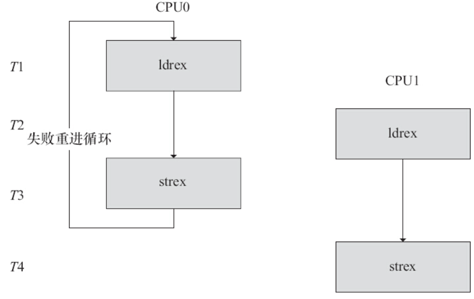

原子操作可以保证对一个整型数据的修改是排他性的。Linux内核提供了一系列函数来实现内核中的原子操作，这些函数又分为两类，分别针对位和整型变量进行原子操作。位和整型变量的原子操作都依赖于底层CPU的原子操作，因此所有这些函数都与CPU架构密切相关。对于ARM处理器而言，底层使用LDREX和STREX指令，比如atomic_inc（）底层的实现会调用到atomic_add（），其代码如下：

```
static inline void atomic_add(int i, atomic_t *v)
{
       unsigned long tmp;
       int result;
       prefetchw(&v->counter);
       __asm__ __volatile__("@ atomic_add\n"
"1:    ldrex   %0, [%3]\n"
"      add     %0, %0, %4\n"
"      strex   %1, %0, [%3]\n"
"      teq     %1, #0\n"
"      bne     1b"
       : "=&r" (result), "=&r" (tmp), "+Qo" (v->counter)
       : "r" (&v->counter), "Ir" (i)
       : "cc");
}
```

ldrex指令跟strex配对使用，可以让总线监控ldrex到strex之间有无其他的实体存取该地址，如果有并发的访问，执行strex指令时，第一个寄存器的值被设置为1（Non-Exclusive Access）并且存储的行为也不成功；如果没有并发的存取，strex在第一个寄存器里设置0（Exclusive Access）并且存储的行为也是成功的。本例中，如果两个并发实体同时调用ldrex+strex，如图7.6所示，在T3时间点上，CPU0的strex会执行失败，在T4时间点上CPU1的strex会执行成功。所以CPU0和CPU1之间只有CPU1执行成功了，执行strex失败的CPU0的“teq%1，#0”判断语句不会成立，于是失败的CPU0通过“bne 1b”再次进入ldrex。ldrex和strex的这一过程不仅适用于多核之间的并发，也适用于同一个核内部并发的情况。



图7.6　ldrex和strex指令

# 7.4.1　整型原子操作

1.设置原子变量的值

```
void atomic_set(atomic_t *v, int i);    /* 设置原子变量的值为i */
atomic_t v = ATOMIC_INIT(0);            /* 定义原子变量v并初始化为0 */
```

2.获取原子变量的值

```
atomic_read(atomic_t *v);        /* 返回原子变量的值*/
```

3.原子变量加/减

```
void atomic_add(int i, atomic_t *v);      /* 原子变量增加i */
void atomic_sub(int i, atomic_t *v);      /* 原子变量减少i */
```

4.原子变量自增/自减

```
void atomic_inc(atomic_t *v);     /* 原子变量增加1 */
void atomic_dec(atomic_t *v);     /* 原子变量减少1 */
```

5.操作并测试

```
int atomic_inc_and_test(atomic_t *v);
int atomic_dec_and_test(atomic_t *v);
int atomic_sub_and_test(int i, atomic_t *v);
```

上述操作对原子变量执行自增、自减和减操作后（注意没有加），测试其是否为0，为0返回true，否则返回false。

6.操作并返回

```
int atomic_add_return(int i, atomic_t *v);
int atomic_sub_return(int i, atomic_t *v);
int atomic_inc_return(atomic_t *v);
int atomic_dec_return(atomic_t *v);
```

上述操作对原子变量进行加/减和自增/自减操作，并返回新的值。

# 7.4.2　位原子操作

1.设置位

```
void set_bit(nr, void *addr);
```

上述操作设置addr地址的第nr位，所谓设置位即是将位写为1。

2.清除位

```
void clear_bit(nr, void *addr);
```

上述操作清除addr地址的第nr位，所谓清除位即是将位写为0。

3.改变位

```
void change_bit(nr, void *addr);
```

上述操作对addr地址的第nr位进行反置。

4.测试位

```
test_bit(nr, void *addr);
```

上述操作返回addr地址的第nr位。

5.测试并操作位

```
int test_and_set_bit(nr, void *addr);
int test_and_clear_bit(nr, void *addr);
int test_and_change_bit(nr, void *addr);
```

上述test_and_xxx_bit（nr，void*addr）操作等同于执行test_bit（nr，void*addr）后再执行xxx_bit（nr，void*addr）。

代码清单7.2给出了原子变量的使用例子，它使得设备最多只能被一个进程打开。

```
 1static atomic_t xxx_available = ATOMIC_INIT(1); /* 定义原子变量*/
 2
 3static int xxx_open(struct inode *inode, struct file *filp)
 4{
 5  ...
 6  if (!atomic_dec_and_test(&xxx_available))  {
 7      atomic_inc(&xxx_available);
 8      return  - EBUSY;                /* 已经打开*/
 9  }
10  ...
11  return 0;                           /* 成功 */
12}
13
14static int xxx_release(struct inode *inode, struct file *filp)
15{
16  atomic_inc(&xxx_available);         /* 释放设备*/
17  return 0;
18}
```

