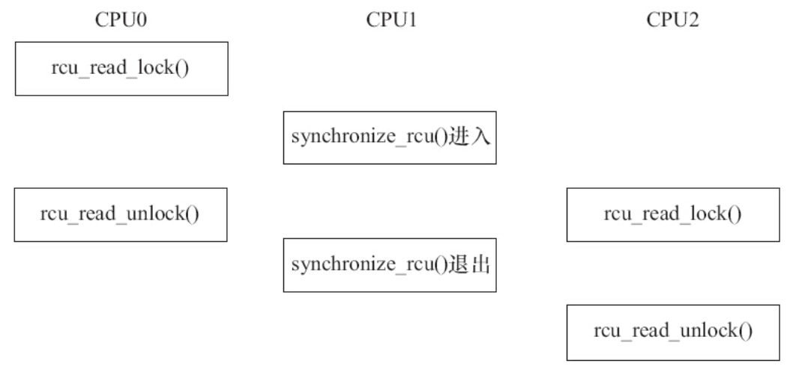

# 7.5.1　自旋锁的使用

自旋锁（Spin Lock）是一种典型的对临界资源进行互斥访问的手段，其名称来源于它的工作方式。为了获得一个自旋锁，在某CPU上运行的代码需先执行一个原子操作，该操作测试并设置（Test-And-Set）某个内存变量。由于它是原子操作，所以在该操作完成之前其他执行单元不可能访问这个内存变量。如果测试结果表明锁已经空闲，则程序获得这个自旋锁并继续执行；如果测试结果表明锁仍被占用，程序将在一个小的循环内重复这个“测试并设置”操作，即进行所谓的“自旋”，通俗地说就是“在原地打转”，如图7.7所示。当自旋锁的持有者通过重置该变量释放这个自旋锁后，某个等待的“测试并设置”操作向其调用者报告锁已释放。

理解自旋锁最简单的方法是把它作为一个变量看待，该变量把一个临界区标记为“我当前在运行，请稍等一会”或者标记为“我当前不在运行，可以被使用”。如果A执行单元首先进入例程，它将持有自旋锁；当B执行单元试图进入同一个例程时，将获知自旋锁已被持有，需等到A执行单元释放后才能进入


图7.7　自旋

在ARM体系结构下，自旋锁的实现借用了ldrex指令、strex指令、ARM处理器内存屏障指令dmb和dsb、wfe指令和sev指令，这类似于代码清单7.1的逻辑。可以说既要保证排他性，也要处理好内存屏障。

Linux中与自旋锁相关的操作主要有以下4种。

1.定义自旋锁

```
spinlock_t lock;
```

2.初始化自旋锁

```
spin_lock_init(lock)
```

该宏用于动态初始化自旋锁lock。

3.获得自旋锁

```
spin_lock(lock)
```

该宏用于获得自旋锁lock，如果能够立即获得锁，它就马上返回，否则，它将在那里自旋，直到该自旋锁的保持者释放。

```
spin_trylock(lock)
```

该宏尝试获得自旋锁lock，如果能立即获得锁，它获得锁并返回true，否则立即返回false，实际上不再“在原地打转”。

4.释放自旋锁

```
spin_unlock(lock)
```

该宏释放自旋锁lock，它与spin_trylock或spin_lock配对使用。

自旋锁一般这样被使用：

```
/* 定义一个自旋锁*/
spinlock_t lock;
spin_lock_init(&lock);
spin_lock (&lock) ;    /* 获取自旋锁，保护临界区*/
. . ./* 临界区*/
spin_unlock (&lock) ;  /* 解锁*/
```

自旋锁主要针对SMP或单CPU但内核可抢占的情况，对于单CPU和内核不支持抢占的系统，自旋锁退化为空操作。在单CPU和内核可抢占的系统中，自旋锁持有期间中内核的抢占将被禁止。由于内核可抢占的单CPU系统的行为实际上很类似于SMP系统，因此，在这样的单CPU系统中使用自旋锁仍十分必要。另外，在多核SMP的情况下，任何一个核拿到了自旋锁，该核上的抢占调度也暂时禁止了，但是没有禁止另外一个核的抢占调度。

尽管用了自旋锁可以保证临界区不受别的CPU和本CPU内的抢占进程打扰，但是得到锁的代码路径在执行临界区的时候，还可能受到中断和底半部（BH，稍后的章节会介绍）的影响。为了防止这种影响，就需要用到自旋锁的衍生。spin_lock（）/spin_unlock（）是自旋锁机制的基础，它们和关中断local_irq_disable（）/开中断local_irq_enable（）、关底半部local_bh_disable（）/开底半部local_bh_enable（）、关中断并保存状态字local_irq_save（）/开中断并恢复状态字local_irq_restore（）结合就形成了整套自旋锁机制，关系如下：

```
spin_lock_irq() = spin_lock() + local_irq_disable()
spin_unlock_irq() = spin_unlock() + local_irq_enable()
spin_lock_irqsave() = spin_lock() + local_irq_save()
spin_unlock_irqrestore() = spin_unlock() + local_irq_restore()
spin_lock_bh() = spin_lock() + local_bh_disable()
spin_unlock_bh() = spin_unlock() + local_bh_enable()
```

spin_lock_irq（）、spin_lock_irqsave（）、spin_lock_bh（）类似函数会为自旋锁的使用系好“安全带”以避免突如其来的中断驶入对系统造成的伤害。

在多核编程的时候，如果进程和中断可能访问同一片临界资源，我们一般需要在进程上下文中调用spin_lock_irqsave（）/spin_unlock_irqrestore（），在中断上下文中调用spin_lock（）/spin_unlock（），如图7.8所示。这样，在CPU0上，无论是进程上下文，还是中断上下文获得了自旋锁，此后，如果CPU1无论是进程上下文，还是中断上下文，想获得同一自旋锁，都必须忙等待，这避免一切核间并发的可能性。同时，由于每个核的进程上下文持有锁的时候用的是spin_lock_irqsave（），所以该核上的中断是不可能进入的，这避免了核内并发的可能性。


图7.8　自旋锁的使用实例

驱动工程师应谨慎使用自旋锁，而且在使用中还要特别注意如下几个问题。

1）自旋锁实际上是忙等锁，当锁不可用时，CPU一直循环执行“测试并设置”该锁直到可用而取得该锁，CPU在等待自旋锁时不做任何有用的工作，仅仅是等待。因此，只有在占用锁的时间极短的情况下，使用自旋锁才是合理的。当临界区很大，或有共享设备的时候，需要较长时间占用锁，使用自旋锁会降低系统的性能。

2）自旋锁可能导致系统死锁。引发这个问题最常见的情况是递归使用一个自旋锁，即如果一个已经拥有某个自旋锁的CPU想第二次获得这个自旋锁，则该CPU将死锁。

3）在自旋锁锁定期间不能调用可能引起进程调度的函数。如果进程获得自旋锁之后再阻塞，如调用copy_from_user（）、copy_to_user（）、kmalloc（）和msleep（）等函数，则可能导致内核的崩溃。

4）在单核情况下编程的时候，也应该认为自己的CPU是多核的，驱动特别强调跨平台的概念。比如，在单CPU的情况下，若中断和进程可能访问同一临界区，进程里调用spin_lock_irqsave（）是安全的，在中断里其实不调用spin_lock（）也没有问题，因为spin_lock_irqsave（）可以保证这个CPU的中断服务程序不可能执行。但是，若CPU变成多核，spin_lock_irqsave（）不能屏蔽另外一个核的中断，所以另外一个核就可能造成并发问题。因此，无论如何，我们在中断服务程序里也应该调用spin_lock（）。

代码清单7.3给出了自旋锁的使用例子，它被用于实现使得设备只能被最多1个进程打开，功能和代码清单与7.2类似。

```
 1 int xxx_count = 0;/* 定义文件打开次数计数*/
 2
 3 static int xxx_open(struct inode *inode, struct file *filp)
 4 {
 5   ...
 6   spinlock(&xxx_lock);
 7   if (xxx_count) {/* 已经打开*/
 8       spin_unlock(&xxx_lock);
 9       return  -EBUSY;
10   }
11   xxx_count++;/* 增加使用计数*/
12   spin_unlock(&xxx_lock);
13   ...
14   return 0;/* 成功*/
15}
16
17static int xxx_release(struct inode *inode, struct file *filp)
18{
19   ...
20   spinlock(&xxx_lock);
21   xxx_count--;/* 减少使用计数*/
22   spin_unlock(&xxx_lock);
23
24   return 0;
25}
```

# 7.5.2　读写自旋锁

自旋锁不关心锁定的临界区究竟在进行什么操作，不管是读还是写，它都一视同仁。即便多个执行单元同时读取临界资源也会被锁住。实际上，对共享资源并发访问时，多个执行单元同时读取它是不会有问题的，自旋锁的衍生锁读写自旋锁（rwlock）可允许读的并发。读写自旋锁是一种比自旋锁粒度更小的锁机制，它保留了“自旋”的概念，但是在写操作方面，只能最多有1个写进程，在读操作方面，同时可以有多个读执行单元。当然，读和写也不能同时进行。

读写自旋锁涉及的操作如下。

1.定义和初始化读写自旋锁

```
rwlock_t my_rwlock;
rwlock_init(&my_rwlock);       /* 动态初始化 */
```

2.读锁定

```
void read_lock(rwlock_t *lock);
void read_lock_irqsave(rwlock_t *lock, unsigned long flags);
void read_lock_irq(rwlock_t *lock);
void read_lock_bh(rwlock_t *lock);
```

3.读解锁

```
void read_unlock(rwlock_t *lock);
void read_unlock_irqrestore(rwlock_t *lock, unsigned long flags);
void read_unlock_irq(rwlock_t *lock);
void read_unlock_bh(rwlock_t *lock);
```

在对共享资源进行读取之前，应该先调用读锁定函数，完成之后应调用读解锁函数。

read_lock_irqsave（）、read_lock_irq（）和read_lock_bh（）也分别是read_lock（）分别与local_irq_save（）、local_irq_disable（）和local_bh_disable（）的组合，读解锁函数read_unlock_irqrestore（）、read_unlock_irq（）、read_unlock_bh（）的情况与此类似。

4.写锁定

```
void write_lock(rwlock_t *lock);
void write_lock_irqsave(rwlock_t *lock, unsigned long flags);
void write_lock_irq(rwlock_t *lock);
void write_lock_bh(rwlock_t *lock);
int write_trylock(rwlock_t *lock);
```

5.写解锁

```
void write_unlock(rwlock_t *lock);
void write_unlock_irqrestore(rwlock_t *lock, unsigned long flags);
void write_unlock_irq(rwlock_t *lock);
void write_unlock_bh(rwlock_t *lock);
```

write_lock_irqsave（）、write_lock_irq（）、write_lock_bh（）分别是write_lock（）与local_irq_save（）、local_irq_disable（）和local_bh_disable（）的组合，写解锁函数write_unlock_irqrestore（）、write_unlock_irq（）、write_unlock_bh（）的情况与此类似。

在对共享资源进行写之前，应该先调用写锁定函数，完成之后应调用写解锁函数。和spin_trylock（）一样，write_trylock（）也只是尝试获取读写自旋锁，不管成功失败，都会立即返回。

读写自旋锁一般这样被使用：

```
rwlock_t lock;                  /* 定义rwlock */
rwlock_init(&lock);             /* 初始化rwlock */
/* 读时获取锁*/
read_lock(&lock);
...                             /* 临界资源 */
read_unlock(&lock);
/* 写时获取锁*/
write_lock_irqsave(&lock, flags);
...                             /* 临界资源*/
write_unlock_irqrestore(&lock, flags);
```

# 7.5.3　顺序锁

顺序锁（seqlock）是对读写锁的一种优化，若使用顺序锁，读执行单元不会被写执行单元阻塞，也就是说，读执行单元在写执行单元对被顺序锁保护的共享资源进行写操作时仍然可以继续读，而不必等待写执行单元完成写操作，写执行单元也不需要等待所有读执行单元完成读操作才去进行写操作。但是，写执行单元与写执行单元之间仍然是互斥的，即如果有写执行单元在进行写操作，其他写执行单元必须自旋在那里，直到写执行单元释放了顺序锁。

对于顺序锁而言，尽管读写之间不互相排斥，但是如果读执行单元在读操作期间，写执行单元已经发生了写操作，那么，读执行单元必须重新读取数据，以便确保得到的数据是完整的。所以，在这种情况下，读端可能反复读多次同样的区域才能读到有效的数据。

在Linux内核中，写执行单元涉及的顺序锁操作如下。

1.获得顺序锁

```
void write_seqlock(seqlock_t *sl);
int write_tryseqlock(seqlock_t *sl);
write_seqlock_irqsave(lock, flags)
write_seqlock_irq(lock)
write_seqlock_bh(lock)
```

其中，

```
write_seqlock_irqsave() = loal_irq_save() + write_seqlock()
write_seqlock_irq() = local_irq_disable() + write_seqlock()
write_seqlock_bh() = local_bh_disable() + write_seqlock()
```

2.释放顺序锁

```
void write_sequnlock(seqlock_t *sl);
write_sequnlock_irqrestore(lock, flags)
write_sequnlock_irq(lock)
write_sequnlock_bh(lock)
```

其中，

```
write_sequnlock_irqrestore() = write_sequnlock() + local_irq_restore()
write_sequnlock_irq() = write_sequnlock() + local_irq_enable()
write_sequnlock_bh() = write_sequnlock() + local_bh_enable()
```

写执行单元使用顺序锁的模式如下：

```
write_seqlock(&seqlock_a);
.../* 写操作代码块*/
write_sequnlock(&seqlock_a);
```

因此，对写执行单元而言，它的使用与自旋锁相同。

读执行单元涉及的顺序锁操作如下。

1.读开始

```
unsigned read_seqbegin(const seqlock_t *sl);
read_seqbegin_irqsave(lock, flags)
```

读执行单元在对被顺序锁s1保护的共享资源进行访问前需要调用该函数，该函数返回顺序锁s1的当前顺序号。其中，

```
read_seqbegin_irqsave() = local_irq_save() + read_seqbegin()
```

2.重读

```
int read_seqretry(const seqlock_t *sl, unsigned iv);
read_seqretry_irqrestore(lock, iv, flags)
```

读执行单元在访问完被顺序锁s1保护的共享资源后需要调用该函数来检查，在读访问期间是否有写操作。如果有写操作，读执行单元就需要重新进行读操作。其中，

```
read_seqretry_irqrestore() = read_seqretry() + local_irq_restore()
```

读执行单元使用顺序锁的模式如下：

```
do {
    seqnum = read_seqbegin(&seqlock_a);
    /* 读操作代码块*/
    ...
} while (read_seqretry(&seqlock_a, seqnum));
```

# 7.5.4　读-复制-更新

RCU（Read-Copy-Update，读-复制-更新），它是基于其原理命名的。RCU并不是新的锁机制，早在20世纪80年代就有了这种机制，而在Linux中是在开发内核2.5.43时引入该技术的，并正式包含在2.6内核中。

Linux社区关于RCU的经典文档位于https://www.kernel.org/doc/ols/2001/read-copy.pdf ，Linux内核源代码Documentation/RCU/也包含了RCU的一些讲解。

不同于自旋锁，使用RCU的读端没有锁、内存屏障、原子指令类的开销，几乎可以认为是直接读（只是简单地标明读开始和读结束），而RCU的写执行单元在访问它的共享资源前首先复制一个副本，然后对副本进行修改，最后使用一个回调机制在适当的时机把指向原来数据的指针重新指向新的被修改的数据，这个时机就是所有引用该数据的CPU都退出对共享数据读操作的时候。等待适当时机的这一时期称为宽限期（Grace Period）。

比如，有下面的一个由struct foo结构体组成的链表：

```
struct foo {
  struct list_head list;
  int a;
  int b;
  int c;
 };
```

假设进程A要修改链表中某个节点N的成员a、b。自旋锁的思路是排他性地访问这个链表，等所有其他持有自旋锁的进程或者中断把自旋锁释放后，进程A再拿到自旋锁访问链表并找到N节点，之后修改它的a、b两个成员，完成后解锁。而RCU的思路则不同，它直接制造一个新的节点M，把N的内容复制给M，之后在M上修改a、b，并用M来代替N原本在链表的位置。之后进程A等待在链表前期已经存在的所有读端结束后（即宽限期，通过下文说的synchronize_rcu（）API完成），再释放原来的N。用代码来描述这个逻辑就是：

```
struct foo {
  struct list_head list;
  int a;
  int b;
  int c;
};
LIST_HEAD(head);
/* . . . */
p = search(head, key);
if (p == NULL) {
  /* Take appropriate action, unlock, and return. */
}
q = kmalloc(sizeof(*p), GFP_KERNEL);
*q = *p;
q->b = 2;
q->c = 3;
list_replace_rcu(&p->list, &q->list);
synchronize_rcu();
kfree(p);
```

RCU可以看作读写锁的高性能版本，相比读写锁，RCU的优点在于既允许多个读执行单元同时访问被保护的数据，又允许多个读执行单元和多个写执行单元同时访问被保护的数据。但是，RCU不能替代读写锁，因为如果写比较多时，对读执行单元的性能提高不能弥补写执行单元同步导致的损失。因为使用RCU时，写执行单元之间的同步开销会比较大，它需要延迟数据结构的释放，复制被修改的数据结构，它也必须使用某种锁机制来同步并发的其他写执行单元的修改操作。

Linux中提供的RCU操作包括如下4种。

1.读锁定

```
rcu_read_lock()
rcu_read_lock_bh()
```

2.读解锁

```
rcu_read_unlock()
rcu_read_unlock_bh()
```

使用RCU进行读的模式如下：

```
rcu_read_lock()
.../* 读临界区*/
rcu_read_unlock()
```

3.同步RCU

```
synchronize_rcu()
```

该函数由RCU写执行单元调用，它将阻塞写执行单元，直到当前CPU上所有的已经存在（Ongoing）的读执行单元完成读临界区，写执行单元才可以继续下一步操作。synchronize_rcu（）并不需要等待后续（Subsequent）读临界区的完成，如图7.9所示。



图7.9　synchronize_rcu

探测所有的rcu_read_lock（）被rcu_read_unlock（）结束的过程很类似Java语言垃圾回收的工作。

4.挂接回调

```
void call_rcu(struct rcu_head *head,
                    void (*func)(struct rcu_head *rcu));
```

函数call_rcu（）也由RCU写执行单元调用，与synchronize_rcu（）不同的是，它不会使写执行单元阻塞，因而可以在中断上下文或软中断中使用。该函数把函数func挂接到RCU回调函数链上，然后立即返回。挂接的回调函数会在一个宽限期结束（即所有已经存在的RCU读临界区完成）后被执行。

```
rcu_assign_pointer(p, v)
```

给RCU保护的指针赋一个新的值。

```
rcu_dereference(p)
```

读端使用rcu_dereference（）获取一个RCU保护的指针，之后既可以安全地引用它（访问它指向的区域）。一般需要在rcu_read_lock（）/rcu_read_unlock（）保护的区间引用这个指针，例如：

```
rcu_read_lock();
irq_rt = rcu_dereference(kvm->irq_routing);
if (irq < irq_rt->nr_rt_entries)
        hlist_for_each_entry(e, &irq_rt->map[irq], link) {
                if (likely(e->type == KVM_IRQ_ROUTING_MSI))
                        ret = kvm_set_msi_inatomic(e, kvm);
                else
                        ret = -EWOULDBLOCK;
                break;
        }
rcu_read_unlock();
```

上述代码取自virt/kvm/irq_comm.c的kvm_set_irq_inatomic（）函数。

```
rcu_access_pointer(p)
```

读端使用rcu_access_pointer（）获取一个RCU保护的指针，之后并不引用它。这种情况下，我们只关心指针本身的值，而不关心指针指向的内容。比如我们可以使用该API来判断指针是否为NULL。

把rcu_assign_pointer（）和rcu_dereference（）结合起来使用，写端分配一个新的struct foo内存，并初始化其中的成员，之后把该结构体的地址赋值给全局的gp指针：

```
struct foo {
  int a;
  int b;
  int c;
};
struct foo *gp = NULL;
/* . . . */
p = kmalloc(sizeof(*p), GFP_KERNEL);
p->a = 1;
p->b = 2;
p->c = 3;
rcu_assign_pointer(gp, p);
```

读端访问该片区域：

```
rcu_read_lock();
p = rcu_dereference(gp);
if (p != NULL) {
  do_something_with(p->a, p->b, p->c);
}
rcu_read_unlock();
```

在上述代码中，我们可以把写端rcu_assign_pointer（）看成发布（Publish）了gp，而读端rcu_dereference（）看成订阅（Subscribe）了gp。它保证读端可以看到rcu_assign_pointer（）之前所有内存被设置的情况（即gp->a，gp->b，gp->c等于1、2、3对于读端可见）。由此可见，与RCU相关的原语已经内嵌了相关的编译屏障或内存屏障。

对于链表数据结构而言，Linux内核增加了专门的RCU保护的链表操作API：

```
static inline void list_add_rcu(struct list_head *new, struct list_head *head);
```

该函数把链表元素new插入RCU保护的链表head的开头。

```
static inline void list_add_tail_rcu(struct list_head *new,
    struct list_head *head);
```

该函数类似于list_add_rcu（），它将把新的链表元素new添加到被RCU保护的链表的末尾。

```
static inline void list_del_rcu(struct list_head *entry);
```

该函数从RCU保护的链表中删除指定的链表元素entry。

```
static inline void list_replace_rcu(struct list_head *old, struct list_head *new);
```

它使用新的链表元素new取代旧的链表元素old。

```
list_for_each_entry_rcu(pos, head)
```

该宏用于遍历由RCU保护的链表head，只要在读执行单元临界区使用该函数，它就可以安全地和其他RCU保护的链表操作函数（如list_add_rcu（））并发运行。

链表的写端代码模型如下

```
struct foo {
  struct list_head list;
  int a;
  int b;
  int c;
};
LIST_HEAD(head);
/* . . . */
p = kmalloc(sizeof(*p), GFP_KERNEL);
p->a = 1;
p->b = 2;
p->c = 3;
list_add_rcu(&p->list, &head);
```

链表的读端代码则形如：

```
rcu_read_lock();
list_for_each_entry_rcu(p, head, list) {
  do_something_with(p->a, p->b, p->c);
}
rcu_read_unlock();
```

前面已经看到了对RCU保护链表中节点进行修改以及添加新节点的动作，下面我们看一下RCU保护的链表删除节点N的工作。写端分为两个步骤，第1步是从链表中删除N，之后等一个宽限期结束，再释放N的内存。下面的代码分别用读写锁和RCU两种不同的方法来描述这一过程：

```
 1 struct el {                           1struct el {
 2 struct list_head lp;                2  struct list_head lp;
 3 long key;                           3  long key;
 4 spinlock_t mutex;                   4  spinlock_t mutex;
 5 int data;                           5  int data;
 6 /* Other data fields */             6  /* Other data fields */
 7};                                   7};
 8DEFINE_RWLOCK(listmutex);            8DEFINE_SPINLOCK(listmutex);
 9LIST_HEAD(head);                     9LIST_HEAD(head);
 1int search(long key, int *result)    1int search(long key, int *result)
 2{                                    2{
 3 struct el *p;                       3  struct el *p;
 4                                     4
 5 read_lock(&listmutex);              5  rcu_read_lock();
 6 list_for_each_entry(p, &head, lp) { 6  list_for_each_entry_rcu(p, &head, lp) {
 7   if (p->key == key) {              7   if (p->key == key) {
 8     *result = p->data;              8     *result = p->data;
 9     read_unlock(&listmutex);        9     rcu_read_unlock();
10     return 1;                      10      return 1;
11   }                                11    }
12 }                                  12  }
13 read_unlock(&listmutex);           13  rcu_read_unlock();
14 return 0;                          14  return 0;
15}                                   15 }
 1int delete(long key)                 1int delete(long key)
 2{                                    2{
 3 struct el *p;                       3  struct el *p;
 4                                     4
 5 write_lock(&listmutex);             5  spin_lock(&listmutex);
 6 list_for_each_entry(p, &head, lp) { 6  list_for_each_entry(p, &head, lp) {
 7   if (p->key == key) {              7    if (p->key == key) {
 8     list_del(&p->lp);               8      list_del_rcu(&p->lp);
 9     write_unlock(&listmutex);       9      spin_unlock(&listmutex);
                                        10      synchronize_rcu();
10      kfree(p);                     11      kfree(p);
11      return 1;                     12      return 1;
12    }                               13    }
13  }                                 14  }
14  write_unlock(&listmutex);         15  spin_unlock(&listmutex);
15  return 0;                         16  return 0;
16}                                   17}
```

