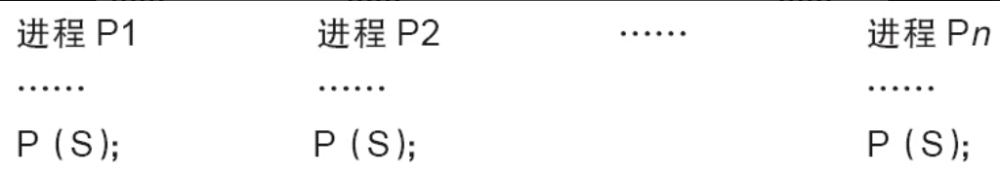
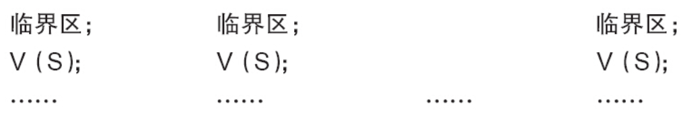

信号量（Semaphore）是操作系统中最典型的用于同步和互斥的手段，信号量的值可以是0、1或者n。信号量与操作系统中的经典概念PV操作对应。

P（S）：

①将信号量S的值减1，即S=S-1；

②如果S≥0，则该进程继续执行；否则该进程置为等待状态，排入等待队列。

V（S）：

①将信号量S的值加1，即S=S+1；

②如果S>0，唤醒队列中等待信号量的进程。

Linux中与信号量相关的操作主要有下面几种。

1.定义信号量

下列代码定义名称为sem的信号量：

```
struct semaphore sem;
```

2.初始化信号量

```
void sema_init(struct semaphore *sem, int val);
```

该函数初始化信号量，并设置信号量sem的值为val。

3.获得信号量

```
void down(struct semaphore * sem);
```

该函数用于获得信号量sem，它会导致睡眠，因此不能在中断上下文中使用。

```
int down_interruptible(struct semaphore * sem);
```

该函数功能与down类似，不同之处为，因为down（）进入睡眠状态的进程不能被信号打断，但因为down_interruptible（）进入睡眠状态的进程能被信号打断，信号也会导致该函数返回，这时候函数的返回值非0。

```
int down_trylock(struct semaphore * sem);
```

该函数尝试获得信号量sem，如果能够立刻获得，它就获得该信号量并返回0，否则，返回非0值。它不会导致调用者睡眠，可以在中断上下文中使用。

在使用down_interruptible（）获取信号量时，对返回值一般会进行检查，如果非0，通常立即返回-ERESTARTSYS，如：

```
if (down_interruptible(&sem))
    return  -ERESTARTSYS;
```

4.释放信号量

```
void up(struct semaphore * sem);
```

该函数释放信号量sem，唤醒等待者。

作为一种可能的互斥手段，信号量可以保护临界区，它的使用方式和自旋锁类似。与自旋锁相同，只有得到信号量的进程才能执行临界区代码。但是，与自旋锁不同的是，当获取不到信号量时，进程不会原地打转而是进入休眠等待状态。用作互斥时，信号量一般这样被使用：





由于新的Linux内核倾向于直接使用mutex作为互斥手段，信号量用作互斥不再被推荐使用。

信号量也可以用于同步，一个进程A执行down（）等待信号量，另外一个进程B执行up（）释放信号量，这样进程A就同步地等待了进程B。其过程类似：


此外，对于关心具体数值的生产者/消费者问题，使用信号量则较为合适。因为生产者/消费者问题也是一种同步问题。