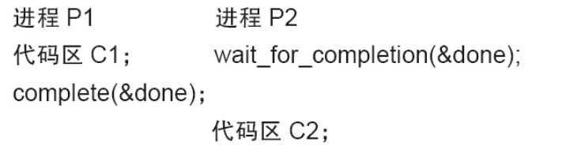

Linux提供了完成量（Completion，关于这个名词，至今没有好的翻译，笔者将其译为“完成量”），它用于一个执行单元等待另一个执行单元执行完某事。

Linux中与完成量相关的操作主要有以下4种。

1.定义完成量

下列代码定义名为my_completion的完成量：

```
struct completion my_completion;
```

2.初始化完成量

下列代码初始化或者重新初始化my_completion这个完成量的值为0（即没有完成的状态）：

```
init_completion(&my_completion);
reinit_completion(&my_completion)
```

3.等待完成量

下列函数用于等待一个完成量被唤醒：

```
void wait_for_completion(struct completion *c);
```

4.唤醒完成量

下面两个函数用于唤醒完成量：

```
void complete(struct completion *c);
void complete_all(struct completion *c);
```

前者只唤醒一个等待的执行单元，后者释放所有等待同一完成量的执行单元。

完成量用于同步的流程一般如下：

