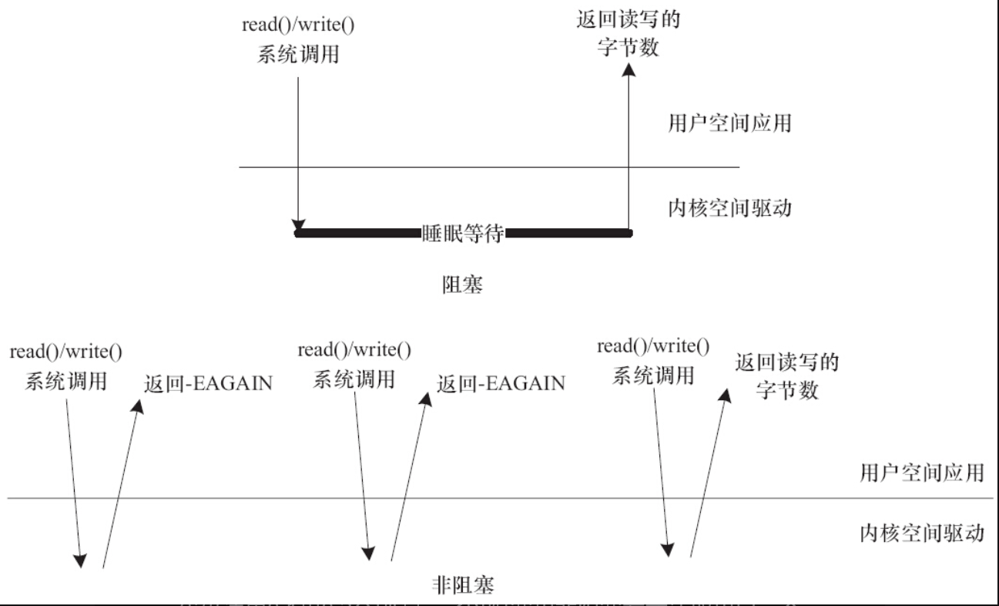
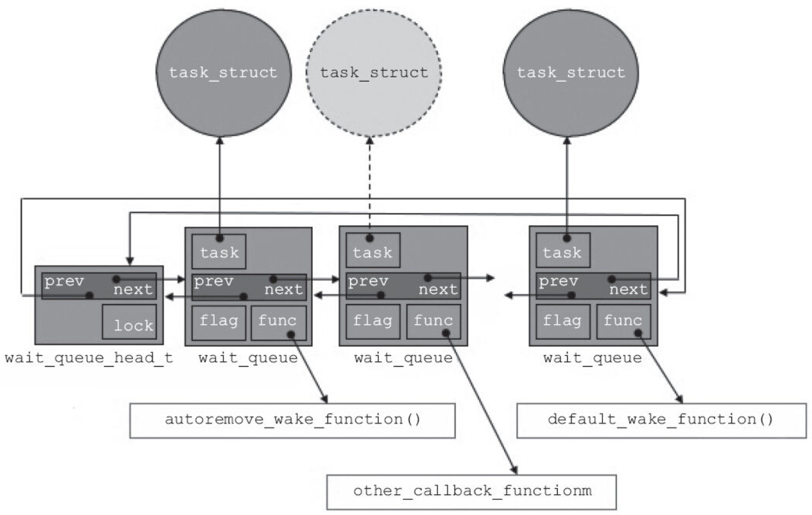

阻塞操作是指在执行设备操作时，若不能获得资源，则挂起进程直到满足可操作的条件后再进行操作。被挂起的进程进入睡眠状态，被从调度器的运行队列移走，直到等待的条件被满足。而非阻塞操作的进程在不能进行设备操作时，并不挂起，它要么放弃，要么不停地查询，直至可以进行操作为止。

驱动程序通常需要提供这样的能力：当应用程序进行read（）、write（）等系统调用时，若设备的资源不能获取，而用户又希望以阻塞的方式访问设备，驱动程序应在设备驱动的xxx_read（）、xxx_write（）等操作中将进程阻塞直到资源可以获取，此后，应用程序的read（）、write（）等调用才返回，整个过程仍然进行了正确的设备访问，用户并没有感知到；若用户以非阻塞的方式访问设备文件，则当设备资源不可获取时，设备驱动的xxx_read（）、xxx_write（）等操作应立即返回，read（）、write（）等系统调用也随即被返回，应用程序收到-EAGAIN返回值。

如图8.1所示，在阻塞访问时，不能获取资源的进程将进入休眠，它将CPU资源“礼让”给其他进程。因为阻塞的进程会进入休眠状态，所以必须确保有一个地方能够唤醒休眠的进程，否则，进程就真的“寿终正寝”了。唤醒进程的地方最大可能发生在中断里面，因为在硬件资源获得的同时往往伴随着一个中断。而非阻塞的进程则不断尝试，直到可以进行I/O。



图8.1　阻塞与非阻塞I/O

代码清单8.1和8.2分别演示了以阻塞和非阻塞方式读取串口一个字符的代码。前者在打开文件的时候没有O_NONBLOCK标记，后者使用O_NONBLOCK标记打开文件。

代码清单8.1　阻塞地读串口一个字符

```
char buf;
fd = open("/dev/ttyS1", O_RDWR);
...
res = read(fd,&buf,1);      /* 当串口上有输入时才返回*/
if(res==1)
printf("%c\n", buf);
```

代码清单8.2　非阻塞地读串口一个字符

```
char buf;
fd = open("/dev/ttyS1", O_RDWR| O_NONBLOCK);
...
while(read(fd,&buf,1)!=1)
      continue;       /* 串口上无输入也返回，因此要循环尝试读取串口*/
printf("%c\n", buf);
```

除了在打开文件时可以指定阻塞还是非阻塞方式以外，在文件打开后，也可以通过ioctl（）和fcntl（）改变读写的方式，如从阻塞变更为非阻塞或者从非阻塞变更为阻塞。例如，调用fcntl（fd，F_SETFL，O_NONBLOCK）可以设置fd对应的I/O为非阻塞。

# 8.1.1　等待队列

在Linux驱动程序中，可以使用等待队列（Wait Queue）来实现阻塞进程的唤醒。等待队列很早就作为一个基本的功能单位出现在Linux内核里了，它以队列为基础数据结构，与进程调度机制紧密结合，可以用来同步对系统资源的访问，第7章中所讲述的信号量在内核中也依赖等待队列来实现。

Linux内核提供了如下关于等待队列的操作。

1.定义“等待队列头部”

```
wait_queue_head_t my_queue;
```

wait_queue_head_t是__wait_queue_head结构体的一个typedef。

2.初始化“等待队列头部”

```
init_waitqueue_head(&my_queue);
```

而下面的DECLARE_WAIT_QUEUE_HEAD（）宏可以作为定义并初始化等待队列头部的“快捷方式”。

```
DECLARE_WAIT_QUEUE_HEAD (name)
```

3.定义等待队列元素

```
DECLARE_WAITQUEUE(name, tsk)
```

该宏用于定义并初始化一个名为name的等待队列元素。

4.添加/移除等待队列

```
void add_wait_queue(wait_queue_head_t *q, wait_queue_t *wait);
void remove_wait_queue(wait_queue_head_t *q, wait_queue_t *wait);
```

add_wait_queue（）用于将等待队列元素wait添加到等待队列头部q指向的双向链表中，而remove_wait_queue（）用于将等待队列元素wait从由q头部指向的链表中移除。

5.等待事件

```
wait_event(queue, condition)
wait_event_interruptible(queue, condition)
wait_event_timeout(queue, condition, timeout)
wait_event_interruptible_timeout(queue, condition, timeout)
```

等待第1个参数queue作为等待队列头部的队列被唤醒，而且第2个参数condition必须满足，否则继续阻塞。wait_event（）和wait_event_interruptible（）的区别在于后者可以被信号打断，而前者不能。加上_timeout后的宏意味着阻塞等待的超时时间，以jiffy为单位，在第3个参数的timeout到达时，不论condition是否满足，均返回。

6.唤醒队列

```
void wake_up(wait_queue_head_t *queue);
void wake_up_interruptible(wait_queue_head_t *queue);
```

上述操作会唤醒以queue作为等待队列头部的队列中所有的进程。

wake_up（）应该与wait_event（）或wait_event_timeout（）成对使用，而wake_up_interruptible（）则应与wait_event_interruptible（）或wait_event_interruptible_timeout（）成对使用。wake_up（）可唤醒处于TASK_INTERRUPTIBLE和TASK_UNINTERRUPTIBLE的进程，而wake_up_interruptible（）只能唤醒处于TASK_INTERRUPTIBLE的进程。

7.在等待队列上睡眠

```
sleep_on(wait_queue_head_t *q );
interruptible_sleep_on(wait_queue_head_t *q );
```

sleep_on（）函数的作用就是将目前进程的状态置成TASK_UNINTERRUPTIBLE，并定义一个等待队列元素，之后把它挂到等待队列头部q指向的双向链表，直到资源可获得，q队列指向链接的进程被唤醒。

interruptible_sleep_on（）与sleep_on（）函数类似，其作用是将目前进程的状态置成TASK_INTERRUPTIBLE，并定义一个等待队列元素，之后把它附属到q指向的队列，直到资源可获得（q指引的等待队列被唤醒）或者进程收到信号。

sleep_on（）函数应该与wake_up（）成对使用，interruptible_sleep_on（）应该与wake_up_interruptible（）成对使用。

代码清单8.3演示了一个在设备驱动中使用等待队列的模版，在进行写I/O操作的时候，判断设备是否可写，如果不可写且为阻塞I/O，则进程睡眠并挂起到等待队列。

代码清单8.3　在设备驱动中使用等待队列

```
 1static ssize_t xxx_write(struct file *file, const char *buffer, size_t count,
 2  loff_t *ppos)
 3{
 4  ...
 5  DECLARE_WAITQUEUE(wait, current);                           /* 定义等待队列元素*/
 6  add_wait_queue(&xxx_wait, &wait);                           /* 添加元素到等待队列*/
 7
 8  /* 等待设备缓冲区可写*/
 9  do {
10    avail = device_writable(...);
11    if (avail < 0) {
12       if (file->f_flags &O_NONBLOCK)   {                     /* 非阻塞 */
13              ret =  -EAGAIN;
14              goto out;
15         }
16      __set_current_state(TASK_INTERRUPTIBLE);                /* 改变进程状态*/
17      schedule();                                             /* 调度其他进程执行*/
18      if (signal_pending(current))  {                         /* 如果是因为信号唤醒*/
19             ret =  -ERESTARTSYS;
20             goto out;
21        }
22     }
23  } while (avail < 0);
24
25  /* 写设备缓冲区*/
26  device_write(...)
27  out:
28  remove_wait_queue(&xxx_wait, &wait);           /* 将元素移出xxx_wait指引的队列*/
29  set_current_state(TASK_RUNNING);               /* 设置进程状态为TASK_RUNNING */
30  return ret;
31}
```

读懂代码清单8.3对理解Linux进程状态切换非常重要，所以提请读者反复阅读此段代码（尤其注意其中黑体的部分），直至完全领悟，几个要点如下。

1）如果是非阻塞访问（O_NONBLOCK被设置），设备忙时，直接返回“-EAGAIN”。

2）对于阻塞访问，会调用__set_current_state（TASK_INTERRUPTIBLE）进行进程状态切换并显示通过“schedule（）”调度其他进程执行。

3）醒来的时候要注意，由于调度出去的时候，进程状态是TASK_INTERRUPTIBLE，即浅度睡眠，所以唤醒它的有可能是信号，因此，我们首先通过signal_pending（current）了解是不是信号唤醒的，如果是，立即返回“-ERESTARTSYS”。

DECLARE_WAITQUEUE、add_wait_queue这两个动作加起来完成的效果如图8.2所示。在wait_queue_head_t指向的链表上，新定义的wait_queue元素被插入，而这个新插入的元素绑定了一个task_struct（当前做xxx_write的current，这也是DECLARE_WAITQUEUE使用“current”作为参数的原因）。



图8.2　wait_queque_head_t、wait_queque和task_struct之间的关系

# 8.1.2　支持阻塞操作的globalfifo设备驱动

现在我们给globalmem增加这样的约束：把globalmem中的全局内存变成一个FIFO，只有当FIFO中有数据的时候（即有进程把数据写到这个FIFO而且没有被读进程读空），读进程才能把数据读出，而且读取后的数据会从globalmem的全局内存中被拿掉；只有当FIFO不是满的时（即还有一些空间未被写，或写满后被读进程从这个FIFO中读出了数据），写进程才能往这个FIFO中写入数据。

现在，将globalmem重命名为“globalfifo”，在globalfifo中，读FIFO将唤醒写FIFO的进程（如果之前FIFO正好是满的），而写FIFO也将唤醒读FIFO的进程（如果之前FIFO正好是空的）。首先，需要修改设备结构体，在其中增加两个等待队列头部，分别对应于读和写，如代码清单8.4所示。

代码清单8.4　globalfifo设备结构体

```
 1struct globalfifo_dev {
 2  struct cdev cdev;
 3  unsigned int current_len;
 4  unsigned char mem[GLOBALFIFO_SIZE];
 5  struct mutex mutex;
 6  wait_queue_head_t r_wait;
 7  wait_queue_head_t w_wait;
 8};
```

与globalfifo设备结构体的另一个不同是增加了current_len成员以用于表征目前FIFO中有效数据的长度。current_len等于0意味着FIFO空，current_len等于GLOBALFIFO_SIZE意味着FIFO满。

这两个等待队列头部需在设备驱动模块加载函数中调用init_waitqueue_head（）被初始化，新的设备驱动模块加载函数如代码清单8.5所示。

代码清单8.5　globalfifo设备驱动模块加载函数

```
 1static int __init globalfifo_init(void)
 2{
 3  int ret;
 4  dev_t devno = MKDEV(globalfifo_major, 0);
 5
 6  if (globalfifo_major)
 7       ret = register_chrdev_region(devno, 1, "globalfifo");
 8  else {
 9       ret = alloc_chrdev_region(&devno, 0, 1, "globalfifo");
10       globalfifo_major = MAJOR(devno);
11  }
12  if (ret < 0)
13       return ret;
14
15  globalfifo_devp = kzalloc(sizeof(struct globalfifo_dev), GFP_KERNEL);
16  if (!globalfifo_devp) {
17       ret = -ENOMEM;
18       goto fail_malloc;
19  }
20
21  globalfifo_setup_cdev(globalfifo_devp, 0);
22
23  mutex_init(&globalfifo_devp->mutex);
24  init_waitqueue_head(&globalfifo_devp->r_wait);
25  init_waitqueue_head(&globalfifo_devp->w_wait);
26
27  return 0;
28
29fail_malloc:
30  unregister_chrdev_region(devno, 1);
31  return ret;
32}
33module_init(globalfifo_init);
```

设备驱动读写操作需要被修改，在读函数中需增加唤醒globalfifo_devp->w_wait的语句，而在写操作中唤醒globalfifo_devp->r_wait，如代码清单8.6所示。

代码清单8.6　增加等待队列后的globalfifo读写函数

```
  1static ssize_t globalfifo_read(struct file *filp, char __user *buf,
  2               size_t count, loff_t *ppos)
  3{
  4int ret;
  5struct globalfifo_dev *dev = filp->private_data;
  6DECLARE_WAITQUEUE(wait, current);
  7
  8mutex_lock(&dev->mutex);
  9add_wait_queue(&dev->r_wait, &wait);
 10
 11while (dev->current_len == 0) {
 12    if (filp->f_flags & O_NONBLOCK) {
 13         ret = -EAGAIN;
 14         goto out;
 15    }
 16    __set_current_state(TASK_INTERRUPTIBLE);
 17    mutex_unlock(&dev->mutex);
 18
 19    schedule();
 20    if (signal_pending(current)) {
 21         ret = -ERESTARTSYS;
 22         goto out2;
 23    }
 24
 25    mutex_lock(&dev->mutex);
 26}
 27
 28if (count > dev->current_len)
 29    count = dev->current_len;
 30
 31if (copy_to_user(buf, dev->mem, count)) {
 32    ret = -EFAULT;
 33    goto out;
 34} else {
 35    memcpy(dev->mem, dev->mem + count, dev->current_len - count);
 36    dev->current_len -= count;
 37    printk(KERN_INFO "read %d bytes(s),current_len:%d\n", count,
 38          dev->current_len);
 39
 40    wake_up_interruptible(&dev->w_wait);
 41
 42    ret = count;
 43}
 44 out:
 45mutex_unlock(&dev->mutex);;
 46 out2:
 47remove_wait_queue(&dev->w_wait, &wait);
 48set_current_state(TASK_RUNNING);
 49return ret;
 50}
 51
 52static ssize_t globalfifo_write(struct file *filp, const char __user * buf,
 53             size_t count, loff_t *ppos)
 54{
 55struct globalfifo_dev *dev = filp->private_data;
 56int ret;
 57DECLARE_WAITQUEUE(wait, current);
 58
 59mutex_lock(&dev->mutex);
 60add_wait_queue(&dev->w_wait, &wait);
 61
 62while (dev->current_len == GLOBALFIFO_SIZE) {
 63    if (filp->f_flags & O_NONBLOCK) {
 64         ret = -EAGAIN;
 65         goto out;
 66    }
 67    __set_current_state(TASK_INTERRUPTIBLE);
 68
 69    mutex_unlock(&dev->mutex);
 70
 71    schedule();
 72    if (signal_pending(current)) {
 73         ret = -ERESTARTSYS;
 74         goto out2;
 75    }
 76
 77    mutex_lock(&dev->mutex);
 78}
 79
 80if (count > GLOBALFIFO_SIZE - dev->current_len)
 81    count = GLOBALFIFO_SIZE - dev->current_len;
 82
 83if (copy_from_user(dev->mem + dev->current_len, buf, count)) {
 84    ret = -EFAULT;
 85    goto out;
 86} else {
 87    dev->current_len += count;
 88    printk(KERN_INFO "written %d bytes(s),current_len:%d\n", count,
 89          dev->current_len);
 90
 91    wake_up_interruptible(&dev->r_wait);
 92
 93    ret = count;
 94}
 95
 96 out:
 97mutex_unlock(&dev->mutex);;
 98 out2:
 99remove_wait_queue(&dev->w_wait, &wait);
100set_current_state(TASK_RUNNING);
101return ret;
102}
```

globalfifo_read（）通过第6行和第9行将自己加到了r_wait这个队列里面，但是此时读的进程并未睡眠，之后第16行调用__set_current_state（TASK_INTERRUPTIBLE）时，也只是标记了task_struct的一个浅度睡眠标记，并未真正睡眠，直到第19行调用schedule（），读进程进入睡眠。进行完读操作后，第40行调用wake_up_interruptible（&dev->w_wait）唤醒可能阻塞的写进程。globalfifo_write（）的过程与此类似。

关注代码的第17行和69行，无论是读函数还是写函数，进入schedule（）把自己切换出去之前，都主动释放了互斥体。原因是如果读进程阻塞，实际意味着FIFO空，必须依赖写的进程往FIFO里面写东西来唤醒它，但是写的进程为了写FIFO，它也必须拿到这个互斥体来访问FIFO这个临界资源，如果读进程把自己调度出去之前不释放这个互斥体，那么读写进程之间就死锁了。所谓死锁，就是多个进程循环等待他方占有的资源而无限期地僵持下去。如果没有外力的作用，那么死锁涉及的各个进程都将永远处于封锁状态。因此，驱动工程师一定要注意：当多个等待队列、信号量、互斥体等机制同时出现时，谨防死锁！

现在回过来了看一下代码清单8.6的第12行和63行，发现在设备驱动的read（）、write（）等功能函数中，可以通过filp->f_flags标志获得用户空间是否要求非阻塞访问。驱动中可以依据此标志判断用户究竟要求阻塞还是非阻塞访问，从而进行不同的处理。

# 8.1.3　在用户空间验证globalfifo的读写

本书代码仓库的/kernel/drivers/globalfifo/ch8包含了globalfifo的驱动，运行“make”命令编译得到globalfifo.ko。接着用insmod模块

```
# insmod globalfifo.ko
```

创建设备文件节点“/dev/globalfifo”，具体如下：

```
# mknod /dev/globalfifo c 231 0
```

启动两个进程，一个进程cat/dev/globalfifo&在后台执行，一个进程“echo字符串/dev/globalfifo”在前台执行：

```
# cat /dev/globalfifo &
[1] 20910
# echo 'I want to be' > /dev/globalfifo
I want to be
# echo 'a great Chinese Linux Kernel Developer' > /dev/globalfifo
a great Chinese Linux kernel Developer
```

往/dev/globalfifo里面echo需要root权限，直接运行“sudo echo”是不行的，可以先执行：

```
baohua@baohua-VirtualBox://sys/module/globalmem$ sudo su
[sudo] password for baohua:
```

这段代码的密码也是“baohua”。之后再进行echo。