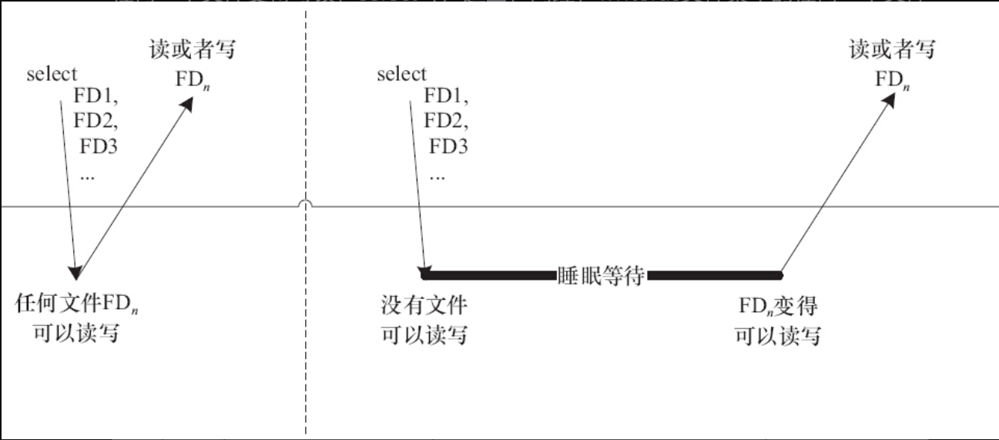

# 8.2.1　轮询的概念与作用

在用户程序中，select（）和poll（）也是与设备阻塞与非阻塞访问息息相关的论题。使用非阻塞I/O的应用程序通常会使用select（）和poll（）系统调用查询是否可对设备进行无阻塞的访问。select（）和poll（）系统调用最终会使设备驱动中的poll（）函数被执行，在Linux2.5.45内核中还引入了epoll（），即扩展的poll（）。

select（）和poll（）系统调用的本质一样，前者在BSD UNIX中引入，后者在System V中引入。

## 8.2.2　应用程序中的轮询编程

应用程序中最广泛用到的是BSD UNIX中引入的select（）系统调用，其原型为：

```
int select(int numfds, fd_set *readfds, fd_set *writefds, fd_set *exceptfds,
    struct timeval *timeout);
```

其中readfds、writefds、exceptfds分别是被select（）监视的读、写和异常处理的文件描述符集合，numfds的值是需要检查的号码最高的fd加1。readfds文件集中的任何一个文件变得可读，select（）返回；同理，writefds文件集中的任何一个文件变得可写，select也返回。

如图8.3所示，第一次对n个文件进行select（）的时候，若任何一个文件满足要求，select（）就直接返回；第2次再进行select（）的时候，没有文件满足读写要求，select（）的进程阻塞且睡眠。由于调用select（）的时候，每个驱动的poll（）接口都会被调用到，实际上执行select（）的进程被挂到了每个驱动的等待队列上，可以被任何一个驱动唤醒。如果FDn变得可读写，select（）返回。



图8.3　多路复用select（）

timeout参数是一个指向struct timeval类型的指针，它可以使select（）在等待timeout时间后若仍然没有文件描述符准备好则超时返回。struct timeval数据结构的定义如代码清单8.7所示。

代码清单8.7　timeval结构体定义

```
 1struct timeval  {
 2   int tv_sec;     /* 秒*/
 3   int tv_usec;    /* 微秒 */
 4};
```

下列操作用来设置、清除、判断文件描述符集合：

```
FD_ZERO(fd_set *set)
```

清除一个文件描述符集合；

```
FD_SET(int fd,fd_set *set)
```

将一个文件描述符加入文件描述符集合中；

```
FD_CLR(int fd,fd_set *set)
```

将一个文件描述符从文件描述符集合中清除；

```
FD_ISSET(int fd,fd_set *set)
```

判断文件描述符是否被置位。

poll（）的功能和实现原理与select（）相似，其函数原型为：

```
int poll(struct pollfd *fds, nfds_t nfds, int timeout);
```

当多路复用的文件数量庞大、I/O流量频繁的时候，一般不太适合使用select（）和poll（），此种情况下，select（）和poll（）的性能表现较差，我们宜使用epoll。epoll的最大好处是不会随着fd的数目增长而降低效率，select（）则会随着fd的数量增大性能下降明显。

与epoll相关的用户空间编程接口包括

```
int epoll_create(int size);
```

创建一个epoll的句柄，size用来告诉内核要监听多少个fd。需要注意的是，当创建好epoll句柄后，它本身也会占用一个fd值，所以在使用完epoll后，必须调用close（）关闭。

```
int epoll_ctl(int epfd, int op, int fd, struct epoll_event *event);
```

告诉内核要监听什么类型的事件。

第1个参数是epoll_create（）的返回值，

第2个参数表示动作，包含：

- EPOLL_CTL_ADD：注册新的fd到epfd中。
- EPOLL_CTL_MOD：修改已经注册的fd的监听事件。
- EPOLL_CTL_DEL：从epfd中删除一个fd。

第3个参数是需要监听的fd，

第4个参数是告诉内核需要监听的事件类型，struct epoll_event结构如下：

```
struct epoll_event {
  __uint32_t events;  /* Epoll events */
  epoll_data_t data;  /* User data variable */
};
```

events可以是以下几个宏的“或”：

- EPOLLIN：表示对应的文件描述符可以读。
- EPOLLOUT：表示对应的文件描述符可以写。
- EPOLLPRI：表示对应的文件描述符有紧急的数据可读（这里应该表示的是有socket带外数据到来）。
- EPOLLERR：表示对应的文件描述符发生错误。
- EPOLLHUP：表示对应的文件描述符被挂断。
- EPOLLET：将epoll设为边缘触发（Edge Triggered）模式，这是相对于水平触发（Level Triggered）来说的。LT（Level Triggered）是缺省的工作方式，在LT情况下，内核告诉用户一个fd是否就绪了，之后用户可以对这个就绪的fd进行I/O操作。但是如果用户不进行任何操作，该事件并不会丢失，而ET（Edge-Triggered）是高速工作方式，在这种模式下，当fd从未就绪变为就绪时，内核通过epoll告诉用户，然后它会假设用户知道fd已经就绪，并且不会再为那个fd发送更多的就绪通知。
- EPOLLONESHOT：意味着一次性监听，当监听完这次事件之后，如果还需要继续监听这个fd的话，需要再次把这个fd加入到epoll队列里。

```
int epoll_wait(int epfd, struct epoll_event * events, int maxevents, int timeout);
```

等待事件的产生，其中events参数是输出参数，用来从内核得到事件的集合，maxevents告诉内核本次最多收多少事件，maxevents的值不能大于创建epoll_create（）时的size，参数timeout是超时时间（以毫秒为单位，0意味着立即返回，-1意味着永久等待）。该函数的返回值是需要处理的事件数目，如返回0，则表示已超时。

位于https://www.kernel.org/doc/ols/2004/ols2004v1-pages-215-226.pdf 的文档《Comparing and Evaluating epoll，select，and poll Event Mechanisms》对比了select、epoll、poll之间的一些性能。一般来说，当涉及的fd数量较少的时候，使用select是合适的；如果涉及的fd很多，如在大规模并发的服务器中侦听许多socket的时候，则不太适合选用select，而适合选用epoll。

# 8.2.3　设备驱动中的轮询编程

设备驱动中poll（）函数的原型是：

```
unsigned int(*poll)(struct file * filp, struct poll_table* wait);
```

第1个参数为file结构体指针，第2个参数为轮询表指针。这个函数应该进行两项工作。

1）对可能引起设备文件状态变化的等待队列调用poll_wait（）函数，将对应的等待队列头部添加到poll_table中。

2）返回表示是否能对设备进行无阻塞读、写访问的掩码。

用于向poll_table注册等待队列的关键poll_wait（）函数的原型如下：

```
void poll_wait(struct file *filp, wait_queue_heat_t *queue, poll_table * wait);
```

poll_wait（）函数的名称非常容易让人产生误会，以为它和wait_event（）等一样，会阻塞地等待某事件的发生，其实这个函数并不会引起阻塞。poll_wait（）函数所做的工作是把当前进程添加到wait参数指定的等待列表（poll_table）中，实际作用是让唤醒参数queue对应的等待队列可以唤醒因select（）而睡眠的进程。

驱动程序poll（）函数应该返回设备资源的可获取状态，即POLLIN、POLLOUT、POLLPRI、POLLERR、POLLNVAL等宏的位“或”结果。每个宏的含义都表明设备的一种状态，如POLLIN（定义为0x0001）意味着设备可以无阻塞地读，POLLOUT（定义为0x0004）意味着设备可以无阻塞地写。

代码清单8.8　poll（）函数典型模板

```
 1 static unsigned int xxx_poll(struct file *filp, poll_table *wait)
 2 {
 3  unsigned int mask = 0;
 4  struct xxx_dev *dev = filp->private_data;      /* 获得设备结构体指针*/
 5
 6  ...
 7  poll_wait(filp, &dev->r_wait, wait);           /* 加入读等待队列 */
 8  poll_wait(filp, &dev->w_wait, wait);           /* 加入写等待队列*/
 9
10  if (...)                                       /* 可读*/
11      mask |= POLLIN | POLLRDNORM;               /* 标示数据可获得（对用户可读）*/
12
13  if (...)                                       /* 可写 */
14      mask |= POLLOUT | POLLWRNORM;              /* 标示数据可写入*/
15  ...
16  return mask;
17}
```

