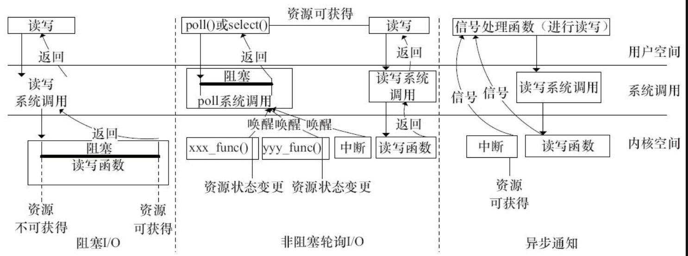

阻塞与非阻塞访问、poll（）函数提供了较好的解决设备访问的机制，但是如果有了异步通知，整套机制则更加完整了。

异步通知的意思是：一旦设备就绪，则主动通知应用程序，这样应用程序根本就不需要查询设备状态，这一点非常类似于硬件上“中断”的概念，比较准确的称谓是“信号驱动的异步I/O”。信号是在软件层次上对中断机制的一种模拟，在原理上，一个进程收到一个信号与处理器收到一个中断请求可以说是一样的。信号是异步的，一个进程不必通过任何操作来等待信号的到达，事实上，进程也不知道信号到底什么时候到达。

阻塞I/O意味着一直等待设备可访问后再访问，非阻塞I/O中使用poll（）意味着查询设备是否可访问，而异步通知则意味着设备通知用户自身可访问，之后用户再进行I/O处理。由此可见，这几种I/O方式可以相互补充。

图9.1呈现了阻塞I/O，结合轮询的非阻塞I/O及基于SIGIO的异步通知在时间先后顺序上的不同。

图9.1　阻塞、结合轮询的非阻塞I/O和异步通知的区别

这里要强调的是：阻塞、非阻塞I/O、异步通知本身没有优劣，应该根据不同的应用场景合理选择。