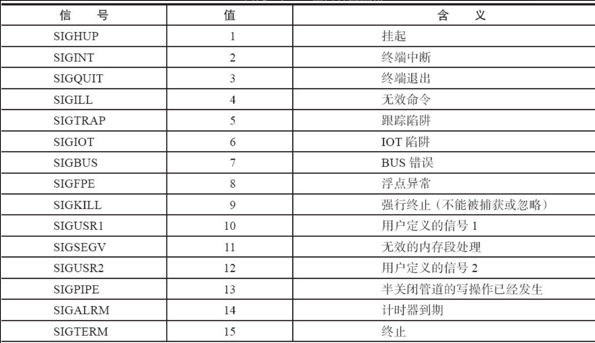
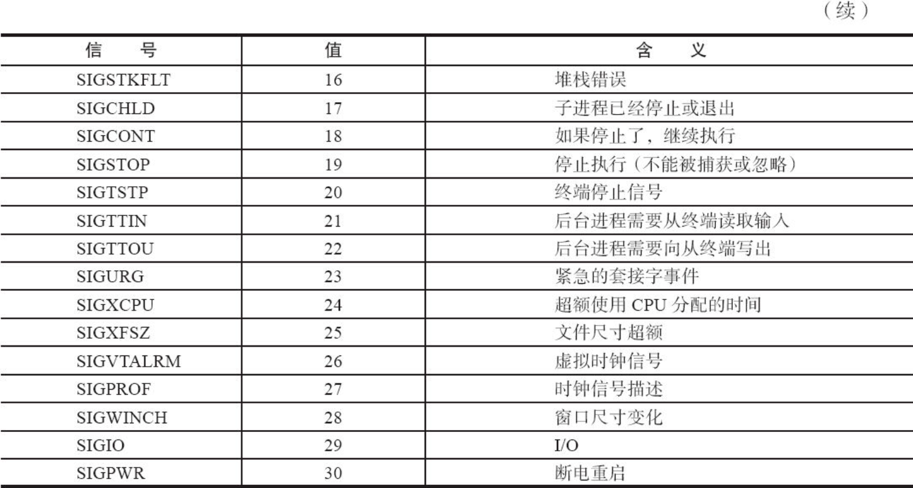
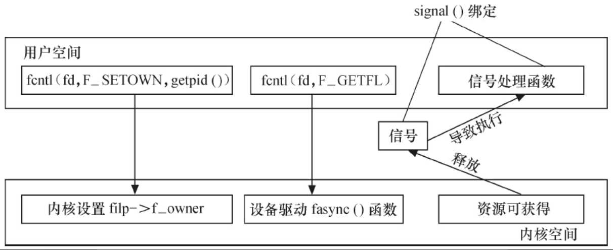

# 9.2.1　Linux信号

使用信号进行进程间通信（IPC）是UNIX中的一种传统机制，Linux也支持这种机制。在Linux中，异步通知使用信号来实现，Linux中可用的信号及其定义如表9.1所示。

表9.1　Linux信号及其定义





除了SIGSTOP和SIGKILL两个信号外，进程能够忽略或捕获其他的全部信号。一个信号被捕获的意思是当一个信号到达时有相应的代码处理它。如果一个信号没有被这个进程所捕获，内核将采用默认行为处理。

# 9.2.2　信号的接收

在用户程序中，为了捕获信号，可以使用signal（）函数来设置对应信号的处理函数：

```
void (*signal(int signum, void (*handler))(int)))(int);
```

该函数原型较难理解，它可以分解为：

```
typedef void (*sighandler_t)(int);
sighandler_t signal(int signum, sighandler_t handler));
```

第一个参数指定信号的值，第二个参数指定针对前面信号值的处理函数，若为SIG_IGN，表示忽略该信号；若为SIG_DFL，表示采用系统默认方式处理信号；若为用户自定义的函数，则信号被捕获到后，该函数将被执行。

如果signal（）调用成功，它返回最后一次为信号signum绑定的处理函数的handler值，失败则返回SIG_ERR。

在进程执行时，按下“Ctrl+C”将向其发出SIGINT信号，正在运行kill的进程将向其发出SIGTERM信号，代码清单9.1的进程可捕获这两个信号并输出信号值。

代码清单9.1　signal（）捕获信号范例

```
 1void sigterm_handler(int signo)
 2{
 3  printf("Have caught sig N.O. %d\n", signo);
 4  exit(0);
 5}
 6
 7int main(void)
 8{
 9  signal(SIGINT, sigterm_handler);
10  signal(SIGTERM, sigterm_handler);
11  while(1);
12
13  return 0;
14}
```

除了signal（）函数外，sigaction（）函数可用于改变进程接收到特定信号后的行为，它的原型为：

```
int sigaction(int signum,const struct sigaction *act,struct sigaction *oldact));
```

该函数的第一个参数为信号的值，可以是除SIGKILL及SIGSTOP外的任何一个特定有效的信号。第二个参数是指向结构体sigaction的一个实例的指针，在结构体sigaction的实例中，指定了对特定信号的处理函数，若为空，则进程会以缺省方式对信号处理；第三个参数oldact指向的对象用来保存原来对相应信号的处理函数，可指定oldact为NULL。如果把第二、第三个参数都设为NULL，那么该函数可用于检查信号的有效性。

先来看一个使用信号实现异步通知的例子，它通过signal（SIGIO，input_handler）对标准输入文件描述符STDIN_FILENO启动信号机制。用户输入后，应用程序将接收到SIGIO信号，其处理函数input_handler（）将被调用，如代码清单9.2所示。

代码清单9.2　使用信号实现异步通知的应用程序实例

```
 1#include <sys/types.h>
 2#include <sys/stat.h>
 3#include <stdio.h>
 4#include <fcntl.h>
 5#include <signal.h>
 6#include <unistd.h>
 7#define MAX_LEN 100
 8void input_handler(int num)
 9{
10  char data[MAX_LEN];
11  int len;
12
13  /* 读取并输出STDIN_FILENO上的输入 */
14  len = read(STDIN_FILENO, &data, MAX_LEN);
15  data[len] = 0;
16  printf("input available:%s\n", data);
17}
18
19main()
20{
21  int oflags;
22
23  /* 启动信号驱动机制*/
24  signal(SIGIO, input_handler);
25  fcntl(STDIN_FILENO, F_SETOWN, getpid());
26  oflags = fcntl(STDIN_FILENO, F_GETFL);
27  fcntl(STDIN_FILENO, F_SETFL, oflags | FASYNC);
28
29 /* 最后进入一个死循环，仅为保持进程不终止，如果程序中
30 没有这个死循会立即执行完毕*/
31 while (1);
32}
```

上述代码24行为SIGIO信号安装input_handler（）作为处理函数，第25行设置本进程为STDIN_FILENO文件的拥有者，没有这一步，内核不会知道应该将信号发给哪个进程。而为了启用异步通知机制，还需对设备设置FASYNC标志，第26行、27行代码可实现此目的。整个程序的执行效果如下：

```
[root@localhost driver_study]# ./signal_test
I am Chinese.                            -> 用户输入
input available: I am Chinese.            -> signal_test程序打印
I love Linux driver.                      -> 用户输入
input available: I love Linux driver.    -> signal_test程序打印

```

从中可以看出，当用户输入一串字符后，标准输入设备释放SIGIO信号，这个信号“中断”与驱使对应的应用程序中的input_handler（）得以执行，并将用户输入显示出来。

由此可见，为了能在用户空间中处理一个设备释放的信号，它必须完成3项工作。

1）通过F_SETOWN IO控制命令设置设备文件的拥有者为本进程，这样从设备驱动发出的信号才能被本进程接收到。

2）通过F_SETFL IO控制命令设置设备文件以支持FASYNC，即异步通知模式。

3）通过signal（）函数连接信号和信号处理函数

# 9.2.3　信号的释放

在设备驱动和应用程序的异步通知交互中，仅仅在应用程序端捕获信号是不够的，因为信号的源头在设备驱动端。因此，应该在合适的时机让设备驱动释放信号，在设备驱动程序中增加信号释放的相关代码。

为了使设备支持异步通知机制，驱动程序中涉及3项工作。

1）支持F_SETOWN命令，能在这个控制命令处理中设置filp->f_owner为对应进程ID。不过此项工作已由内核完成，设备驱动无须处理。

2）支持F_SETFL命令的处理，每当FASYNC标志改变时，驱动程序中的fasync（）函数将得以执行。因此，驱动中应该实现fasync（）函数。

3）在设备资源可获得时，调用kill_fasync（）函数激发相应的信号。

驱动中的上述3项工作和应用程序中的3项工作是一一对应的，图9.2所示为异步通知处理过程中用户空间和设备驱动的交互。



图9.2　异步通知中设备驱动和异步通知的交互

设备驱动中异步通知编程比较简单，主要用到一项数据结构和两个函数。数据结构是fasync_struct结构体，两个函数分别是：

1）处理FASYNC标志变更的函数。

```
int fasync_helper(int fd, struct file *filp, int mode, struct fasync_struct **fa);
```

2）释放信号用的函数。

```
void kill_fasync(struct fasync_struct **fa, int sig, int band);
```

和其他的设备驱动一样，将fasync_struct结构体指针放在设备结构体中仍然是最佳选择，代码清单9.3给出了支持异步通知的设备结构体模板。

代码清单9.3　支持异步通知的设备结构体模板

```
 1struct xxx_dev {
 2   struct cdev cdev;                    /* cdev结构体*/
 3   ...
 4   struct fasync_struct *async_queue;   /* 异步结构体指针 */
 5};
```

在设备驱动的fasync（）函数中，只需要简单地将该函数的3个参数以及fasync_struct结构体指针的指针作为第4个参数传入fasync_helper（）函数即可。代码清单9.4给出了支持异步通知的设备驱动程序fasync（）函数的模板。

代码清单9.4　支持异步通知的设备驱动fasync（）函数模板

```
 1static int xxx_fasync(int fd, struct file *filp, int mode)
 2{
 3  struct xxx_dev *dev = filp->private_data;
 4  return fasync_helper(fd, filp, mode, &dev->async_queue);
 5}
```

在设备资源可以获得时，应该调用kill_fasync（）释放SIGIO信号。在可读时，第3个参数设置为POLL_IN，在可写时，第3个参数设置为POLL_OUT。代码清单9.5给出了释放信号的范例。

代码清单9.5　支持异步通知的设备驱动信号释放范例

```
 1static ssize_t xxx_write(struct file *filp, const char __user *buf, size_t count,
 2                      loff_t *f_pos)
 3{
 4     struct xxx_dev *dev = filp->private_data;
 5     ...
 6     /* 产生异步读信号 */
 7     if (dev->async_queue)
 8          kill_fasync(&dev->async_queue, SIGIO, POLL_IN);
 9...
10}
```

最后，在文件关闭时，即在设备驱动的release（）函数中，应调用设备驱动的fasync（）函数将文件从异步通知的列表中删除。代码清单9.5给出了支持异步通知的设备驱动release（）函数的模板。

代码清单9.6　支持异步通知的设备驱动release（）函数模板

```
 1static int xxx_release(struct inode *inode, struct file *filp)
 2{
 3   /* 将文件从异步通知列表中删除*/
 4   xxx_fasync(-1, filp, 0);
 5   ...
 6   return 0;
 7}
```

