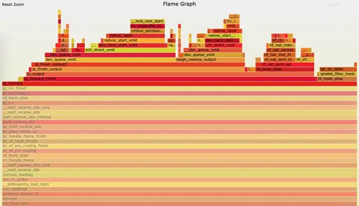

在 Linux 内核的广袤天地里，性能优化与故障排查宛如两座高耸的山峰，横亘在开发者前行的道路上。为了攀登这两座高峰，开发者们不断寻觅着强大的工具。而 perf，无疑是其中最为耀眼的 “神器” 之一。当你在运行一个复杂的 Linux 系统时，是否常常被一些莫名的性能问题所困扰？系统突然变得卡顿，应用程序响应迟缓，可你却无从下手，不知问题究竟出在哪里。或许是某个内核函数在不经意间消耗了大量资源，又或许是进程间的资源竞争引发了瓶颈。

在过去，面对这些问题，开发者们犹如在黑暗中摸索，只能凭借经验和猜测来进行调试。但 perf 的出现，彻底改变了这一局面。它就像一把精准的手术刀，能够深入到内核的每一个角落，精准地剖析系统性能。从处理器的指令周期，到缓存的命中率；从函数的调用频率，到进程的上下文切换，perf 都能提供详尽的数据。接下来，让我们一同深入 perf 的世界，探寻它究竟是如何实现这一强大功能的，看看它是怎样在复杂的内核环境中，为我们揭示性能奥秘，助力解决棘手的问题 。

# 一、Perf工具简介

## 1.1什么是 Perf

在 Linux 性能分析的广袤领域中，Perf 犹如一颗璀璨的明星，散发着独特的光芒。Perf，即 Performance 的缩写，是一款集成于 Linux 内核的性能分析工具，如同一位技艺精湛的诊断大师，能深入系统的各个角落，精准地剖析系统性能。它以事件驱动为核心机制，如同精密的仪器，能够捕捉到硬件、软件以及内核层面的各种性能事件。

随着 Linux 内核的不断演进，Perf 也在持续发展壮大。从最初简单的性能监测，到如今具备丰富多样的功能，Perf 已经成为 Linux 性能分析不可或缺的工具。它不仅支持硬件事件的监测，如 CPU 时钟周期、缓存命中情况等，这些硬件事件犹如系统运行的脉搏，反映着硬件的工作状态；还能捕捉软件事件，如进程切换、缺页中断等，这些软件事件则是系统运行的 “软指标”，揭示着软件层面的运行效率。此外，内核追踪点事件、用户程序静态追踪点以及动态追踪等功能，更是让 Perf 的监测能力如虎添翼，能够全方位、深层次地洞察系统性能。

## 1.2Perf 的强大功能

Perf 之所以备受赞誉，是因为它拥有一系列强大而实用的功能，这些功能犹如一把把精准的手术刀，能够深入剖析系统性能的各个方面。Perf是内置于Linux内核源码树中的性能剖析(profiling)工具。它基于事件采样原理，以性能事件为基础，支持针对处理器相关性能指标与操作系统相关性能指标的性能剖析，常用于性能瓶颈的查找与热点代码的定位。

**(1)轻量级事件采样**

Perf 具备轻量级事件采样的能力，这使其能够通过硬件性能计数对处理器事件进行采样，从而获取应用程序或内核的性能数据 。它可以监测指令执行的数量，了解程序在运行过程中到底执行了多少条指令，这就像是记录一场比赛中运动员的动作次数，能直观反映出程序的工作量。缓存命中率也是它的监测范围，缓存作为计算机系统中速度较快的存储区域，缓存命中率的高低直接影响着系统的性能，Perf 能够精确地捕捉到缓存命中的次数以及未命中的次数，让我们清楚地知道缓存的工作效率。分支预测同样逃不过 Perf 的 “眼睛”，分支预测是处理器为了提高执行效率而采用的一种技术，Perf 可以监测分支预测的成功率，帮助我们评估处理器在这方面的性能表现。这些监测指标就像一个个关键的信号，为我们揭示了系统性能的奥秘。

**(2)Trace 功能**

Trace 功能是 Perf 的又一强大武器，它可以跟踪进程或内核的函数调用链，如同一位经验丰富的侦探，能够顺着线索找出代码的执行路径。通过这一功能，Perf 可以生成函数调用图，函数调用图就像是一幅详细的地图，展示了各个函数之间的调用关系，让我们一目了然地看到程序的执行流程。火焰图也是 Perf Trace 功能的重要产物，火焰图以一种直观的方式展示了函数的执行时间和调用栈深度，越宽的部分表示该函数占用的时间越长，就像火焰的大小反映了火势的强弱，帮助我们快速定位性能瓶颈所在。在一个复杂的应用程序中，可能存在多个函数相互调用，通过火焰图，我们可以轻松地发现哪些函数占用了大量的时间，从而有针对性地进行优化。

**(3)Profiling 功能**

Profiling 功能使 Perf 能够对特定的应用程序进行深入分析，找出其中最耗时的函数和代码行。它提供了逐行统计的功能，就像一位细心的校对员，对每一行代码的执行时间进行统计，让我们清楚地知道每一行代码对性能的影响。火焰图在 Profiling 功能中同样发挥着重要作用，通过火焰图，我们可以从宏观的角度看到整个程序的性能热点，快速锁定需要优化的区域。热点分析也是 Perf Profiling 功能的重要组成部分，它能够帮助我们找出程序中最常被访问或执行时间最长的代码区域，这些区域往往是性能优化的关键所在。在开发一个大型软件项目时，可能存在一些核心算法或频繁调用的函数，通过 Perf 的 Profiling 功能，我们可以准确地找出这些函数和代码行，对其进行优化，从而提高整个软件的性能。

**(4)基准测试**

在基准测试方面，Perf 可以与其他基准测试工具如 sysbench、fio 等结合使用，对系统的整体性能进行全面评估。与 sysbench 结合时，Perf 可以测量 CPU 在不同负载下的性能表现，比如在高并发的数据库事务处理中，CPU 的运算速度、响应时间等指标，这对于评估服务器在实际业务场景中的性能非常重要。在内存性能评估上，Perf 与 fio 配合，能够精准地测量内存的读写速度、带宽利用率等参数。磁盘 IO 性能也是 Perf 的 “拿手好戏”，它可以测试磁盘的读写速率、寻道时间等关键指标，为系统调优提供全面而准确的参考数据。在构建一个大型数据中心时，需要对服务器的性能进行全面评估，Perf 与其他基准测试工具的结合使用，可以帮助我们了解服务器在不同工作负载下的性能表现，从而合理配置硬件资源，提高系统的整体性能。

**(5)调试功能**

Perf 还具备强大的调试功能，它可以与调试器如 gdb 结合使用，为开发人员提供更详细的性能分析和调试信息。在程序运行时，Perf 能够捕获跟踪数据，这些数据就像是程序运行的 “脚印”，记录了程序的执行过程。并且，Perf 可以将这些跟踪数据与源代码进行关联，就像将案件的线索与嫌疑人的行为联系起来，让开发人员能够清晰地看到程序在执行过程中各个函数的调用情况、执行时间以及变量的变化等信息，从而更好地理解程序的运行机制，快速定位并解决性能问题。在开发一个复杂的软件系统时，可能会遇到一些难以排查的性能问题，通过 Perf 与 gdb 的结合使用，开发人员可以深入分析程序的执行过程，找出问题的根源，提高软件开发的效率和质量。

# 二、Perf安装与使用

## 2.1安装 Perf

在使用 Perf 之前，首先需要将其安装到系统中。Perf 在不同的 Linux 发行版中有不同的安装方式。

在基于 Debian 或 Ubuntu 的系统中，Perf 工具通常包含在linux-tools-common和linux-tools-< kernel-version>包中。安装命令如下：

```
sudo apt-get install linux-tools-common linux-tools-`uname -r`
```

上述命令中，uname -r用于获取当前系统的内核版本，linux-tools-kernel-version包会根据实际的内核版本进行安装，确保 Perf 与系统内核版本兼容。

对于基于 Red Hat 或 CentOS 的系统，可以使用 yum 包管理器进行安装：

```
sudo yum install perf
```

如果系统中没有配置对应的 yum 源，可能需要先配置 yum 源，再进行安装。yum 源的配置方式根据不同的系统和需求有所不同，一般可以通过下载官方的 yum 源配置文件，放置到/etc/yum.repos.d/目录下，并根据实际情况修改文件中的参数，如baseurl、gpgcheck等。

从源码安装 Perf 则是另一种安装方式，适合那些需要定制 Perf 功能或在没有包管理器的环境中安装的情况。首先，需要从 Linux 内核官方网站下载内核源码，下载命令如下：

```
git clone git://git.kernel.org/pub/scm/linux/kernel/git/torvalds/linux.git
```

下载完成后，进入内核源码目录中的tools/perf子目录，执行make命令进行编译：

```
cd linux/tools/perf
make
```

编译过程中，系统会检查依赖库的情况，如果缺少依赖库，会提示需要安装相应的库。安装完所有依赖库后，再次执行make命令进行编译。编译完成后，在当前目录下会生成一个名为perf的二进制文件，这就是 Perf 工具。可以将其复制到系统的可执行文件目录中，如/usr/local/bin/，以便在系统的任何位置都能执行 Perf 命令：

```
sudo cp perf /usr/local/bin/
```

安装完成后，可以通过运行perf --version命令来验证 Perf 是否正确安装。如果安装成功，会显示 Perf 的版本信息。

## 2.2Perf的基本使用

CPU周期(cpu-cycles)是默认的性能事件，所谓的CPU周期是指CPU所能识别的最小时间单元，通常为亿分之几秒，是CPU执行最简单的指令时所需要的时间，例如读取寄存器中的内容，也叫做clock tick。

perf COMMAND [-e event ...] PROGRAM, perf 是采用的这么一个命令格式, COMMAND一般常用的就是 top, stat, record, report等. 然后用 -e 参数来统计需要关注的事件. 多个事件就用多个 -e 连接。

Perf是一个包含22种子工具的工具集，以下是最常用的6种：

1. perf-list
2. perf-stat
3. perf-top
4. perf-record
5. perf-report
6. perf-trace

**⑴perf-list**

Perf-list用来查看perf所支持的性能事件，有软件的也有硬件的。
List all symbolic event types。

```
perf list [hw | sw | cache | tracepoint | event_glob]
```

**⑵perf stat**

说明一个工具的最佳途径是列举一个例子。考查下面这个例子程序。其中函数 longa() 是个很长的循环，比较浪费时间。函数 foo1 和 foo2 将分别调用该函数 10 次，以及 100 次。

```
//t1.c
 void longa()
 {
   int i,j;
   for(i = 0; i < 1000000; i++)
   j=i; //am I silly or crazy? I feel boring and desperate.
 }

 void foo2()
 {
   int i;
   for(i=0 ; i < 10; i++)
        longa();
 }

 void foo1()
 {
   int i;
   for(i = 0; i< 100; i++)
      longa();
 }

 int main(void)
 {
   foo1();
   foo2();
 }
```

然后编译它：

```
gcc -o t1 -g t1.c
```

下面演示了 perf stat 针对程序 t1 的输出：

```
root@ubuntu-test:~# perf stat ./t1

 Performance counter stats for './t1':

        218.584169 task-clock # 0.997 CPUs utilized
                18 context-switches # 0.000 M/sec
                 0 CPU-migrations # 0.000 M/sec
                82 page-faults # 0.000 M/sec
       771,180,100 cycles # 3.528 GHz
     <not counted> stalled-cycles-frontend
     <not counted> stalled-cycles-backend
       550,703,114 instructions # 0.71 insns per cycle
       110,117,522 branches # 503.776 M/sec
             5,009 branch-misses # 0.00% of all branches

       0.219155248 seconds time elapsed

程序 t1 是一个 CPU bound 型，因为 task-clock-msecs 接近 1
```

对 t1 进行调优应该要找到热点 ( 即最耗时的代码片段 )，再看看是否能够提高热点代码的效率。缺省情况下，除了 task-clock-msecs 之外，perf stat 还给出了其他几个最常用的统计信息：

- Task-clock-msecs：CPU 利用率，该值高，说明程序的多数时间花费在 CPU 计算上而非 IO。
- Context-switches：进程切换次数，记录了程序运行过程中发生了多少次进程切换，频繁的进程切换是应该避免的。
- Cache-misses：程序运行过程中总体的 cache 利用情况，如果该值过高，说明程序的 cache 利用不好
- CPU-migrations：表示进程 t1 运行过程中发生了多少次 CPU 迁移，即被调度器从一个 CPU 转移到另外一个 CPU 上运行。
- Cycles：处理器时钟，一条机器指令可能需要多个 cycles，Instructions: 机器指令数目。
- IPC：是 Instructions/Cycles 的比值，该值越大越好，说明程序充分利用了处理器的特性。
- Cache-references: cache 命中的次数，Cache-misses: cache 失效的次数。

通过指定 -e 选项，您可以改变 perf stat 的缺省事件 ( 关于事件，在上一小节已经说明，可以通过 perf list 来查看 )。假如您已经有很多的调优经验，可能会使用 -e 选项来查看您所感兴趣的特殊的事件。

有些程序慢是因为计算量太大，其多数时间都应该在使用 CPU 进行计算，这叫做 CPU bound 型；有些程序慢是因为过多的 IO，这种时候其 CPU 利用率应该不高，这叫做 IO bound 型；对于 CPU bound 程序的调优和 IO bound 的调优是不同的。

**⑶perf top**

使用 perf stat 的时候，往往您已经有一个调优的目标。比如我刚才写的那个无聊程序 t1。

也有些时候，您只是发现系统性能无端下降，并不清楚究竟哪个进程成为了贪吃的 hog。

此时需要一个类似 top 的命令，列出所有值得怀疑的进程，从中找到需要进一步审查的家伙。

Perf top 用于实时显示当前系统的性能统计信息。该命令主要用来观察整个系统当前的状态，比如可以通过查看该命令的输出来查看当前系统最耗时的内核函数或某个用户进程。

让我们再设计一个例子来演示吧，我很快就想到了如代码清单 2 所示的一个程序：

```
//t2.c
main(){
    int i;
    while(1) i++;
}
```

然后编译这个程序：

```
gcc -o t2 -g t2.c
```

运行这个程序后， 我们另起一个窗口，运行perf top来看看：

```
Events: 8K cycles
 98.67% t2 [.] main
  1.10% [kernel] [k] __do_softirq
  0.07% [kernel] [k] _raw_spin_unlock_irqrestore
  0.05% perf [.] kallsyms__parse
  0.05% libc-2.15.so [.] 0x807c7
  0.05% [kernel] [k] kallsyms_expand_symbol
  0.02% perf [.] map__process_kallsym_symbol
```

很容易便发现 t2 是需要关注的可疑程序。不过其作案手法太简单：肆无忌惮地浪费着 CPU。所以我们不用再做什么其他的事情便可以找到问题所在。但现实生活中，影响性能的程序一般都不会如此愚蠢，所以我们往往还需要使用其他的 perf 工具进一步分析。

**⑷使用 perf record, 解读 report**

使用 top 和 stat 之后，您可能已经大致有数了。要进一步分析，便需要一些粒度更细的信息。比如说您已经断定目标程序计算量较大，也许是因为有些代码写的不够精简。那么面对长长的代码文件，究竟哪几行代码需要进一步修改呢？这便需要使用 perf record 记录单个函数级别的统计信息，并使用 perf report 来显示统计结果。

您的调优应该将注意力集中到百分比高的热点代码片段上，假如一段代码只占用整个程序运行时间的 0.1%，即使您将其优化到仅剩一条机器指令，恐怕也只能将整体的程序性能提高 0.1%。俗话说，好钢用在刀刃上，不必我多说了。

```
perf record -e cpu-clock ./t1
perf report
```

perf report 输出结果：

```
Events: 229 cpu-clock
100.00% t1 t1 [.] longa
```

不出所料，hot spot 是 longa( ) 函数。但，代码是非常复杂难说的，t1 程序中的 foo1() 也是一个潜在的调优对象，为什么要调用 100 次那个无聊的 longa() 函数呢？但我们在上图中无法发现 foo1 和 foo2，更无法了解他们的区别了。

我曾发现自己写的一个程序居然有近一半的时间花费在 string 类的几个方法上，string 是 C++ 标准，我绝不可能写出比 STL 更好的代码了。因此我只有找到自己程序中过多使用 string 的地方。因此我很需要按照调用关系进行显示的统计信息。

使用 perf 的 -g 选项便可以得到需要的信息：

输出结果：

```
Events: 270 cpu-clock
- 100.00% t1 t1 [.] longa
   - longa
      + 91.85% foo1
      + 8.15% foo2
```

通过对 calling graph 的分析，能很方便地看到 91.85% 的时间都花费在 foo1() 函数中，因为它调用了 100 次 longa() 函数，因此假如 longa() 是个无法优化的函数，那么程序员就应该考虑优化 foo1，减少对 longa() 的调用次数。

**⑸使用tracepoint**

当 perf 根据 tick 时间点进行采样后，人们便能够得到内核代码中的 hot spot。那什么时候需要使用 tracepoint 来采样呢？

我想人们使用 tracepoint 的基本需求是对内核的运行时行为的关心，如前所述，有些内核开发人员需要专注于特定的子系统，比如内存管理模块。这便需要统计相关内核函数的运行情况。另外，内核行为对应用程序性能的影响也是不容忽视的：

以之前的遗憾为例，假如时光倒流，我想我要做的是统计该应用程序运行期间究竟发生了多少次系统调用。在哪里发生的？

下面我用 ls 命令来演示 sys_enter 这个 tracepoint 的使用：

```
root@ubuntu-test:~# perf stat -e raw_syscalls:sys_enter ls
bin libexec off perf.data.old t1 t3 tutong.iso
bwtest minicom.log perf.data pktgen t1.c t3.c

 Performance counter stats for 'ls':

               111 raw_syscalls:sys_enter

       0.001557549 seconds time elapsed
```

上个报告详细说明了在 ls 运行期间发生了多少次系统调用 ( 上例中有 111 次 )。

## 2.3常用命令详解

Perf 提供了丰富的命令和参数，以满足不同的性能分析需求。下面详细介绍一些常用的命令及参数。

**(1)列出所有可监测事件**

perf list命令用于列出系统中所有可监测的性能事件，这些事件包括硬件性能事件、软件性能事件以及 tracepoints。硬件性能事件由 CPU 硬件提供，如cycles表示 CPU 时钟周期计数，instructions表示执行的指令数，cache-misses表示缓存未命中计数等；软件性能事件由内核软件提供，例如context-switches表示上下文切换的次数，page-faults表示页面错误的次数，cpu-migrations表示 CPU 迁移的次数等；tracepoints 则是内核中静态 tracepoint 所触发的事件，用来判断程序运行期间内核的行为细节 。使用perf list命令可以查看系统支持的所有事件类型，例如：

```
$ perf list
List of pre-defined events (to be used in -e):
  branch-instructions OR branches                    [Hardware event]
  branch-misses                                      [Hardware event]
  bus-cycles                                         [Hardware event]
  cache-misses                                       [Hardware event]
  cache-references                                   [Hardware event]
  cpu-cycles OR cycles                               [Hardware event]
  instructions                                       [Hardware event]
  alignment-faults                                   [Software event]
  bpf-output                                         [Software event]
  context-switches OR cs                             [Software event]
  cpu-clock                                          [Software event]
  cpu-migrations OR migrations                       [Software event]
  dummy                                              [Software event]
  emulation-faults                                   [Software event]
  major-faults                                       [Software event]
  minor-faults                                       [Software event]
  page-faults OR faults                              [Software event]
  task-clock                                         [Software event]
  duration_time                                      [Tool event]
  L1-dcache-load-misses                              [Hardware cache event]
  L1-dcache-loads                                    [Hardware cache event]
  L1-dcache-stores                                   [Hardware cache event]
  L1-icache-load-misses                              [Hardware cache event]
  L1-icache-loads                                    [Hardware cache event]
  branch-load-misses                                 [Hardware cache event]
  branch-loads                                       [Hardware cache event]
  dTLB-load-misses                                   [Hardware cache event]
  dTLB-loads                                         [Hardware cache event]
  dTLB-store-misses                                  [Hardware cache event]
  dTLB-stores                                        [Hardware cache event]
  iTLB-load-misses                                   [Hardware cache event]
  iTLB-loads                                         [Hardware cache event]
  node-load-misses                                   [Hardware cache event]
  node-loads                                         [Hardware cache event]
  node-store-misses                                  [Hardware cache event]
  node-stores                                        [Hardware cache event]
  branch-instructions OR cpu/branch-instructions/    [Kernel PMU event]
  branch-misses OR cpu/branch-misses/                [Kernel PMU event]
  bus-cycles OR cpu/bus-cycles/                      [Kernel PMU event]
  cache-misses OR cpu/cache-misses/                  [Kernel PMU event]
  cache-references OR cpu/cache-references/          [Kernel PMU event]
  cpu-cycles OR cpu/cpu-cycles/                      [Kernel PMU event]
  instructions OR cpu/instructions/                  [Kernel PMU event]
  mem-loads OR cpu/mem-loads/                        [Kernel PMU event]
  mem-stores OR cpu/mem-stores/                      [Kernel PMU event]
  ref-cycles OR cpu/ref-cycles/                      [Kernel PMU event]
  topdown-fetch-bubbles OR cpu/topdown-fetch-bubbles/ [Kernel PMU event]
  topdown-recovery-bubbles OR cpu/topdown-recovery-bubbles/ [Kernel PMU event]
  topdown-slots-issued OR cpu/topdown-slots-issued/  [Kernel PMU event]
  topdown-slots-retired OR cpu/topdown-slots-retired/ [Kernel PMU event]
  topdown-total-slots OR cpu/topdown-total-slots/    [Kernel PMU event]
```

通过查看这些事件，可以了解系统中哪些性能指标是可以被监测的，从而在进行性能分析时选择合适的事件进行监测。

**(2)显示统计信息**

perf stat命令用于分析指定程序或命令的性能概况，它会在程序执行结束后，输出各类事件的统计信息，帮助用户了解程序在运行过程中的性能表现。例如，使用perf stat命令监测ls命令的性能：

```
$ perf stat ls
Performance counter stats for 'ls':

         0.653782 task-clock (msec)         #    0.691 CPUs utilized
                 0 context-switches          #    0.000 K/sec
                 0 CPU-migrations            #    0.000 K/sec
               247 page-faults               #    0.378 M/sec
         1,625,426 cycles                    #    2.486 GHz
         1,050,293 stalled-cycles-frontend   #   64.62% frontend cycles idle
           838,781 stalled-cycles-backend    #   51.60% backend cycles idle
         1,055,735 instructions              #    0.65  insns per cycle
                                              #    0.99  stalled cycles per insn
           210,587 branches                  #  322.106 M/sec
            10,809 branch-misses             #    5.13% of all branches

       0.000945883 seconds time elapsed
```

上述输出中，task-clock表示任务真正占用的处理器时间，单位为毫秒；CPUs utilized表示 CPU 的占用率，通过task-clock除以time elapsed计算得出；context-switches表示上下文的切换次数；CPU-migrations表示处理器迁移次数，Linux 为了维持多个处理器的负载均衡，在特定条件下会将某个任务从一个 CPU 迁移到另一个 CPU；page-faults表示缺页异常的次数，当应用程序请求的页面尚未建立、请求的页面不在内存中，或者请求的页面虽然在内存中，但物理地址和虚拟地址的映射关系尚未建立时，都会触发一次缺页异常；cycles表示消耗的处理器周期数；instructions表示执行的指令数；branches表示遇到的分支指令数；branch-misses表示预测错误的分支指令数；time elapsed表示程序持续时间。

perf stat命令还可以通过-e选项指定要显示统计的性能事件，例如：

```
$ perf stat -e cache-misses,cache-references ls
Performance counter stats for 'ls':

            13,808 cache-misses              #    14.603 M/sec
            53,932 cache-references          #    57.029 M/sec

       0.000945883 seconds time elapsed
```

上述命令只统计了cache-misses和cache-references事件，帮助用户更专注地了解程序在缓存方面的性能表现。

**(3)实时查看系统性能**

perf top命令用于实时显示系统或进程的性能统计信息，它会动态地展示占用最多 CPU 时间的函数或程序，类似于top命令，但更加专注于性能分析。直接运行perf top命令，将会展示系统中所有的进程和函数，按照它们占用 CPU 时间的百分比降序排列：

```
$ perf top
Samples: 1M of event 'cycles', Event count (approx.): 73891391490
  5.44%  perf                 [.] 0x0000000000023256
  4.86%  [kernel]             [k] _spin_lock
  2.43%  [kernel]             [k] _spin_lock_bh
  2.29%  [kernel]             [k] _spin_lock_irqsave
  1.77%  [kernel]             [k] __d_lookup
  1.55%  libc-2.12.so         [.] __strcmp_sse42
  1.43%  nginx                [.] ngx_vslprintf
  1.37%  [kernel]             [k] tcp_poll
```

第一列表示符号引发的性能事件的比例，默认指占用的 CPU 周期比例；第二列表示符号所在的 DSO（Dynamic Shared Object），可以是应用程序、内核、动态链接库、模块；第三列表示 DSO 的类型，[.]表示此符号属于用户态的 ELF 文件，包括可执行文件与动态链接库，[k]表示此符号属于内核或模块；第四列表示符号名，有些符号不能解析为函数名，只能用地址表示。

如果只想关注特定的进程，可以使用-p选项，后面跟上进程的 PID：

```
$ perf top -p <PID>
```

使用-e选项可以指定一个特定的性能事件，比如关心缓存未命中（cache misses）：

```
$ perf top -e cache-misses
```

-a选项用于查看所有 CPU 的数据，而不仅仅是默认的 CPU 0：

```
$ perf top -a
```

-K选项可以隐藏内核相关的符号，如果只对用户空间的性能感兴趣，这个选项会非常有用：

```
$ perf top -K
```

在运行perf top时，需要确保有足够的权限，大多数情况下，需要 root 权限才能运行它。并且，perf top的结果是实时更新的，用户只需要保持窗口开启，就可以实时观察到系统性能的变化。

**(4)记录与生成报告**

perf record命令用于收集程序运行时的性能数据，并将数据保存到一个名为perf.data的文件中。例如，使用perf record命令记录ls命令的性能数据：

```
$ perf record -g ls
```

上述命令中，-g选项用于记录函数间的调用关系，方便后续分析函数的调用栈。运行该命令后，ls命令的性能数据会被记录到perf.data文件中。

perf report命令用于分析perf record生成的perf.data文件，并显示分析报告。运行perf report命令后，会进入一个交互式界面，展示性能数据的详细分析结果，包括函数的调用关系、每个函数占用的 CPU 时间等信息：

```
$ perf report -i perf.data
```

-i选项用于指定要分析的perf.data文件，如果不指定，默认分析当前目录下的perf.data文件。在交互式界面中，可以使用方向键上下移动选择不同的函数，按回车键可以查看函数的详细信息，如汇编代码、调用栈等。还可以使用/键进行搜索，输入关键词来查找特定的函数或符号。

此外，perf report命令还可以通过其他参数进行更详细的分析。例如，-d选项只显示指定 DSO 的符号，-C选项只显示指定 comm（触发事件的进程名）的信息，-S选项只考虑指定符号，-U选项只显示已解析的符号，-g[type,min,order]选项显示调用关系，具体等同于perf top命令中的-g选项 。通过这些参数的组合使用，可以根据具体需求对性能数据进行更有针对性的分析。

# 三、Perf的应用场景与重要性

## 3.1性能问题定位

perf 在解决系统性能问题方面发挥着至关重要的作用。当面临 CPU 利用率过高的情况时，perf 可以通过收集性能数据，分析各个进程和函数对 CPU 资源的占用情况，找出导致高 CPU 使用率的热点代码段。例如，通过 perf top 命令可以实时显示当前系统中消耗 CPU 周期最多的函数或指令，快速定位可能存在性能问题的代码区域。

在 cache miss 过多的场景下，perf 能够评估程序对各级 cache 的访问次数和丢失次数。利用 perf stat 命令可以查看与 cache 相关的性能事件，如 L1-dcache-loads、L1-dcache-load-miss 等，了解 cache 的利用情况。如果发现 cache miss 率过高，可以进一步分析代码，优化数据访问模式以提高 cache 命中率。

对于内存 I/O 过慢的问题，perf 可以评估程序的内存访问行为。通过收集与内存相关的性能事件，如 page-faults、dTLB-loads、dTLB-load-miss 等，分析内存访问的效率。如果频繁出现页错误或者 TLB 未命中，可能需要调整内存分配策略或者优化数据结构，以减少内存访问的开销。

此外，perf 还可以生成程序的调用图，记录函数之间的调用关系。通过 perf record 和 perf report 命令，可以收集程序运行时的性能数据，并生成详细的报告，包括函数调用图、耗时分布等信息。这有助于理解程序的执行流程，找出可能存在性能瓶颈的函数调用链。

同时，perf 还能检测程序的内存泄漏问题。虽然文章中未明确提及 perf 在内存泄漏检测方面的具体方法，但可以推测，通过对内存相关性能事件的监测以及对程序运行时内存使用情况的分析，可能能够发现内存泄漏的迹象。例如，持续观察内存使用量的增长情况，结合函数调用图分析可能存在内存分配但未释放的位置。

## 3.2性能优化关键

perf 在程序性能优化中具有不可替代的重要性。它可以深入了解应用程序的执行过程，为开发者提供关键的性能指标和分析结果，帮助发现性能瓶颈并进行针对性优化。

通过追踪 CPU 使用情况，开发者可以了解程序在不同阶段对 CPU 资源的消耗情况。利用 perf stat 命令可以获取诸如 cycles、instructions、IPC 等指标，分析程序是否充分利用了处理器的特性。如果 IPC 值较低，可能需要优化代码以提高指令的执行效率，减少不必要的指令或循环。

内存占用的追踪也是性能优化的重要方面。perf 可以监测内存的使用情况，包括内存分配、释放以及 cache 的利用情况。通过分析这些数据，可以优化内存管理策略，减少内存碎片，提高内存的使用效率。例如，合理调整数据结构的大小和布局，避免频繁的内存分配和释放操作。

函数调用堆栈的追踪可以帮助开发者找出热点函数，即那些消耗大量资源的函数。利用 perf top 和 perf record 命令可以收集函数级别的性能数据，确定哪些函数是性能瓶颈所在。针对热点函数，可以进行算法优化或代码重构，提高其执行效率。

# 四、常见性能问题分析

**⑴性能测试大致分以下几个步骤：**

1. 需求分析
2. 脚本准备
3. 测试执行
4. 结果整理
5. 问题分析

> 需求描述：有一个服务，启动时会加载一个1G的词表文件到内存，请求来了之后，会把请求词去词表里做模糊匹配，如果匹配到了就向一个后端服务发送一条http请求，拿回数据之后，返回给客户端的同时，向mysql记录请求的唯一标识和一个请求次数的标记；

- 其中有几个关键函数
- 模糊匹配（fuzzyMatching）
- 后端请求函数（sendingRequest）
- 拼装请求函数（buildResponse）
- 记录mysql请求次数标记（signNum）

**问题及分析：**

第一组：完全随机请求词，qps达到1k时，服务器未见异常，cpu、内存、带宽均未满，qps无法继续提升；

> 分析：由于此服务后端连接了其它服务，所以在压测之前，要确认后端服务不会成为瓶颈点，目前的状态很可能是后端服务限制了被测服务的性能；此时可以检查后端服务所在机器的各项指标，或者查看本机的连接状况，一般后端服务无法处理，而被测服务又会一直向后面请求的话，timewait状态的连接会变得比较多；

第二组：解决后端服务的问题后，第二组使用平均30个字的请求词，来打压，qps到400时，cpu load已满；

> 分析：这种情况明显是由于fuzzyMatching函数计算效率的问题导致cpu满载，从而无法提升qps，使响应时间不断增大，此时可以通过perf+火焰图来确定整个处理请求过程中响应时间长的函数；此时需要评估压测数据是否合理，如果线上平均请求词只有2个的时候，此组测试明显不合理，此时要开发进行性能优化就是浪费时间的；如果评估测试数据合理，可以再次更换短词数据进行压测验证猜测；

第三组：解决了上述两个问题之后，使用完全随机请求词，qps到达3k后降低至1k，然后再次提升到3k，如此反复；

> 分析：此时关注一下各项指标，排除了以上的问题的话，操作mysql慢的问题可能性大一些，对这种需要高并发的系统来说，直接读写mysql不是个聪明的解决方案，一般会用redis做一层缓存，这里说道的另一个问题就是开发设计不合理，导致的性能问题；

第四组：将后端换做真实的服务来做整体压测，发现qps最高只能到300，此时检查各项指标，发现入口带宽占满了；

> 分析：这次问题比较明显，后端服务返回内容过大，导致带宽被占满，此时依然需要评估需求：1、是否需要后端返回的所有数据内容；2、评估更换万兆网卡的性价比；3、是否可以通过技术手段优化带宽占用，比如把一次请求分散到多组服务的多个请求；

**⑵perf+火焰图定位函数问题**

这里简单说一下如何使用perf+火焰图来直观的定位性能问题：

Perf 拥有了众多的性能分析能力，举例来说，使用 Perf 可以计算每个时钟周期内的指令数，称为 IPC，IPC 偏低表明代码没有很好地利用 CPU。Perf 还可以对程序进行函数级别的采样，从而了解程序的性能瓶颈究竟在哪里等等。Perf 还可以替代 strace，可以添加动态内核 probe 点，还可以做 benchmark 衡量调度器的好坏。

- 使用举例：perf record -e cpu-clock -g -p 11110 -o data/perf.data sleep 30
- -g 选项是告诉perf record额外记录函数的调用关系 -e cpu-clock 指perf record监控的指标为cpu周期 -p 指定需要record的进程pid

**⑶生成火焰图**

①第一步：使用压力测试工具对程序进行打压，压到程序拐点；

```
$sudo perf record -e cpu-clock -g -p 11110
Ctrl+c结束执行后，在当前目录下会生成采样数据perf.data.
```

②第二步：用perf 工具对perf.data进行解析

```
perf -i perf.data &> perf.unfold
```

⑶第三步：将perf.unfold中的符号进行折叠：

```
./stackcollapse-perf.pl perf.unfold &> perf.folded
```

④最后生成svg图：

```
./flamegraph.pl perf.folded > perf.svg
```

到这儿可以生成函数调用火焰图，如下图：



原生的perf可以直接定位C/C++的程序，通常编译debug版本的程序能看到更多的信息，java、go等语言可以通过各自定制的工具来生成，原理类似；通过火焰图可以轻松定位到哪个函数的处理时间最长，从而找到问题所在。