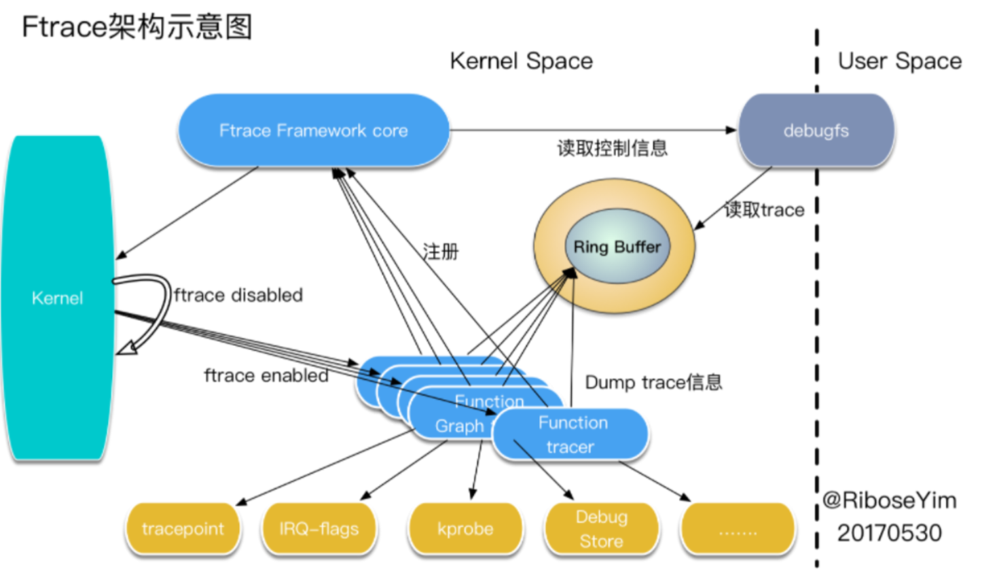
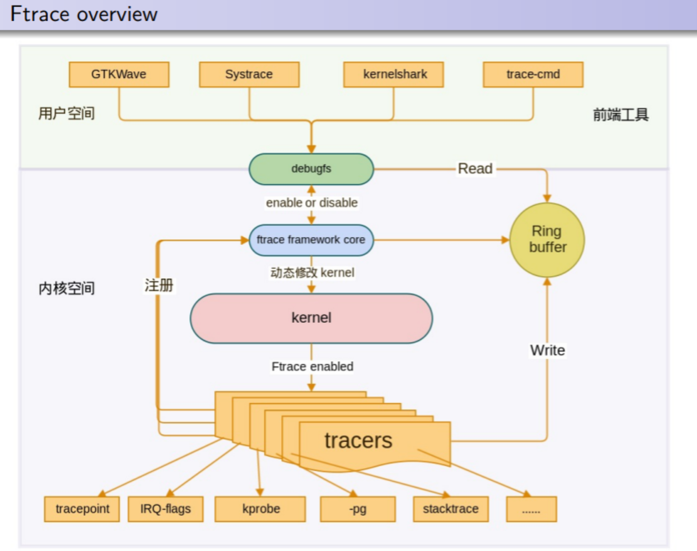

在当今数字化时代，Linux 系统凭借其开源、稳定、安全等诸多优势，在服务器领域占据了举足轻重的地位。据统计，全球超过 70% 的网站服务器都运行在 Linux 操作系统上 ，众多大型互联网公司如 Google、Facebook 等，都在其数据中心大规模使用 Linux，以实现高效的数据处理和存储。

对于企业而言，Linux 服务器的性能直接关系到业务的稳定运行和用户体验。想象一下，当用户访问网站或使用应用程序时，如果系统响应缓慢甚至出现卡顿，用户很可能会选择离开，这不仅会导致业务流失，还会损害企业的声誉。而通过有效的性能分析，我们能够及时发现系统中的潜在问题，找出性能瓶颈所在，从而采取针对性的优化措施，确保系统始终处于最佳运行状态。

在 Linux 性能分析的工具家族中，ftrace 是一款功能强大且独特的工具，它犹如一把精密的手术刀，能够深入剖析 Linux 内核的运行时行为，为我们揭示系统内部的奥秘，在性能分析和故障调试中发挥着关键作用。

# 一、Ftrace概述

ftrace，即 Function Trace 的缩写，是 Linux 内核自带的一款强大的跟踪工具 。它诞生于 2008 年，由 Steven Rostedt 开发，并在 2.6.27 版本的内核中首次引入。最初，ftrace 只是一个简单的函数跟踪器，主要用于记录内核的函数调用流程，随着不断的发展和完善，如今它已演变成一个功能丰富的跟踪框架，采用插件式的设计，支持开发者添加更多类型的跟踪功能，在 Linux 内核的开发与调试中发挥着不可或缺的作用。

简单来说，ftrace 就像是一个 “内核侦探”，能够深入系统内部，帮助开发人员了解 Linux 内核在运行时的各种行为。无论是内核函数的调用顺序、执行时间，还是进程的调度情况、中断的处理过程，ftrace 都能进行详细的跟踪和记录。通过这些信息，开发人员可以像侦探破案一样，从蛛丝马迹中找出系统运行时出现的问题，进而进行针对性的优化和调试。

在实际应用中，ftrace 的用途十分广泛。当系统出现性能瓶颈时，我们可以借助 ftrace 来分析是哪些内核函数占用了大量的时间，从而找出性能瓶颈所在，进行优化。比如，在一个高并发的 Web 服务器中，如果发现响应时间过长，通过 ftrace 跟踪相关的网络处理函数和文件系统操作函数，就有可能发现是某些函数的低效实现或者资源竞争导致了性能问题。又或者，当系统出现异常崩溃时，ftrace 记录的函数调用栈信息可以帮助我们快速定位到问题的根源，确定是哪个函数在什么情况下出现了错误，大大提高了故障排查的效率。

# 二、Ftrace的功能详解

## 2.1多样化的追踪功能

ftrace 拥有丰富多样的追踪功能，这得益于它所支持的一系列不同类型的 tracer，这些 tracer 就像是一个个各有所长的 “侦察兵”，能够从不同角度对 Linux 内核的运行时行为进行细致入微的跟踪。

其中，Function tracer（函数跟踪器）是最基础的一种 tracer ，它就像一个勤奋的记录员，能够忠实地跟踪内核函数的调用情况。当系统运行时，它会详细记录下每个函数何时被调用，为开发人员提供了函数调用的基本时间线。通过分析 Function tracer 生成的跟踪信息，开发人员可以清晰地了解到系统中各个函数的执行顺序，这对于理解复杂的内核代码逻辑以及排查因函数调用顺序错误而导致的问题非常有帮助。例如，在一个文件系统操作中，Function tracer 可以记录下从文件打开函数到文件读写函数再到文件关闭函数的一系列调用过程，让开发人员一目了然地看到整个文件操作的流程。

Function graph tracer（函数调用图跟踪器）则以一种更加直观的图形化方式展示函数调用的层次关系 。它不仅能够显示函数的调用顺序，还能清晰地呈现出函数之间的嵌套关系，就像一幅详细的作战地图，让开发人员对函数调用的整体结构有更全面的认识。比如，在一个网络数据包处理的过程中，可能涉及到多个层次的函数调用，从网络驱动层的接收函数，到网络协议栈中的各个处理函数，再到应用层的回调函数。Function graph tracer 可以将这些函数的调用关系以图形的形式展示出来，使开发人员能够迅速定位到关键函数以及它们之间的依赖关系，方便进行性能优化和问题排查。

Schedule switch tracer（调度切换跟踪器）主要负责跟踪进程的调度情况 ，它能够记录下系统中进程何时进行了切换，以及切换的原因。在多任务的 Linux 系统中，进程调度是一个关键的环节，进程的频繁切换可能会带来额外的开销，影响系统性能。通过分析 Schedule switch tracer 的跟踪数据，开发人员可以了解到系统中进程调度的频繁程度，判断是否存在不合理的调度策略。例如，如果发现某个进程频繁地被调度，可能是因为该进程的优先级设置不合理，或者是因为它在执行过程中出现了资源竞争等问题，开发人员可以据此进行针对性的调整和优化。

Wakeup tracer（唤醒跟踪器）专注于跟踪进程的调度延迟 ，特别是对于实时进程，它能够记录下高优先级进程从进入就绪状态到获得 CPU 的延迟时间。在实时系统中，对进程的响应时间有着严格的要求，哪怕是微小的调度延迟都可能导致严重的后果。Wakeup tracer 就像是一个精准的计时器，能够帮助开发人员准确地测量出调度延迟，从而找出导致延迟的原因，比如是否存在其他进程占用了过多的 CPU 资源，或者是内核调度算法在某些情况下存在缺陷等。通过优化这些问题，可以提高实时系统的响应性能，确保关键任务能够及时得到处理。

Irqsoff tracer（中断关闭跟踪器）则是专门用于跟踪内核中中断被禁止的情况 。当中断被禁止时，系统无法及时响应外部事件，这可能会导致系统响应延迟，影响用户体验。Irqsoff tracer 会记录下哪些函数禁止了中断，并且会特别标示出中断禁止时间最长的函数，就像一个 “罪魁祸首探测器”，让开发人员能够迅速定位到那些可能导致系统响应问题的函数。例如，在一个实时控制系统中，如果某个函数长时间禁止中断，可能会导致传感器数据无法及时采集和处理，从而影响系统的控制精度。通过使用 Irqsoff tracer，开发人员可以及时发现并解决这类问题，保证系统的稳定性和可靠性。

除了上述几种常见的 tracer，ftrace 还支持 Branch tracer（分支跟踪器），用于跟踪内核程序中的分支预测命中率情况，帮助开发人员优化程序的执行路径；Hardware branch tracer（硬件分支跟踪器），利用处理器的分支跟踪能力，实现硬件级别的指令跳转记录；Initcall tracer（初始化调用跟踪器），记录系统在启动阶段所调用的初始化函数；Mmiotrace tracer（内存映射 I/O 跟踪器），记录内存映射 I/O 的相关信息；

Power tracer（电源跟踪器），记录系统电源管理相关的信息；Sysprof tracer（系统性能分析跟踪器），定期对内核进行采样，记录函数调用和堆栈信息；Kernel memory tracer（内核内存跟踪器），跟踪内核内存分配器的分配情况，帮助开发人员分析内存碎片问题；Workqueue statistical tracer（工作队列统计跟踪器），统计系统中所有工作队列的工作情况，辅助开发人员选择合适的工作队列实现方式；Event tracer（事件跟踪器），跟踪系统中的各种事件，如定时器、系统调用、中断等。这些丰富的 tracer 类型，使得 ftrace 能够满足不同场景下的性能分析和故障调试需求，成为 Linux 内核开发和维护的得力助手。

## 2.2轻量级与稳定性

ftrace 在设计上采用了静态代码插装技术，这使得它具有显著的轻量级特性。简单来说，静态代码插装就是在编译内核时，将一些特定的代码片段插入到内核函数中，这些代码片段就像是预先设置好的 “小探针”，能够在函数执行时收集相关信息。与其他一些动态跟踪技术相比，ftrace 的静态代码插装方式不需要在运行时进行复杂的动态分析和代码注入，因此代码量相对较小，对系统资源的占用也非常低。在一个高负载的服务器环境中，系统资源十分宝贵，使用 ftrace 进行性能分析时，它几乎不会对系统的正常运行产生明显的影响，就像一个安静的观察者，默默地记录着系统的运行情况，而不会干扰系统的正常工作节奏。

这种静态代码插装技术还赋予了 ftrace 极高的稳定性 。由于它不需要支持复杂的编程接口让用户自定义跟踪行为，也就减少了因用户不当使用而导致内核崩溃的风险。与一些功能强大但设计复杂的跟踪工具（如 SystemTap）相比，ftrace 的设计目标更加简单直接，它专注于提供可靠的跟踪功能，而不是追求过于复杂的自定义能力。在实际的生产环境中，稳定性是至关重要的，任何一次系统崩溃都可能导致严重的业务损失。ftrace 的稳定可靠特性，使得它成为了内核开发人员和系统管理员在进行性能分析和故障排查时的首选工具之一，就像一位值得信赖的老伙伴，始终能够在关键时刻提供准确可靠的信息，帮助解决问题。

##  2.3便捷的接口

ftrace 通过 debugfs 接口与用户进行交互，这使得它的使用变得非常便捷 。debugfs 是 Linux 内核提供的一种特殊文件系统，它主要用于调试目的，为用户提供了一种简单直观的方式来访问和修改内核的调试信息。ftrace 利用 debugfs 文件系统，将其各种控制和配置选项以文件的形式呈现给用户，用户只需要通过简单的文件读写操作，就可以完成对 ftrace 的各种设置和操作。

具体来说，当用户想要使用 ftrace 时，首先需要挂载 debugfs 文件系统，这通常只需要执行一条简单的命令，如 “mount -t debugfs nodev /sys/kernel/debug”（在不同的系统中，挂载点可能会有所不同）。挂载完成后，用户就可以在 “/sys/kernel/debug/tracing” 目录下找到 ftrace 的各种控制文件。

例如，“available_tracers” 文件列出了当前系统中可用的所有 tracer 类型，用户可以通过查看这个文件来了解 ftrace 支持哪些跟踪功能；“current_tracer” 文件则用于指定当前要使用的 tracer，用户只需要将想要使用的 tracer 名称写入这个文件，就可以轻松切换跟踪器；“tracing_on” 文件用于控制 ftrace 的开启和关闭，将 “1” 写入该文件表示开启跟踪，将 “0” 写入则表示关闭跟踪；“trace” 文件则是用于查看 ftrace 生成的跟踪信息，用户可以使用 “cat” 命令来读取这个文件的内容，从而获取系统的运行时行为数据。

这种基于文件系统的接口设计，使得 ftrace 的使用非常灵活方便，即使是对于那些不太熟悉复杂命令行工具的用户来说，也能够轻松上手。用户不需要学习复杂的命令语法和参数设置，只需要熟悉基本的文件操作命令，就可以充分利用 ftrace 的强大功能。而且，由于 ftrace 的输出信息都是以文本文件的形式呈现，用户可以方便地使用各种文本处理工具对跟踪数据进行进一步的分析和处理，如使用 grep 命令进行关键词搜索，使用 awk 命令进行数据提取和统计等，大大提高了分析效率。

# 三、Ftrace的工作原理

## 3.1插桩技术

ftrace 的强大功能离不开其背后精妙的工作原理，而插桩技术则是其实现内核跟踪的核心基础。插桩技术就像是在系统这个庞大的机器中安装了许多精密的 “传感器”，这些 “传感器” 能够实时捕捉系统运行时的各种信息，为我们深入了解系统内部的运行机制提供了关键数据。ftrace 采用了静态插桩和动态插桩两种方式，它们各有特点，相互配合，共同实现了高效的内核跟踪。





静态插桩是 ftrace 实现跟踪功能的基础方式之一 。当我们在 Kernel 中打开 CONFIG_FUNCTION_TRACER 功能后，编译过程中会增加一个 - pg 的编译选项。这个编译选项就像是一个神奇的 “指令注入器”，它会在每个函数入口处插入一条 bl mcount 跳转指令。这意味着，当系统中的每个函数运行时，都会先跳转到 mcount 函数。在 mcount 函数中，会判断函数指针 ftrace_trace_function 是否被注册，默认注册的是空函数 ftrace_stub，只有打开 function tracer 后才会注册具体的处理函数 ftrace_trace_function。

这种静态插桩的方式，就像是在每个函数的必经之路上设置了一个固定的 “检查点”，无论函数何时被调用，都必须经过这个 “检查点”，从而实现对所有函数调用的跟踪。然而，这种方式虽然能够全面地跟踪函数调用，但也带来了一定的性能开销，因为每个函数调用都要额外执行一次跳转和判断操作，这在高负载的系统中可能会对性能产生明显的影响。

为了解决静态插桩带来的性能问题，开发者们推出了 Dynamic ftrace，即动态插桩技术 。动态插桩技术的核心思想是动态修改函数指令，以实现更加灵活和高效的跟踪。在编译时，系统会记录所有被添加跳转指令（即支持追踪）的函数。

在内核启动时，这些函数入口处的跳转指令会被替换为 nop 指令（nop 指令是一种空操作指令，执行它不会产生任何实际的运算或操作，仅占用一个指令周期），这样在非调试状态下，函数的执行就不会受到额外的性能损耗，就像在高速公路上取消了所有不必要的收费站，车辆可以畅行无阻，大大提高了系统的运行效率。而当需要进行跟踪时，根据 function tracer 的设置，系统会动态地将被调试函数的 nop 指令替换为跳转指令，从而实现对特定函数的追踪。

这种动态插桩的方式，就像是一个智能的 “交通管制系统”，只有在需要监控某些特定 “车辆”（函数）时，才会在其行驶路径上设置 “检查点”，而在其他时候，道路则保持畅通，既实现了跟踪功能，又最大限度地减少了对系统性能的影响。

## 3.2数据记录与存储

当 ftrace 通过插桩技术在函数入口处设置好 “传感器” 后，接下来就需要考虑如何记录这些函数调用过程中产生的数据，并将这些宝贵的信息存储起来，以便后续的分析和处理。

在开启 ftrace 的跟踪功能后，首先会打开编译选项 -pg，为每个函数都增加跳转指令，这就像是为每个函数都安装了一个 “数据采集器”，当函数被调用时，“数据采集器” 就会被触发。

然后，系统会记录这些可追踪的函数，并为了减少性能消耗，将跳转函数替换为 nop 指令，就像暂时关闭了这些 “数据采集器”，让系统能够高效运行。而当需要进行跟踪时，通过 flag 标志位来动态管理，将需要追踪的函数预留的 nop 指令替换回追踪指令，此时 “数据采集器” 重新启动，开始记录调试信息，包括函数的调用时间、调用参数、返回值等关键信息。

ftrace 将这些追踪信息存储到 Ring buffer 缓冲区中 。Ring buffer 是一种环形缓冲区，它就像是一个循环的 “数据仓库”，具有固定的大小。当追踪信息产生时，会按照顺序依次写入 Ring buffer 中。当缓冲区被填满后，新产生的追踪信息会覆盖最早写入的信息，就像一个不断循环的传送带，始终保持最新的追踪数据在缓冲区中。这种设计方式既保证了追踪信息的实时性，又避免了因缓冲区溢出而导致的数据丢失问题。

用户可以通过读取 Ring buffer 中的数据，来获取系统的运行时行为信息，为性能分析和故障排查提供有力的支持。例如，在分析系统性能瓶颈时，开发人员可以从 Ring buffer 中读取函数调用的时间信息，找出那些执行时间较长的函数，进而深入分析这些函数的内部实现，找出性能瓶颈所在；在排查系统故障时，开发人员可以读取函数调用的参数和返回值信息，判断函数是否在某些特定参数下出现异常，从而快速定位问题的根源。

# 四、Ftrace的使用方法

##  4.1内核配置

在使用 ftrace 之前，首先需要确保内核配置中启用了相关选项。这一步至关重要，就像搭建一座房子，内核配置是基石，只有打好了基础，ftrace 才能正常发挥其强大的功能。主要的配置选项包括：

- CONFIG_FTRACE：这是 ftrace 的核心配置选项，它就像是 ftrace 的总开关，只有开启了这个选项，ftrace 的其他功能才能得以启用。如果没有启用 CONFIG_FTRACE，那么后续的一切配置和操作都将无法进行，就如同没有启动发动机的汽车，无论多么精美的内饰和先进的配置都无法让它行驶起来。在编译内核时，通过 make menuconfig 命令进入内核配置界面，在 “Kernel hacking ---> Tracers --->” 路径下，可以找到 CONFIG_FTRACE 选项，将其设置为 “[*]”，表示启用该选项。
- CONFIG_FUNCTION_TRACER：此选项用于启用函数跟踪功能，它是 ftrace 中最常用的功能之一。一旦启用，ftrace 就能够跟踪内核中函数的调用情况，记录函数的调用时间、调用参数等关键信息。对于开发者来说，这些信息就像是打开系统内部奥秘的钥匙，能够帮助他们深入了解系统的运行机制，排查各种潜在的问题。在上述内核配置界面中，找到 “[*] Kernel Function Tracer” 选项，将其选中即可启用函数跟踪功能。
- CONFIG_FUNCTION_GRAPH_TRACER：这个选项主要用于启用函数调用图跟踪功能，它能够以图形化的方式展示函数之间的调用关系，让开发者对系统的函数调用结构一目了然。在分析复杂的系统时，函数调用图能够帮助开发者快速定位关键函数和它们之间的依赖关系，大大提高了问题排查和性能优化的效率。在 “Tracers --->” 路径下，找到 “[] Kernel Function Graph Tracer” 选项，将其设置为 “[]”，即可启用函数调用图跟踪功能。
- CONFIG_DYNAMIC_FTRACE：动态 ftrace 配置选项，它允许在运行时动态地修改函数指令，以实现更加灵活的跟踪。通过启用这个选项，ftrace 可以在不重新编译内核的情况下，根据实际需求动态地开启或关闭对某些函数的跟踪，大大提高了 ftrace 的使用灵活性和效率。在 “Tracers --->” 路径下，找到 “[*] Dynamic ftrace” 选项，将其选中即可启用动态 ftrace 功能。

除了上述主要选项外，还有许多其他的配置选项，如 CONFIG_IRQSOFF_TRACER（用于启用中断关闭跟踪功能）、CONFIG_SCHED_TRACER（用于启用调度跟踪功能）等，开发者可以根据具体的需求进行选择和配置。不同的配置选项就像是不同的工具，开发者可以根据问题的类型和分析的目的，选择合适的工具来进行系统性能分析和故障排查。

## 4.2挂载 debugfs 文件系统

在完成内核配置并成功编译内核后，接下来需要挂载 debugfs 文件系统，这是使用 ftrace 的关键步骤之一。debugfs 是一种特殊的文件系统，它为内核调试提供了一个接口，ftrace 正是通过这个接口与用户进行交互，将内核的跟踪信息呈现给用户。

挂载 debugfs 文件系统的步骤如下：

1. 首先，检查系统中是否已经挂载了 debugfs 文件系统。可以使用以下命令进行检查

   ```
   mount | grep debugfs
   ```

   如果命令输出中包含类似于 “debugfs /sys/kernel/debug debugfs rw,relatime 0 0” 的信息，说明 debugfs 文件系统已经挂载，挂载点为 /sys/kernel/debug。此时，可以直接进入下一步操作。

2. 如果 debugfs 文件系统尚未挂载，则需要手动进行挂载。使用以下命令进行挂载：

   ```
   mount -t debugfs none /sys/kernel/debug
   ```

   在这个命令中，“-t debugfs” 表示指定要挂载的文件系统类型为 debugfs，“none” 表示不需要指定设备，因为 debugfs 是一种虚拟文件系统，不需要实际的物理设备支持，“/sys/kernel/debug” 是挂载点，即将 debugfs 文件系统挂载到 /sys/kernel/debug 目录下。执行这个命令后，debugfs 文件系统就会被挂载到指定的目录下，就像将一个装满工具的工具箱放置在了一个方便取用的位置，用户可以通过这个挂载点来访问 ftrace 提供的各种调试信息和控制文件

3. 挂载完成后，可以通过查看 /sys/kernel/debug 目录下的文件来验证 debugfs 文件系统是否挂载成功。在该目录下，应该可以看到一个名为 “tracing” 的目录，这个目录就是 ftrace 的主要工作目录，其中包含了各种用于控制和查看 ftrace 跟踪信息的文件。如果能够找到 “tracing” 目录，说明 debugfs 文件系统挂载成功，可以继续进行后续的 ftrace 配置和使用操作。

##  4.3常用文件及操作

各种控制文件和跟踪信息文件。这些文件就像是 ftrace 的操作手册和日志记录，通过对它们的操作和查看，用户可以实现对 ftrace 的各种配置和跟踪信息的获取。以下是一些常用文件及其操作方法：

trace 文件：这是 ftrace 最重要的文件之一，它包含了当前的追踪内容。就像一个详细的日记，trace 文件记录了 ftrace 跟踪到的所有内核函数调用、事件发生等信息。

用户可以使用以下命令查看 trace 文件的内容：

```
cat /sys/kernel/debug/tracing/trace
```

执行这个命令后，系统会输出 trace 文件中的内容，这些内容通常以文本形式呈现，包括时间戳、进程 ID、CPU 编号、函数名等信息，通过分析这些信息，用户可以了解系统的运行时行为，找出潜在的性能问题和故障原因。例如，如果在 trace 文件中发现某个函数的调用频率非常高，或者某个函数的执行时间过长，就可以进一步深入分析这个函数，查看它的实现逻辑和调用参数，找出优化的方向。

tracing_on 文件：用于启用或停止追踪，它就像是 ftrace 的启动和停止按钮。将 “1” 写入 tracing_on 文件，表示启用追踪，此时 ftrace 会开始记录系统的运行时信息；将 “0” 写入该文件，表示停止追踪，ftrace 会停止记录新的信息。、

使用以下命令可以启用追踪：

```
echo 1 > /sys/kernel/debug/tracing/tracing_on
```

使用以下命令可以停止追踪：

```
echo 0 > /sys/kernel/debug/tracing/tracing_on
```

通过灵活地控制 tracing_on 文件，用户可以根据实际需求在需要时开启追踪，获取系统的运行信息，在不需要时停止追踪，减少系统资源的消耗。

current_tracer 文件：用于设置当前启用的 tracer，它就像是 ftrace 的功能选择器。ftrace 支持多种不同类型的 tracer，每种 tracer 都有其特定的功能和用途，通过设置 current_tracer 文件，用户可以选择使用不同的 tracer 来满足不同的分析需求。

例如，如果想要跟踪内核函数的调用情况，可以将 “function” 写入 current_tracer 文件；如果想要以图形化的方式查看函数调用关系，可以将 “function_graph” 写入该文件。

使用以下命令可以设置当前启用的 tracer 为 function：

```
echo function > /sys/kernel/debug/tracing/current_tracer
```

在设置 current_tracer 文件后，ftrace 会根据用户选择的 tracer 类型来记录和展示系统的运行时信息。

available_tracers 文件：列出了当前系统中可用的所有 tracer 类型，它就像是 ftrace 的功能菜单。

用户可以使用以下命令查看 available_tracers 文件的内容：

```
cat /sys/kernel/debug/tracing/available_tracers
```

执行这个命令后，系统会输出当前系统中可用的 tracer 类型，如 function、function_graph、irqsoff、wakeup 等。通过查看这个文件，用户可以了解 ftrace 支持哪些跟踪功能，从而根据实际需求选择合适的 tracer。

set_ftrace_filter 文件：用于设置函数过滤，它就像是一个筛子，可以帮助用户筛选出感兴趣的函数进行跟踪。通过将需要跟踪的函数名写入 set_ftrace_filter 文件，用户可以只让 ftrace 跟踪这些特定的函数，而忽略其他函数，从而减少跟踪数据的量，提高分析效率。

例如，如果只对 “vfs_open” 函数感兴趣，可以使用以下命令设置函数过滤：

```
echo vfs_open > /sys/kernel/debug/tracing/set_ftrace_filter
```

设置完成后，ftrace 只会跟踪 “vfs_open” 函数的调用情况，而不会记录其他函数的信息。

set_ftrace_pid 文件：用于设置进程 ID 过滤，它就像是一个定位器，可以让用户只跟踪特定进程的函数调用。将需要跟踪的进程 ID 写入 set_ftrace_pid 文件，ftrace 会只记录该进程中函数的调用情况，而忽略其他进程的信息。例如，如果要跟踪进程 ID 为 1234 的进程，可以使用以下命令设置进程 ID 过滤：

```
echo 1234 > /sys/kernel/debug/tracing/set_ftrace_pid
```

通过设置进程 ID 过滤，用户可以更有针对性地分析特定进程的性能和行为，找出该进程中可能存在的问题。

# 五、Ftrace应用案例

## 5.1性能优化

假设我们正在开发一个文件系统相关的内核模块，近期发现系统在进行大量文件读写操作时，性能出现了明显的下降。为了找出性能瓶颈，我们决定使用 ftrace 来进行深入分析。

首先，我们需要确保 ftrace 已经正确配置并启用。通过前面介绍的方法，挂载 debugfs 文件系统，并进入 /sys/kernel/debug/tracing 目录。

接下来，我们使用 Function graph tracer 来跟踪文件系统相关函数的调用情况。因为 Function graph tracer 能够以图形化的方式展示函数调用关系和执行时间，这对于我们分析性能瓶颈非常有帮助。我们执行以下命令：

```
echo 0 > tracing_on  # 停止追踪
echo nop > current_tracer  # 清除当前追踪器
echo function_graph > current_tracer  # 启用function_graph跟踪器
```

然后，我们设置只跟踪与文件系统相关的函数，这里以 “vfs_read” 和 “vfs_write” 函数为例，执行以下命令：

```
echo vfs_read > set_graph_function
echo vfs_write >> set_graph_function
```

完成上述设置后，我们开始进行文件读写操作，模拟实际的业务场景。操作完成后，我们停止追踪，执行命令：

```
echo 0 > tracing_on
```

接着，我们查看 trace 文件，获取跟踪结果：

```
cat trace
```

在 trace 文件中，我们可以看到类似以下的信息：

```
# tracer: function_graph
#
# CPU  DURATION                  FUNCTION CALLS
# |     |   |                     |   |   |   |
0)  1234.567 us |  vfs_read() {
0)  10.123 us |    generic_file_read() {
0)  5.678 us |      do_generic_file_read() {
0)  3.456 us |        page_cache_sync_readahead() {
0)  1.234 us |          ra_submit() {
0)  0.567 us |            submit_bio() {
0)  0.234 us |              generic_make_request() {
0)  0.123 us |                blk_queue_bio() {
0)  0.067 us |                  blk_mq_submit_bio() {
0)  0.034 us |                    blk_mq_alloc_request() {
0)  0.012 us |                      kmem_cache_alloc() {
0)  0.005 us |                        slab_alloc() {
0)  0.002 us |                         ...
0)  0.002 us |                        }
0)  0.005 us |                      }
0)  0.012 us |                    }
0)  0.034 us |                  }
0)  0.067 us |                }
0)  0.123 us |              }
0)  0.234 us |            }
0)  0.567 us |          }
0)  1.234 us |        }
0)  3.456 us |      }
0)  5.678 us |    }
0)  1234.567 us |  }
```

从这些信息中，我们可以清晰地看到函数的调用层次和每个函数的执行时间。通过分析，我们发现 “page_cache_sync_readahead” 函数的执行时间较长，进一步查看其内部调用的函数，发现 “ra_submit” 函数以及其下的一系列函数调用也占用了不少时间。经过深入研究代码逻辑，我们发现 “ra_submit” 函数在某些情况下会进行不必要的磁盘 I/O 操作，导致性能下降。

针对这个问题，我们对代码进行了优化，减少了不必要的磁盘 I/O 操作。再次使用 ftrace 进行跟踪测试，发现 “vfs_read” 和 “vfs_write” 函数的执行时间明显缩短，系统的文件读写性能得到了显著提升。

##  5.2故障排查

某一天，运维人员发现生产系统出现了响应延迟的问题，用户反馈在访问系统时，页面加载速度明显变慢，一些操作甚至需要等待很长时间才能完成。为了找出问题的根源，我们决定使用 ftrace 来进行故障排查。

首先，我们怀疑是中断相关的问题导致了系统响应延迟，因为当中断被禁止时，系统无法及时响应外部事件，可能会导致响应延迟。所以我们使用 Irqsoff tracer 来跟踪中断禁止的情况。进入 /sys/kernel/debug/tracing 目录，执行以下命令：

```
echo 0 > tracing_on  # 停止追踪
echo nop > current_tracer  # 清除当前追踪器
echo irqsoff > current_tracer  # 启用irqsoff跟踪器
```

然后，我们等待系统响应延迟问题再次出现，在问题出现期间，ftrace 会记录下中断禁止的相关信息。问题出现后，我们停止追踪，执行命令：

```
echo 0 > tracing_on
```

接着，查看 trace 文件，获取跟踪结果：

```
cat trace
```

在 trace 文件中，我们看到了类似以下的信息：

```
# tracer: irqsoff
#
# WORST IRQSOFF LATENCY: 12345 us
#
#              _-----=> irqs-off
#             / _----=> need-resched
#            | / _---=> hardirq/softirq
#            || / _--=> preempt-depth
#            ||| / _-=> migrate-disable
#            |||| /     delay
#           TASK-PID     CPU#  |||||  TIMESTAMP  FUNCTION
#              | |         |   |||||     |         |
my_task-1234[000] d.h. 123456.789012: irqsoff_delay: 12345 us
my_task-1234[000] d.h. 123456.789012:   <stack trace>
 => 0xffffffffc0123456
 => some_function_1
 => some_function_2
 => some_function_3
```

从这些信息中，我们可以看到中断禁止的最长延迟时间为 12345 微秒，并且记录了导致中断禁止的函数调用栈。通过分析函数调用栈，我们发现 “some_function_3” 函数在执行过程中禁止了中断，并且禁止时间较长，很可能是这个函数导致了系统响应延迟。

进一步查看 “some_function_3” 函数的代码，发现该函数在进行一些复杂的数据处理时，为了保证数据的一致性，错误地禁止了中断，而且处理过程中存在一些低效的算法，导致执行时间过长。我们对该函数进行了优化，将数据处理过程中的中断禁止时间尽量缩短，并优化了算法，提高了执行效率。

经过优化后，再次观察系统运行情况，响应延迟问题得到了有效解决，用户反馈系统恢复正常。通过这个案例，我们可以看到 ftrace 在故障排查中的强大作用，它能够帮助我们快速定位问题的根源，为解决系统故障提供有力的支持。

# 六、Ftrace与其他工具对比

##  6.1ftrace与 systemTap 对比

在 Linux 性能分析工具的大家庭中，systemTap 是与 ftrace 常常被放在一起比较的工具。systemTap 诞生于 Linux 社区对 SUN Dtrace 的回应，其目标是达到甚至超越 Dtrace ，这使得它在设计上较为复杂。它为用户提供了一种强大的脚本语言，用户可以通过编写脚本来自定义跟踪逻辑，实现对系统各种行为的深入分析。比如，用户可以使用 systemTap 编写脚本，精确地统计某个系统调用在特定时间段内的调用次数，或者计算某个函数的平均执行时间等，这种高度的自定义能力使得 systemTap 在处理复杂的性能分析场景时具有很大的优势。

然而，正是由于 systemTap 的设计复杂，它也存在一些不足之处。在实际应用中，systemTap 始终处于不断完善自身的状态，不当的使用和其自身的不完善都有可能导致系统崩溃。例如，在一个生产环境中，运维人员尝试使用 systemTap 来分析系统性能，由于对脚本编写不够熟悉，编写的脚本中存在一些逻辑错误，结果在运行脚本时，导致了系统的不稳定，甚至出现了短暂的服务中断，给业务带来了一定的影响。

相比之下，ftrace 的设计目标则简单得多，它本质上是一种静态代码插装技术，不需要支持复杂的编程接口让用户自定义 trace 行为。这种设计使得 ftrace 更加可靠，不会因为用户的不当使用而轻易导致内核崩溃 。ftrace 的代码量也很小，这意味着它对系统资源的占用非常低，在系统运行时几乎不会对系统性能产生明显的影响。在一个对稳定性要求极高的服务器环境中，ftrace 的这些特性使得它成为了系统管理员和内核开发者的首选工具之一。即使是在系统高负载运行的情况下，使用 ftrace 进行性能分析也不会给系统带来额外的负担，能够确保系统的稳定运行。

## 6.2ftrace与 LTTng 对比

LTTng（Linux Trace Toolkit Next Generation）也是一款功能强大的跟踪工具，它与 ftrace 在一些方面存在明显的差异。

从接口类型来看，ftrace 采用的是 ASCII 接口，这使得它的输出信息可以直接阅读，对于内核开发人员来说，这种接口非常具有吸引力，因为他们只需要结合内核代码和简单的 cat 命令，就可以轻松地获取和分析跟踪信息，操作十分便捷。在进行内核调试时，开发人员可以直接通过 cat 命令查看 ftrace 生成的跟踪文件，快速定位问题所在。而 LTTng 则采用 binary 接口，这种接口更利于专门工具进行分析使用，它能够将跟踪数据以二进制的形式高效存储，适合通过特定的工具进行深入的数据挖掘和分析。

在 ring buffer 的实现上，两者也有所不同。ftrace 对所有 tracer 都采用同一个 ring buffer，就像一个公共的 “数据仓库”，所有的跟踪信息都存储在这个统一的缓冲区中。这种方式虽然简单直接，但在某些情况下可能会导致缓冲区的竞争和数据覆盖问题。例如，当多个 tracer 同时产生大量的跟踪信息时，可能会因为缓冲区空间不足而导致部分数据被覆盖，影响分析的完整性。而 LTTng 则使用各自不同的 ring buffer，每个 tracer 都有自己独立的 “小仓库”，这样可以有效地避免缓冲区竞争问题，确保每个 tracer 的数据都能得到准确的存储和记录。这使得 LTTng 在处理多 tracer 同时工作的复杂场景时，具有更好的性能和稳定性。

由于这些差异，ftrace 和 LTTng 在适用场景上也各有侧重。ftrace 由于其简单易用、直接可读的特点，更适合内核开发人员在日常开发和调试中快速获取系统运行时的基本信息，进行初步的性能分析和问题排查；而 LTTng 则凭借其高效的二进制接口和独立的 ring buffer 设计，更受嵌入式工程师的欢迎，在对跟踪数据的存储和分析要求较高的嵌入式系统开发中发挥着重要作用。